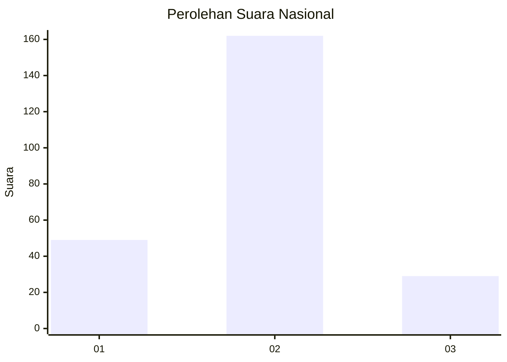
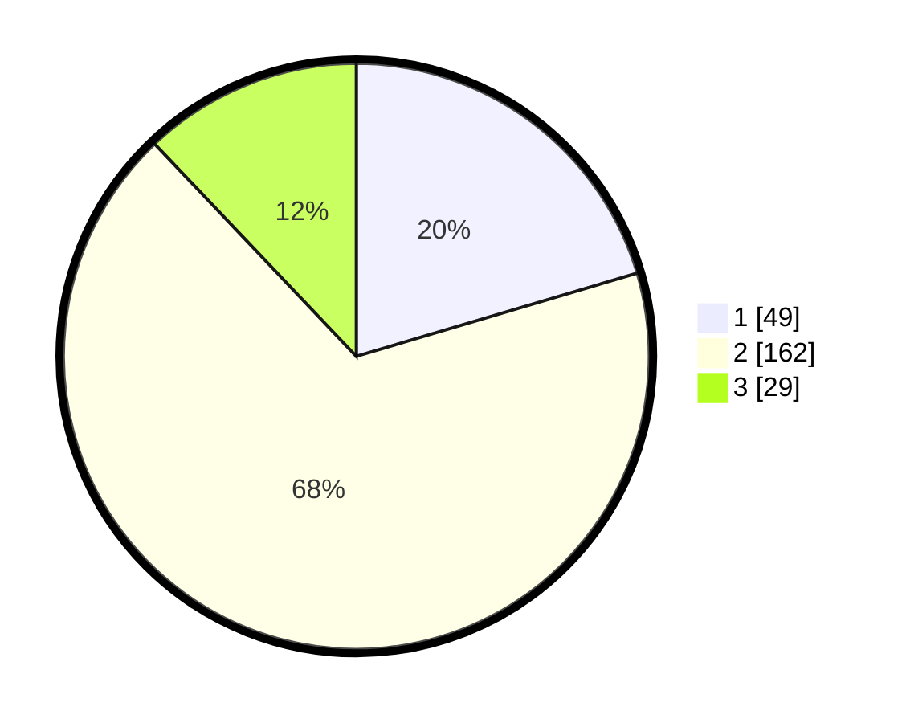

# Hasil

## Grafik

## Tabel

| No. | Nama Paslon    | Suara | Suara (raw) | Persentase |
|:--- |:-------------- | -----:| -----------:| ----------:|
| 1   | ANIES MUHAIMIN | 49    | [49][p-1]   | 20,42      |
| 2   | PRABOWO GIBRAN | 162   | [162][p-2]  | 67,50      |
| 3   | GANJAR MAHFUD  | 29    | [29][p-3]   | 12,08      |

[p-1]: https://github.com/gigit-pemilu/pemilu-2024/blob/main/pilpres/hitung-suara/sub/61-kalimantan-barat/sub/06-kapuas-hulu/sub/05-bunut-hilir/sub/2001-bunut-hilir/sub/001-tps/sub/paslon-1.txt
[p-2]: https://github.com/gigit-pemilu/pemilu-2024/blob/main/pilpres/hitung-suara/sub/61-kalimantan-barat/sub/06-kapuas-hulu/sub/05-bunut-hilir/sub/2001-bunut-hilir/sub/001-tps/sub/paslon-2.txt
[p-3]: https://github.com/gigit-pemilu/pemilu-2024/blob/main/pilpres/hitung-suara/sub/61-kalimantan-barat/sub/06-kapuas-hulu/sub/05-bunut-hilir/sub/2001-bunut-hilir/sub/001-tps/sub/paslon-3.txt

## Foto C Plano

https://sirekap-obj-formc.kpu.go.id/a929/pemilu/ppwp/61/06/05/20/01/6106052001001-20240215-014928--8a1d3ca1-e499-448f-a04f-bc394109f21c.jpg

https://sirekap-obj-formc.kpu.go.id/a929/pemilu/ppwp/61/06/05/20/01/6106052001001-20240215-015146--fd0cb83e-e79d-43c1-ba4a-332e1917e070.jpg

https://sirekap-obj-formc.kpu.go.id/a929/pemilu/ppwp/61/06/05/20/01/6106052001001-20240215-015223--623735db-1a83-4050-9ef0-5553c8078db4.jpg

## Metadata

| Key        | Value               |
| ---------- | ------------------- |
| Time Stamp | 2024-02-15 15:00:29 |

