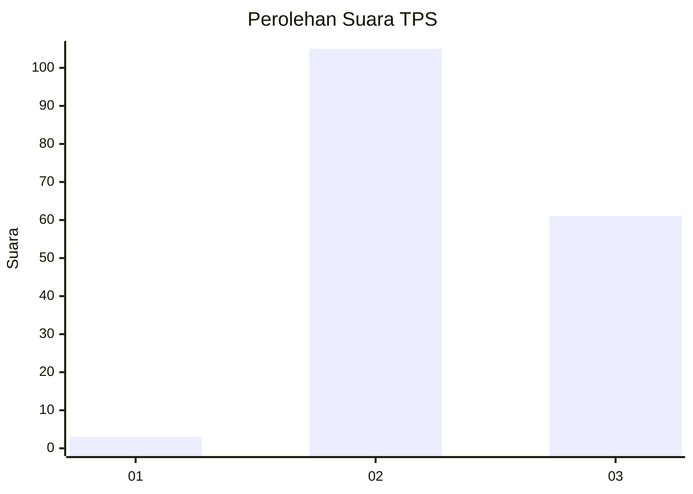
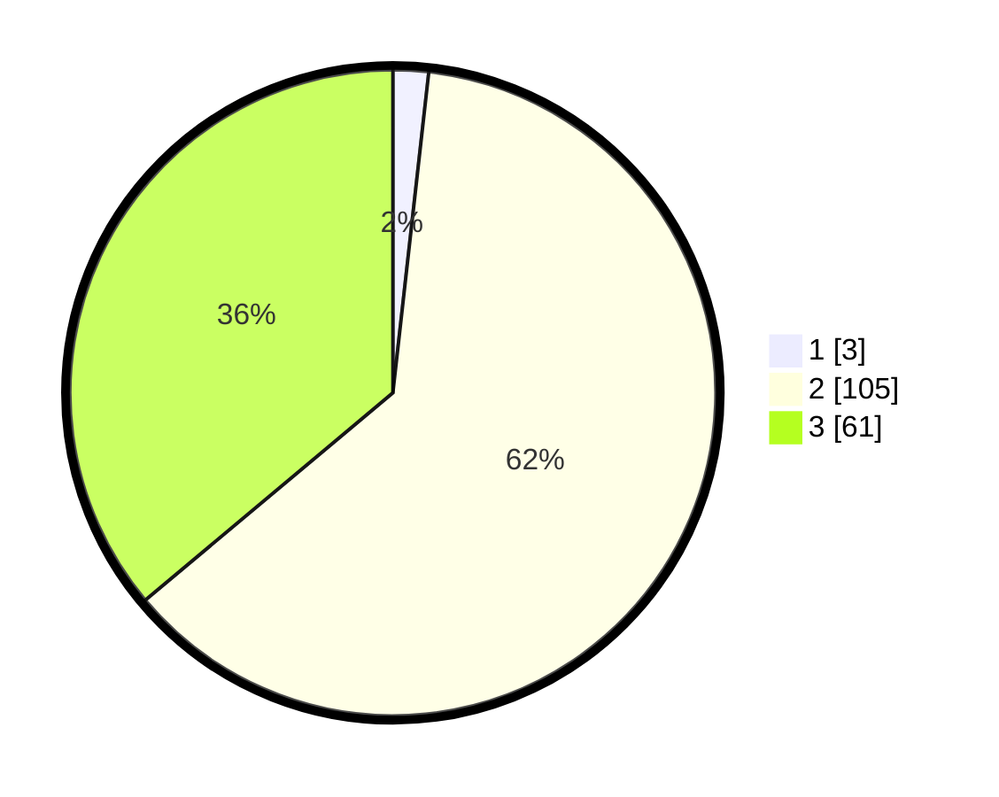

# Hasil

## Grafik

## Tabel

| No. | Nama Paslon    | Suara | Suara (raw) | Persentase |
|:--- |:-------------- | -----:| -----------:| ----------:|
| 1   | ANIES MUHAIMIN | 3     | [3][p-1]    | 1,78       |
| 2   | PRABOWO GIBRAN | 105   | [105][p-2]  | 62,13      |
| 3   | GANJAR MAHFUD  | 61    | [61][p-3]   | 36,09      |

[p-1]: https://github.com/gigit-pemilu/pemilu-2024-61-kalimantan-barat/blob/main/pilpres/hitung-suara/sub/61-kalimantan-barat/sub/06-kapuas-hulu/sub/11-seberuang/sub/2002-beluis-harum/sub/001-tps/sub/paslon-1.txt
[p-2]: https://github.com/gigit-pemilu/pemilu-2024-61-kalimantan-barat/blob/main/pilpres/hitung-suara/sub/61-kalimantan-barat/sub/06-kapuas-hulu/sub/11-seberuang/sub/2002-beluis-harum/sub/001-tps/sub/paslon-2.txt
[p-3]: https://github.com/gigit-pemilu/pemilu-2024-61-kalimantan-barat/blob/main/pilpres/hitung-suara/sub/61-kalimantan-barat/sub/06-kapuas-hulu/sub/11-seberuang/sub/2002-beluis-harum/sub/001-tps/sub/paslon-3.txt

## Foto C Plano

https://sirekap-obj-formc.kpu.go.id/d75d/pemilu/ppwp/61/06/11/20/02/6106112002001-20240223-143441--1fd374c8-139e-482f-ab69-3a05aaccb9fe.jpg

https://sirekap-obj-formc.kpu.go.id/d75d/pemilu/ppwp/61/06/11/20/02/6106112002001-20240220-122046--460d0e62-b38a-4811-9860-8a5926572eb8.jpg

https://sirekap-obj-formc.kpu.go.id/d75d/pemilu/ppwp/61/06/11/20/02/6106112002001-20240220-121532--9c89cfb2-c338-43c2-913c-7cd566caa905.jpg

## Metadata

| Key        | Value               |
| ---------- | ------------------- |
| Time Stamp | 2024-02-24 22:31:28 |

