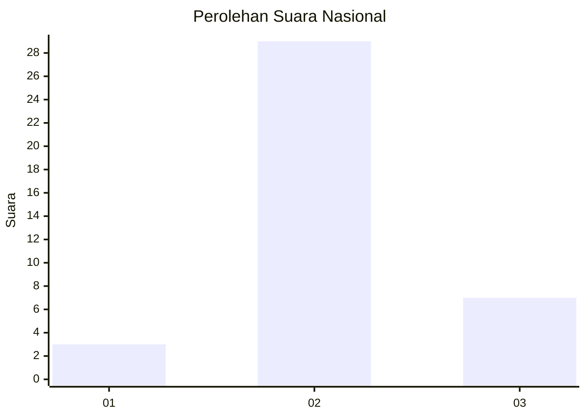
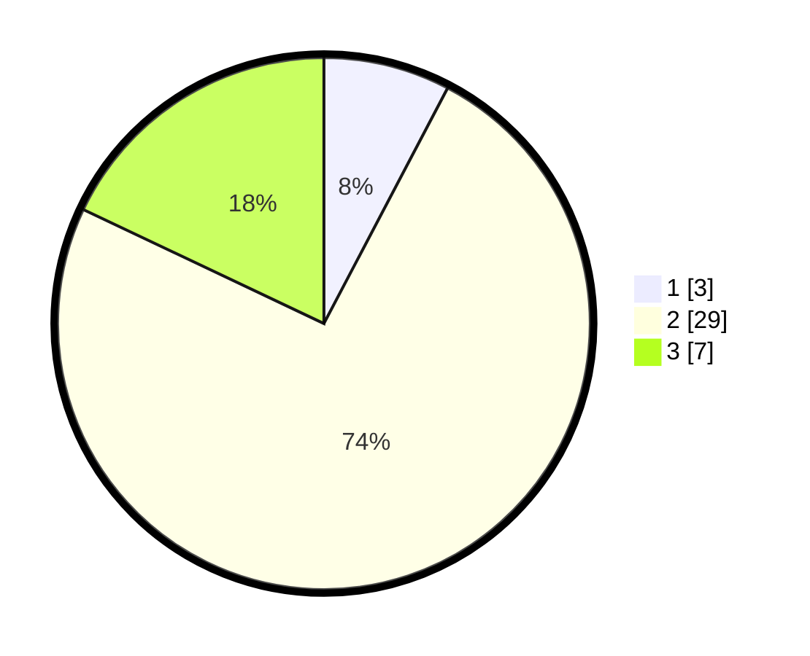

# Hasil

## Grafik

## Tabel

| No. | Nama Paslon    | Suara | Suara (raw) | Persentase |
|:--- |:-------------- | -----:| -----------:| ----------:|
| 1   | ANIES MUHAIMIN | 3     | [3][p-1]    | 7,69       |
| 2   | PRABOWO GIBRAN | 29    | [29][p-2]   | 74,36      |
| 3   | GANJAR MAHFUD  | 7     | [7][p-3]    | 17,95      |

[p-1]: https://github.com/gigit-pemilu/pemilu-2024/blob/main/pilpres/hitung-suara/sub/61-kalimantan-barat/sub/06-kapuas-hulu/sub/12-batang-lupar/sub/2001-setulang/sub/003-tps/sub/paslon-1.txt
[p-2]: https://github.com/gigit-pemilu/pemilu-2024/blob/main/pilpres/hitung-suara/sub/61-kalimantan-barat/sub/06-kapuas-hulu/sub/12-batang-lupar/sub/2001-setulang/sub/003-tps/sub/paslon-2.txt
[p-3]: https://github.com/gigit-pemilu/pemilu-2024/blob/main/pilpres/hitung-suara/sub/61-kalimantan-barat/sub/06-kapuas-hulu/sub/12-batang-lupar/sub/2001-setulang/sub/003-tps/sub/paslon-3.txt

## Foto C Plano

https://sirekap-obj-formc.kpu.go.id/4832/pemilu/ppwp/61/06/12/20/01/6106122001003-20240216-134627--9cee496b-8d31-448f-8824-9466725c4cd9.jpg

https://sirekap-obj-formc.kpu.go.id/4832/pemilu/ppwp/61/06/12/20/01/6106122001003-20240216-134628--066bf894-8d37-41a5-aaed-6ff823e62bd2.jpg

https://sirekap-obj-formc.kpu.go.id/4832/pemilu/ppwp/61/06/12/20/01/6106122001003-20240216-134627--f025631d-46cf-4164-bae2-e263070b22b8.jpg

## Metadata

| Key        | Value               |
| ---------- | ------------------- |
| Time Stamp | 2024-02-16 16:25:10 |

## DATA PEMILIH TETAP

Jumlah pemilih dalam DPT: **66**.
 * L: **33**.
 * P: **33**.

## DATA PENGGUNA HAK PILIH

Jumlah pengguna hak pilih dalam DPT: **36**.
 * L: **13**.
 * P: **23**.

Jumlah pengguna hak pilih dalam DPTb: **1**.
 * L: **0**.
 * P: **1**.

Jumlah pengguna hak pilih dalam DPK: **2**.
 * L: **2**.
 * P: **0**.

Jumlah pengguna hak pilih: **39**.
 * L: **15**.
 * P: **24**.

## JUMLAH SUARA SAH DAN TIDAK SAH

JUMLAH SELURUH SUARA SAH: **39**.

JUMLAH SUARA TIDAK SAH: **0**.

JUMLAH SELURUH SUARA SAH DAN SUARA TIDAK SAH: **39**.

