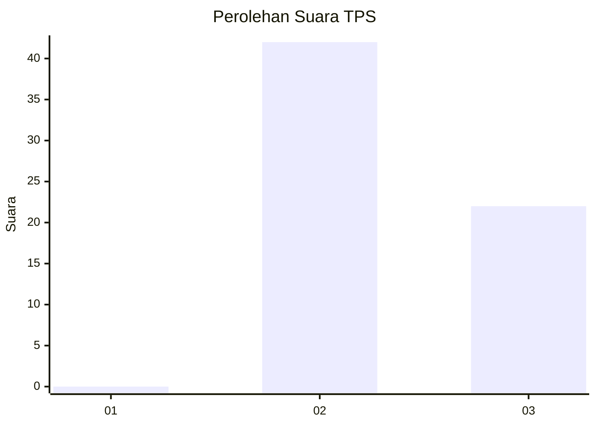
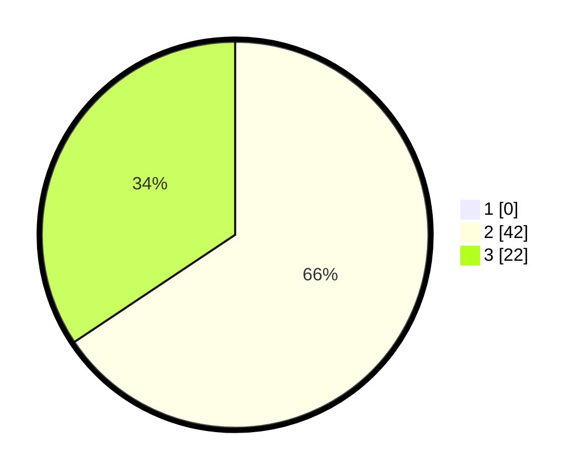

# Hasil

## Grafik

## Tabel

| No. | Nama Paslon    | Suara | Suara (raw) | Persentase |
|:--- |:-------------- | -----:| -----------:| ----------:|
| 1   | ANIES MUHAIMIN | 0     | [0][p-1]    | 0,00       |
| 2   | PRABOWO GIBRAN | 42    | [42][p-2]   | 65,63      |
| 3   | GANJAR MAHFUD  | 22    | [22][p-3]   | 34,38      |

[p-1]: https://github.com/gigit-pemilu/pemilu-2024-61-kalimantan-barat/blob/main/pilpres/hitung-suara/sub/61-kalimantan-barat/sub/06-kapuas-hulu/sub/12-batang-lupar/sub/2003-sungai-ajung/sub/003-tps/sub/paslon-1.txt
[p-2]: https://github.com/gigit-pemilu/pemilu-2024-61-kalimantan-barat/blob/main/pilpres/hitung-suara/sub/61-kalimantan-barat/sub/06-kapuas-hulu/sub/12-batang-lupar/sub/2003-sungai-ajung/sub/003-tps/sub/paslon-2.txt
[p-3]: https://github.com/gigit-pemilu/pemilu-2024-61-kalimantan-barat/blob/main/pilpres/hitung-suara/sub/61-kalimantan-barat/sub/06-kapuas-hulu/sub/12-batang-lupar/sub/2003-sungai-ajung/sub/003-tps/sub/paslon-3.txt

## Foto C Plano

https://sirekap-obj-formc.kpu.go.id/2851/pemilu/ppwp/61/06/12/20/03/6106122003003-20240220-171825--67dd12f3-ebe5-425e-ac32-a462b97fc666.jpg

https://sirekap-obj-formc.kpu.go.id/2851/pemilu/ppwp/61/06/12/20/03/6106122003003-20240220-171939--f3c67921-a9ee-4ef8-bd70-5210d4a30001.jpg

https://sirekap-obj-formc.kpu.go.id/2851/pemilu/ppwp/61/06/12/20/03/6106122003003-20240220-172309--865313b8-d78e-47e8-9ac5-4e73a1ea2a65.jpg

## Metadata

| Key        | Value               |
| ---------- | ------------------- |
| Time Stamp | 2024-02-20 18:00:00 |

## DATA PEMILIH TETAP

Jumlah pemilih dalam DPT: **34**.
 * L: **16**.
 * P: **18**.

## DATA PENGGUNA HAK PILIH

Jumlah pengguna hak pilih dalam DPT: **23**.
 * L: **9**.
 * P: **14**.

Jumlah pengguna hak pilih dalam DPTb: **1**.
 * L: **0**.
 * P: **1**.

Jumlah pengguna hak pilih dalam DPK: **0**.
 * L: **0**.
 * P: **0**.

Jumlah pengguna hak pilih: **24**.
 * L: **9**.
 * P: **15**.

## JUMLAH SUARA SAH DAN TIDAK SAH

JUMLAH SELURUH SUARA SAH: **24**.

JUMLAH SUARA TIDAK SAH: **0**.

JUMLAH SELURUH SUARA SAH DAN SUARA TIDAK SAH: **24**.

