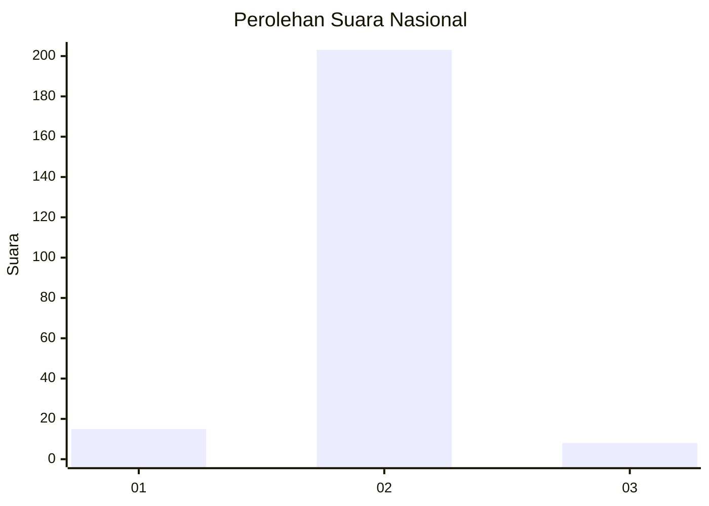
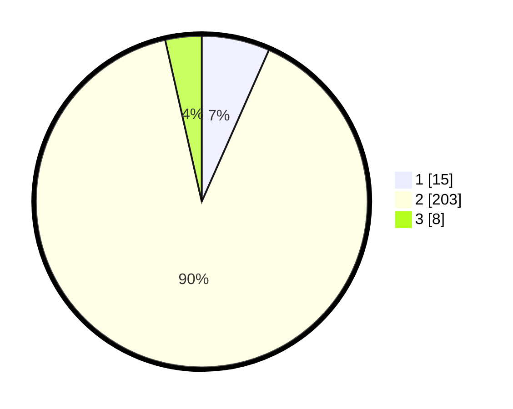

# Hasil

## Grafik

## Tabel

| No. | Nama Paslon    | Suara | Suara (raw) | Persentase |
|:--- |:-------------- | -----:| -----------:| ----------:|
| 1   | ANIES MUHAIMIN | 15    | [15][p-1]   | 6,64       |
| 2   | PRABOWO GIBRAN | 203   | [203][p-2]  | 89,82      |
| 3   | GANJAR MAHFUD  | 8     | [8][p-3]    | 3,54       |

[p-1]: https://github.com/gigit-pemilu/pemilu-2024/blob/main/pilpres/hitung-suara/sub/61-kalimantan-barat/sub/06-kapuas-hulu/sub/15-silat-hilir/sub/2002-baru/sub/003-tps/sub/paslon-1.txt
[p-2]: https://github.com/gigit-pemilu/pemilu-2024/blob/main/pilpres/hitung-suara/sub/61-kalimantan-barat/sub/06-kapuas-hulu/sub/15-silat-hilir/sub/2002-baru/sub/003-tps/sub/paslon-2.txt
[p-3]: https://github.com/gigit-pemilu/pemilu-2024/blob/main/pilpres/hitung-suara/sub/61-kalimantan-barat/sub/06-kapuas-hulu/sub/15-silat-hilir/sub/2002-baru/sub/003-tps/sub/paslon-3.txt

## Foto C Plano

https://sirekap-obj-formc.kpu.go.id/0bd8/pemilu/ppwp/61/06/15/20/02/6106152002003-20240220-105900--6a2e5ea6-9526-4352-9fe1-0271d609b541.jpg

https://sirekap-obj-formc.kpu.go.id/0bd8/pemilu/ppwp/61/06/15/20/02/6106152002003-20240220-105946--b4050085-6b6d-46e9-96e3-43f3d8fe71ab.jpg

https://sirekap-obj-formc.kpu.go.id/0bd8/pemilu/ppwp/61/06/15/20/02/6106152002003-20240220-110019--5e1d5ba6-dc7f-4b49-bbf9-b046c28459d8.jpg

## Metadata

| Key        | Value               |
| ---------- | ------------------- |
| Time Stamp | 2024-02-24 22:31:28 |

