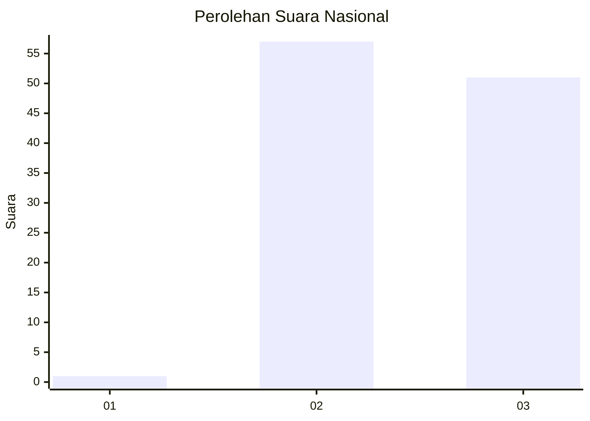
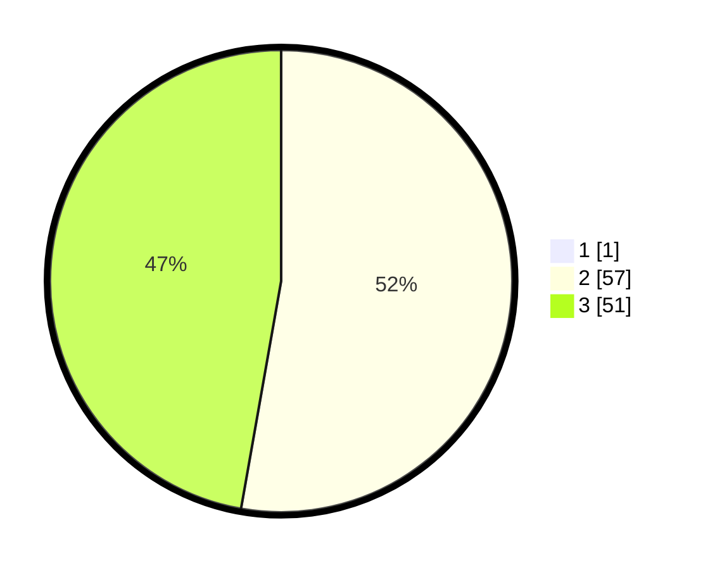

# Hasil

## Grafik

## Tabel

| No. | Nama Paslon    | Suara | Suara (raw) | Persentase |
|:--- |:-------------- | -----:| -----------:| ----------:|
| 1   | ANIES MUHAIMIN | 1     | [1][p-1]    | 0,92       |
| 2   | PRABOWO GIBRAN | 57    | [57][p-2]   | 52,29      |
| 3   | GANJAR MAHFUD  | 51    | [51][p-3]   | 46,79      |

[p-1]: https://github.com/gigit-pemilu/pemilu-2024/blob/main/pilpres/hitung-suara/sub/61-kalimantan-barat/sub/06-kapuas-hulu/sub/15-silat-hilir/sub/2004-miau-merah/sub/001-tps/sub/paslon-1.txt
[p-2]: https://github.com/gigit-pemilu/pemilu-2024/blob/main/pilpres/hitung-suara/sub/61-kalimantan-barat/sub/06-kapuas-hulu/sub/15-silat-hilir/sub/2004-miau-merah/sub/001-tps/sub/paslon-2.txt
[p-3]: https://github.com/gigit-pemilu/pemilu-2024/blob/main/pilpres/hitung-suara/sub/61-kalimantan-barat/sub/06-kapuas-hulu/sub/15-silat-hilir/sub/2004-miau-merah/sub/001-tps/sub/paslon-3.txt

## Foto C Plano

https://sirekap-obj-formc.kpu.go.id/56eb/pemilu/ppwp/61/06/15/20/04/6106152004001-20240222-153351--473e2634-c76f-4eac-9814-26b761589e4c.jpg

https://sirekap-obj-formc.kpu.go.id/56eb/pemilu/ppwp/61/06/15/20/04/6106152004001-20240222-153356--e58756d3-11ef-48b8-9fc3-d3b67fe1453a.jpg

https://sirekap-obj-formc.kpu.go.id/56eb/pemilu/ppwp/61/06/15/20/04/6106152004001-20240222-153401--3e1c5c4b-8a24-45ad-a71a-79c1c79f2e2f.jpg

## Metadata

| Key        | Value               |
| ---------- | ------------------- |
| Time Stamp | 2024-02-22 16:00:00 |

