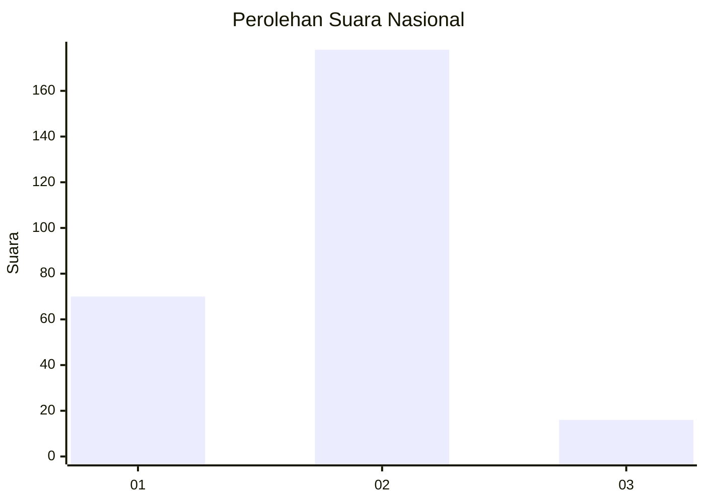
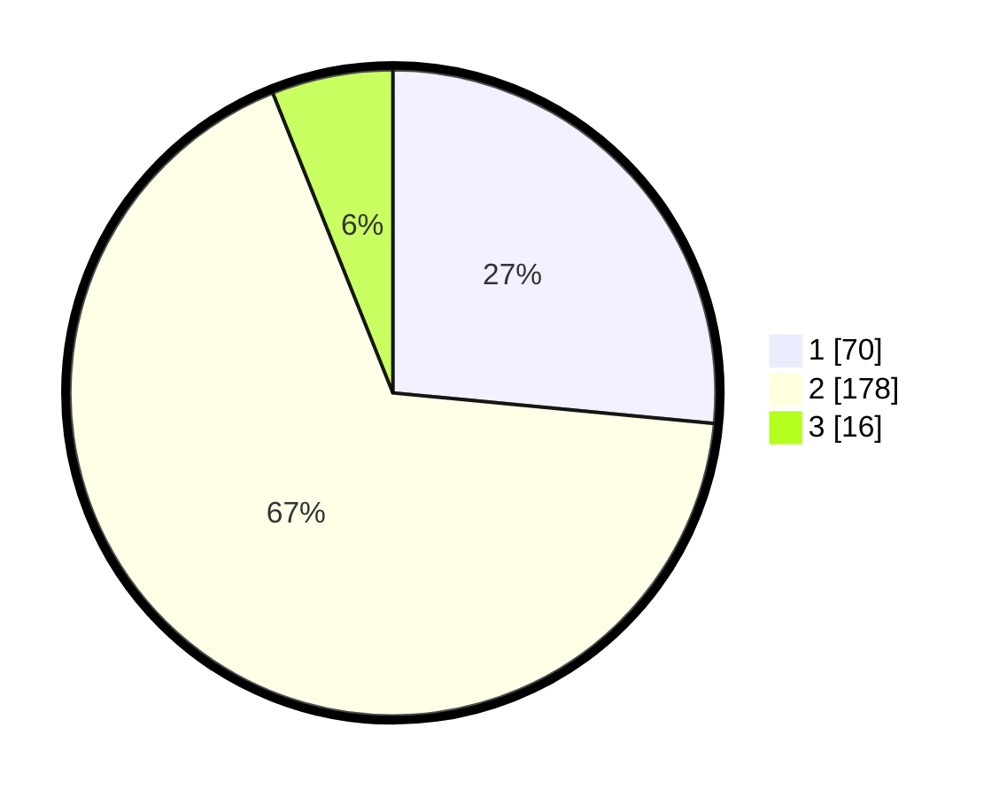

# Hasil

## Grafik

## Tabel

| No. | Nama Paslon    | Suara | Suara (raw) | Persentase |
|:--- |:-------------- | -----:| -----------:| ----------:|
| 1   | ANIES MUHAIMIN | 70    | [70][p-1]   | 26,52      |
| 2   | PRABOWO GIBRAN | 178   | [178][p-2]  | 67,42      |
| 3   | GANJAR MAHFUD  | 16    | [16][p-3]   | 6,06       |

[p-1]: https://github.com/gigit-pemilu/pemilu-2024/blob/main/pilpres/hitung-suara/sub/61-kalimantan-barat/sub/06-kapuas-hulu/sub/15-silat-hilir/sub/2008-nanga-nuar/sub/001-tps/sub/paslon-1.txt
[p-2]: https://github.com/gigit-pemilu/pemilu-2024/blob/main/pilpres/hitung-suara/sub/61-kalimantan-barat/sub/06-kapuas-hulu/sub/15-silat-hilir/sub/2008-nanga-nuar/sub/001-tps/sub/paslon-2.txt
[p-3]: https://github.com/gigit-pemilu/pemilu-2024/blob/main/pilpres/hitung-suara/sub/61-kalimantan-barat/sub/06-kapuas-hulu/sub/15-silat-hilir/sub/2008-nanga-nuar/sub/001-tps/sub/paslon-3.txt

## Foto C Plano

https://sirekap-obj-formc.kpu.go.id/2567/pemilu/ppwp/61/06/15/20/08/6106152008001-20240215-104821--56d4fd20-122a-4212-b8bf-ad19ae38658f.jpg

https://sirekap-obj-formc.kpu.go.id/2567/pemilu/ppwp/61/06/15/20/08/6106152008001-20240215-114401--de789623-57a0-46b3-ac32-660651850fbd.jpg

https://sirekap-obj-formc.kpu.go.id/2567/pemilu/ppwp/61/06/15/20/08/6106152008001-20240215-080944--b4ca9b4f-f57b-4943-a219-9d9bbd4ccf2f.jpg

## Metadata

| Key        | Value               |
| ---------- | ------------------- |
| Time Stamp | 2024-03-10 23:00:00 |

