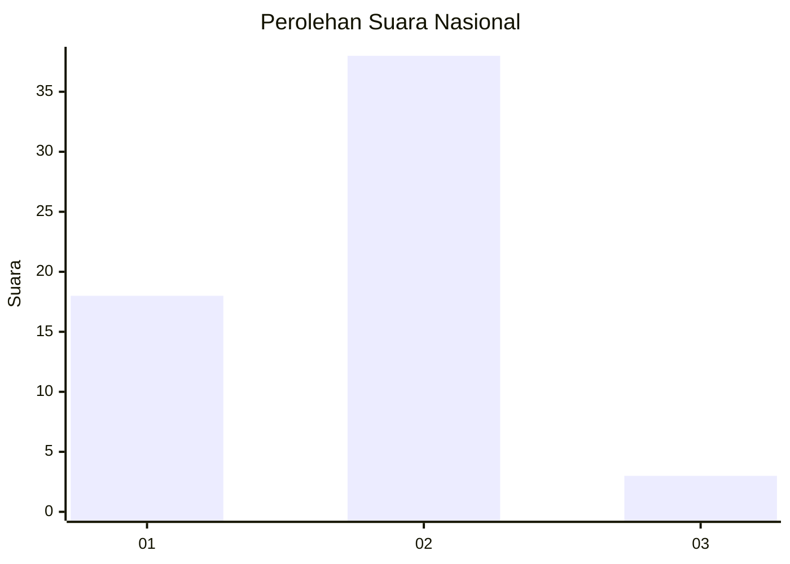
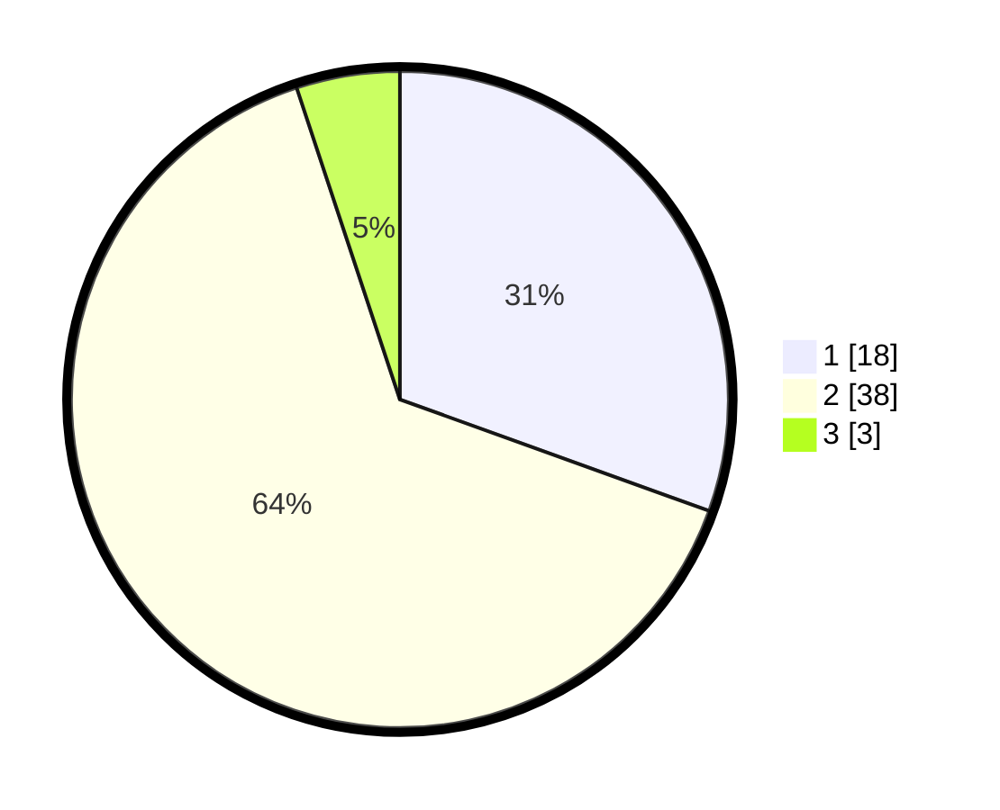

# Hasil

## Grafik

## Tabel

| No. | Nama Paslon    | Suara | Suara (raw) | Persentase |
|:--- |:-------------- | -----:| -----------:| ----------:|
| 1   | ANIES MUHAIMIN | 18    | [18][p-1]   | 30,51      |
| 2   | PRABOWO GIBRAN | 38    | [38][p-2]   | 64,41      |
| 3   | GANJAR MAHFUD  | 3     | [3][p-3]    | 5,08       |

[p-1]: https://github.com/gigit-pemilu/pemilu-2024/blob/main/pilpres/hitung-suara/sub/61-kalimantan-barat/sub/06-kapuas-hulu/sub/17-putussibau-selatan/sub/1001-kedamin-hulu/sub/005-tps/sub/paslon-1.txt
[p-2]: https://github.com/gigit-pemilu/pemilu-2024/blob/main/pilpres/hitung-suara/sub/61-kalimantan-barat/sub/06-kapuas-hulu/sub/17-putussibau-selatan/sub/1001-kedamin-hulu/sub/005-tps/sub/paslon-2.txt
[p-3]: https://github.com/gigit-pemilu/pemilu-2024/blob/main/pilpres/hitung-suara/sub/61-kalimantan-barat/sub/06-kapuas-hulu/sub/17-putussibau-selatan/sub/1001-kedamin-hulu/sub/005-tps/sub/paslon-3.txt

## Foto C Plano

https://sirekap-obj-formc.kpu.go.id/f0fa/pemilu/ppwp/61/06/17/10/01/6106171001005-20240220-111400--a6342fc1-78b5-4a64-90e1-55becd59d8f8.jpg

https://sirekap-obj-formc.kpu.go.id/f0fa/pemilu/ppwp/61/06/17/10/01/6106171001005-20240220-111401--cbe0eef2-bc0f-4d23-8de4-08f594bb0abc.jpg

https://sirekap-obj-formc.kpu.go.id/f0fa/pemilu/ppwp/61/06/17/10/01/6106171001005-20240220-111400--c48910ba-8c5a-48e2-9b21-8416a533e412.jpg

## Metadata

| Key        | Value               |
| ---------- | ------------------- |
| Time Stamp | 2024-02-24 22:31:28 |

## DATA PEMILIH TETAP

Jumlah pemilih dalam DPT: **63**.
 * L: **30**.
 * P: **33**.

## DATA PENGGUNA HAK PILIH

Jumlah pengguna hak pilih dalam DPT: **58**.
 * L: **28**.
 * P: **30**.

Jumlah pengguna hak pilih dalam DPTb: **0**.
 * L: **0**.
 * P: **0**.

Jumlah pengguna hak pilih dalam DPK: **4**.
 * L: **2**.
 * P: **2**.

Jumlah pengguna hak pilih: **62**.
 * L: **30**.
 * P: **32**.

## JUMLAH SUARA SAH DAN TIDAK SAH

JUMLAH SELURUH SUARA SAH: **59**.

JUMLAH SUARA TIDAK SAH: **3**.

JUMLAH SELURUH SUARA SAH DAN SUARA TIDAK SAH: **62**.

