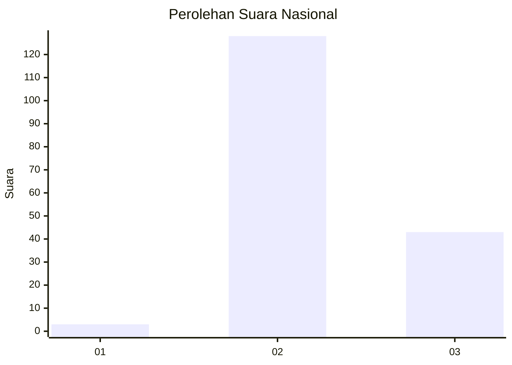
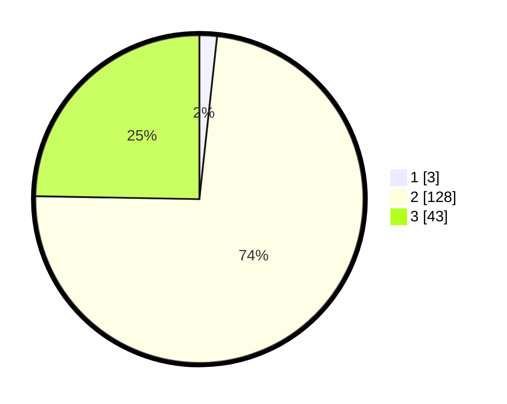

# Hasil

## Grafik

## Tabel

| No. | Nama Paslon    | Suara | Suara (raw) | Persentase |
|:--- |:-------------- | -----:| -----------:| ----------:|
| 1   | ANIES MUHAIMIN | 3     | [3][p-1]    | 1,72       |
| 2   | PRABOWO GIBRAN | 128   | [128][p-2]  | 73,56      |
| 3   | GANJAR MAHFUD  | 43    | [43][p-3]   | 24,71      |

[p-1]: https://github.com/gigit-pemilu/pemilu-2024/blob/main/pilpres/hitung-suara/sub/61-kalimantan-barat/sub/06-kapuas-hulu/sub/18-kalis/sub/2013-tapang-da'an/sub/002-tps/sub/paslon-1.txt
[p-2]: https://github.com/gigit-pemilu/pemilu-2024/blob/main/pilpres/hitung-suara/sub/61-kalimantan-barat/sub/06-kapuas-hulu/sub/18-kalis/sub/2013-tapang-da'an/sub/002-tps/sub/paslon-2.txt
[p-3]: https://github.com/gigit-pemilu/pemilu-2024/blob/main/pilpres/hitung-suara/sub/61-kalimantan-barat/sub/06-kapuas-hulu/sub/18-kalis/sub/2013-tapang-da'an/sub/002-tps/sub/paslon-3.txt

## Foto C Plano

https://sirekap-obj-formc.kpu.go.id/c92b/pemilu/ppwp/61/06/18/20/13/6106182013002-20240215-091137--434cec72-6a6c-4bc1-9b3f-ca22a349f8e0.jpg

https://sirekap-obj-formc.kpu.go.id/c92b/pemilu/ppwp/61/06/18/20/13/6106182013002-20240215-091239--810e7f5a-c211-4308-9abf-6c0ff4c69dae.jpg

https://sirekap-obj-formc.kpu.go.id/c92b/pemilu/ppwp/61/06/18/20/13/6106182013002-20240215-110304--5e6710a3-b5d4-4c4e-ba74-aaf379dca7d2.jpg

## Metadata

| Key        | Value               |
| ---------- | ------------------- |
| Time Stamp | 2024-02-24 22:31:28 |

