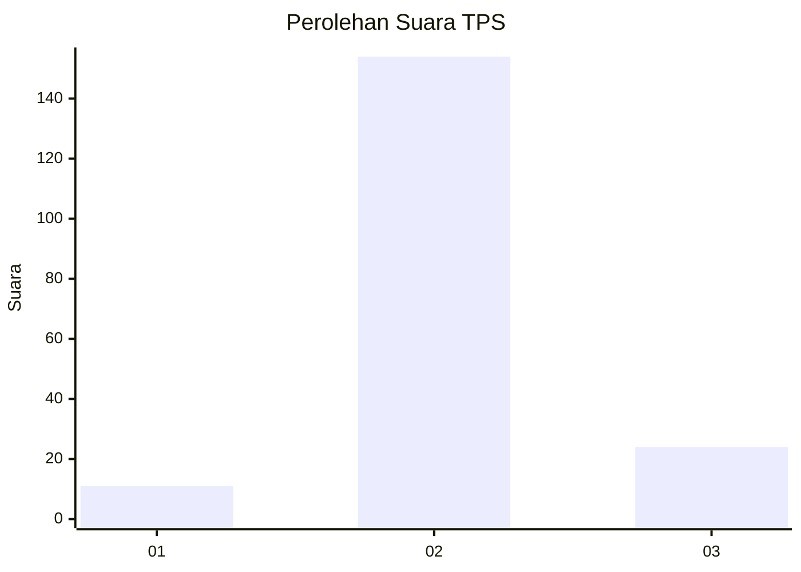
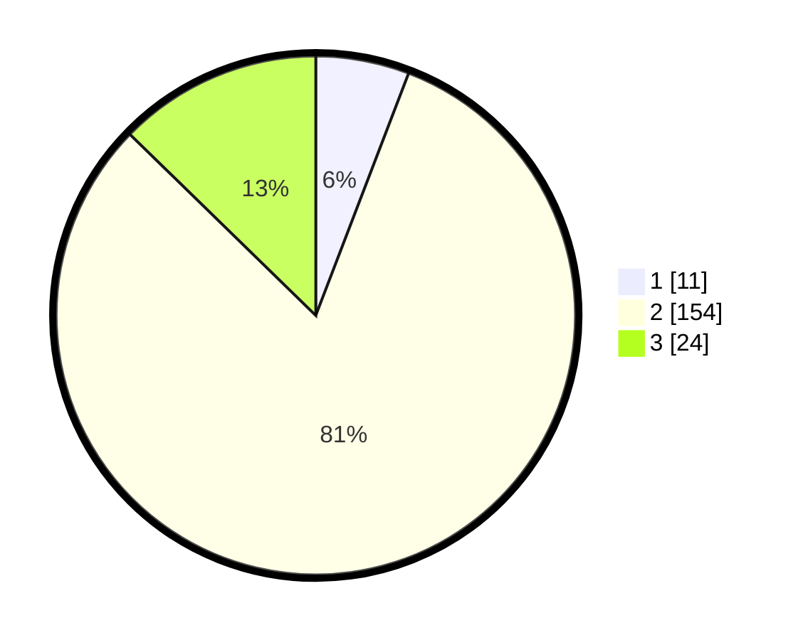

# Hasil

## Grafik

## Tabel

| No. | Nama Paslon    | Suara | Suara (raw) | Persentase |
|:--- |:-------------- | -----:| -----------:| ----------:|
| 1   | ANIES MUHAIMIN | 11    | [11][p-1]   | 5,82       |
| 2   | PRABOWO GIBRAN | 154   | [154][p-2]  | 81,48      |
| 3   | GANJAR MAHFUD  | 24    | [24][p-3]   | 12,70      |

[p-1]: https://github.com/gigit-pemilu/pemilu-2024-61-kalimantan-barat/blob/main/pilpres/hitung-suara/sub/61-kalimantan-barat/sub/06-kapuas-hulu/sub/19-boyan-tanjung/sub/2001-nanga-danau/sub/001-tps/sub/paslon-1.txt
[p-2]: https://github.com/gigit-pemilu/pemilu-2024-61-kalimantan-barat/blob/main/pilpres/hitung-suara/sub/61-kalimantan-barat/sub/06-kapuas-hulu/sub/19-boyan-tanjung/sub/2001-nanga-danau/sub/001-tps/sub/paslon-2.txt
[p-3]: https://github.com/gigit-pemilu/pemilu-2024-61-kalimantan-barat/blob/main/pilpres/hitung-suara/sub/61-kalimantan-barat/sub/06-kapuas-hulu/sub/19-boyan-tanjung/sub/2001-nanga-danau/sub/001-tps/sub/paslon-3.txt

## Foto C Plano

https://sirekap-obj-formc.kpu.go.id/5a17/pemilu/ppwp/61/06/19/20/01/6106192001001-20240220-094420--49252013-03fa-48c9-8d2a-9a81f1a6347c.jpg

https://sirekap-obj-formc.kpu.go.id/5a17/pemilu/ppwp/61/06/19/20/01/6106192001001-20240220-093841--898c3cb3-339d-40c3-8ca8-58c7185dccda.jpg

https://sirekap-obj-formc.kpu.go.id/5a17/pemilu/ppwp/61/06/19/20/01/6106192001001-20240220-094627--d2428a85-6af7-465c-a5ba-2d4559811c2f.jpg

## Metadata

| Key        | Value               |
| ---------- | ------------------- |
| Time Stamp | 2024-02-21 03:00:00 |

