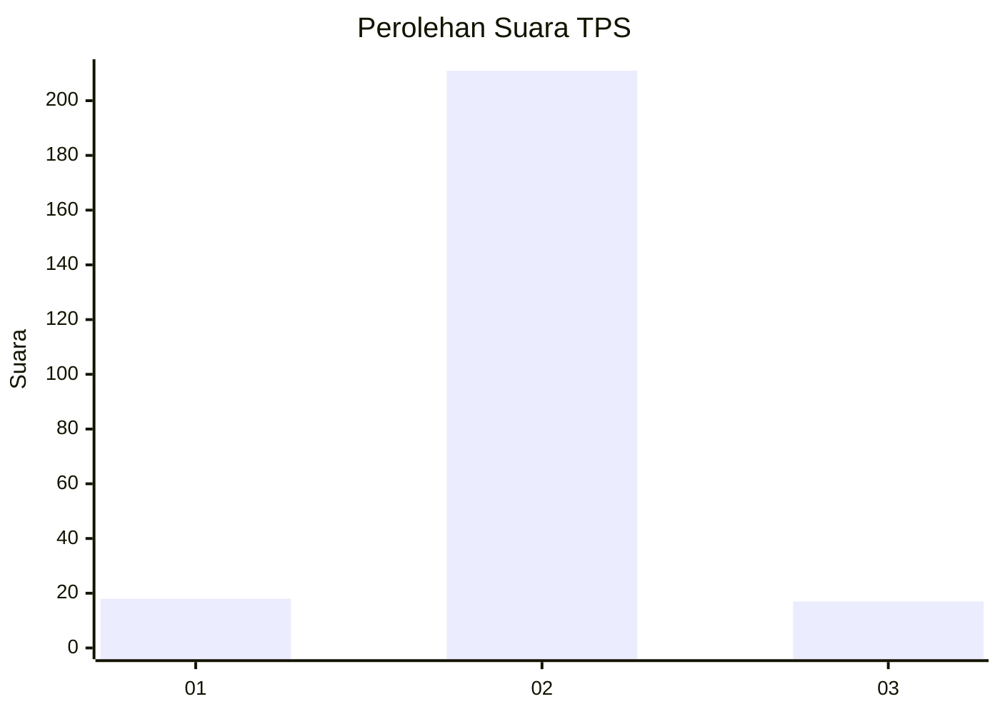
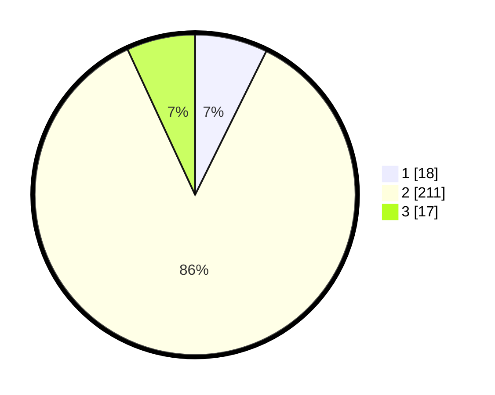

# Hasil

## Grafik

## Tabel

| No. | Nama Paslon    | Suara | Suara (raw) | Persentase |
|:--- |:-------------- | -----:| -----------:| ----------:|
| 1   | ANIES MUHAIMIN | 18    | [18][p-1]   | 7,32       |
| 2   | PRABOWO GIBRAN | 211   | [211][p-2]  | 85,77      |
| 3   | GANJAR MAHFUD  | 17    | [17][p-3]   | 6,91       |

[p-1]: https://github.com/gigit-pemilu/pemilu-2024-61-kalimantan-barat/blob/main/pilpres/hitung-suara/sub/61-kalimantan-barat/sub/06-kapuas-hulu/sub/19-boyan-tanjung/sub/2001-nanga-danau/sub/003-tps/sub/paslon-1.txt
[p-2]: https://github.com/gigit-pemilu/pemilu-2024-61-kalimantan-barat/blob/main/pilpres/hitung-suara/sub/61-kalimantan-barat/sub/06-kapuas-hulu/sub/19-boyan-tanjung/sub/2001-nanga-danau/sub/003-tps/sub/paslon-2.txt
[p-3]: https://github.com/gigit-pemilu/pemilu-2024-61-kalimantan-barat/blob/main/pilpres/hitung-suara/sub/61-kalimantan-barat/sub/06-kapuas-hulu/sub/19-boyan-tanjung/sub/2001-nanga-danau/sub/003-tps/sub/paslon-3.txt

## Foto C Plano

https://sirekap-obj-formc.kpu.go.id/d4bc/pemilu/ppwp/61/06/19/20/01/6106192001003-20240215-084115--aaf516e1-d93a-4bfc-bc89-a6af8bf0d24f.jpg

https://sirekap-obj-formc.kpu.go.id/d4bc/pemilu/ppwp/61/06/19/20/01/6106192001003-20240215-154656--d48bbc63-94ac-43c4-b013-137cc3b92427.jpg

https://sirekap-obj-formc.kpu.go.id/d4bc/pemilu/ppwp/61/06/19/20/01/6106192001003-20240215-163234--0dfbda52-f179-4c03-84cb-cf199e7436de.jpg

## Metadata

| Key        | Value               |
| ---------- | ------------------- |
| Time Stamp | 2024-02-16 21:01:00 |

