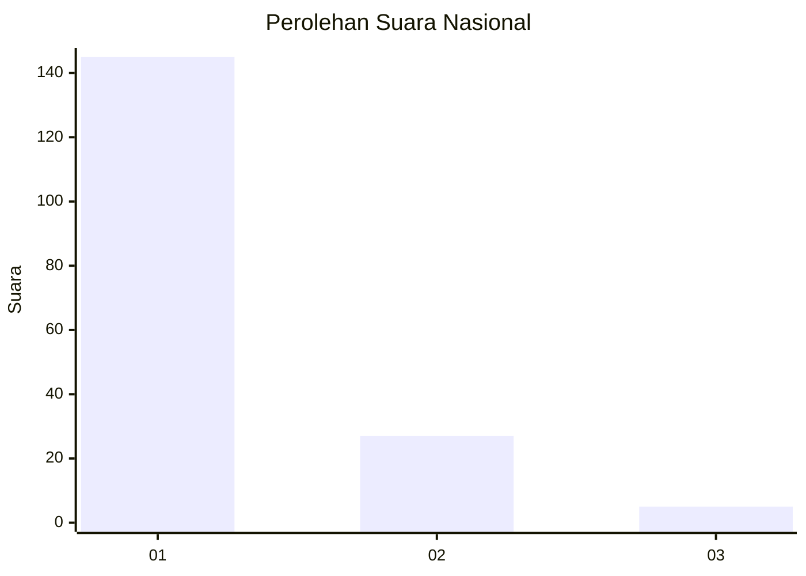
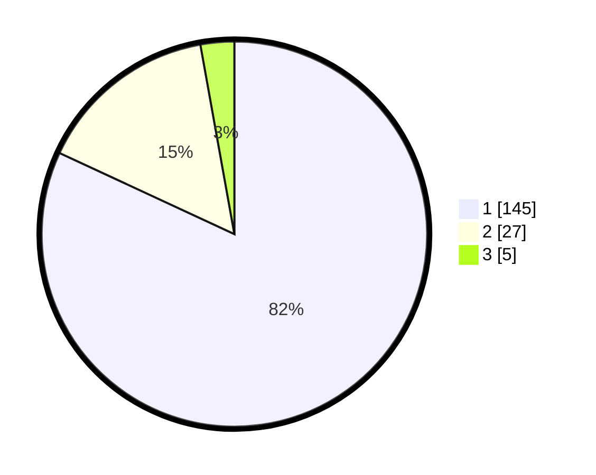

# Hasil

## Grafik

## Tabel

| No. | Nama Paslon    | Suara | Suara (raw) | Persentase |
|:--- |:-------------- | -----:| -----------:| ----------:|
| 1   | ANIES MUHAIMIN | 145   | [145][p-1]  | 81,92      |
| 2   | PRABOWO GIBRAN | 27    | [27][p-2]   | 15,25      |
| 3   | GANJAR MAHFUD  | 5     | [5][p-3]    | 2,82       |

[p-1]: https://github.com/gigit-pemilu/pemilu-2024/blob/main/pilpres/hitung-suara/sub/61-kalimantan-barat/sub/06-kapuas-hulu/sub/21-pengkadan/sub/2009-sasan/sub/002-tps/sub/paslon-1.txt
[p-2]: https://github.com/gigit-pemilu/pemilu-2024/blob/main/pilpres/hitung-suara/sub/61-kalimantan-barat/sub/06-kapuas-hulu/sub/21-pengkadan/sub/2009-sasan/sub/002-tps/sub/paslon-2.txt
[p-3]: https://github.com/gigit-pemilu/pemilu-2024/blob/main/pilpres/hitung-suara/sub/61-kalimantan-barat/sub/06-kapuas-hulu/sub/21-pengkadan/sub/2009-sasan/sub/002-tps/sub/paslon-3.txt

## Foto C Plano

https://sirekap-obj-formc.kpu.go.id/aeea/pemilu/ppwp/61/06/21/20/09/6106212009002-20240218-133851--97650307-2a46-4e1b-b0dd-736789e43e74.jpg

https://sirekap-obj-formc.kpu.go.id/aeea/pemilu/ppwp/61/06/21/20/09/6106212009002-20240218-133944--3e15b760-f9e8-4f33-81e5-0587587361aa.jpg

https://sirekap-obj-formc.kpu.go.id/aeea/pemilu/ppwp/61/06/21/20/09/6106212009002-20240218-134028--7a0422a6-c152-40cd-bc5e-0a8e3667bfdf.jpg

## Metadata

| Key        | Value               |
| ---------- | ------------------- |
| Time Stamp | 2024-02-25 11:00:00 |

