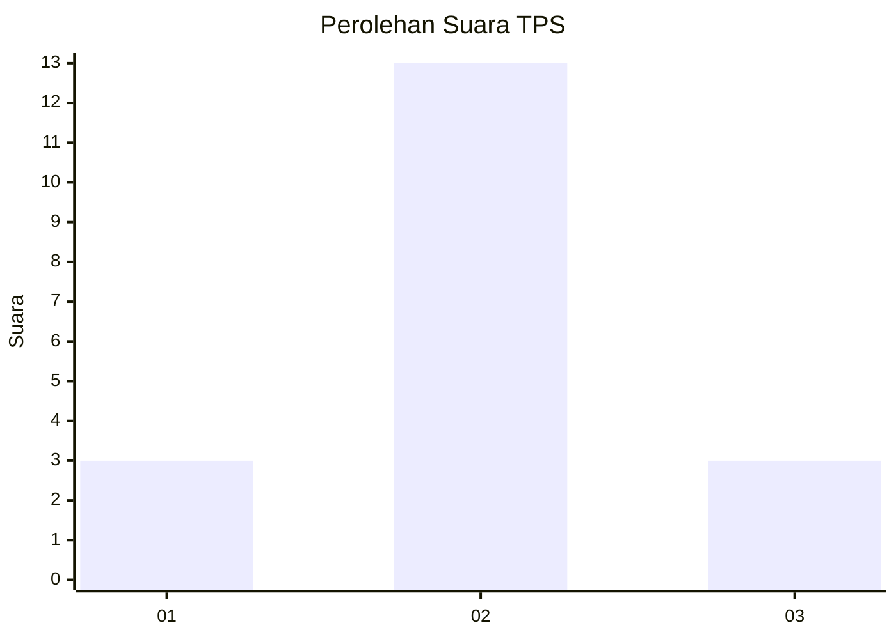
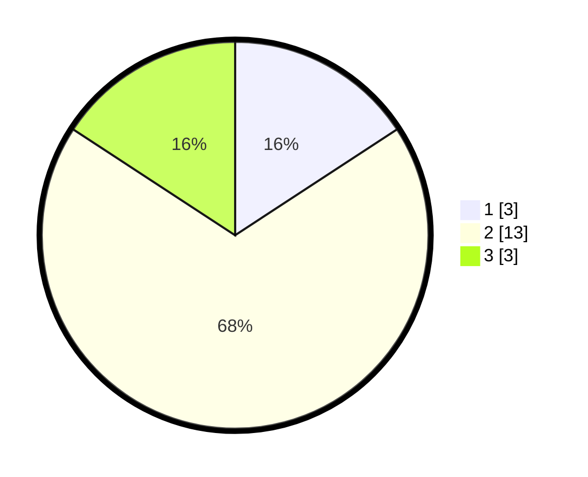

# Hasil

## Grafik

## Tabel

| No. | Nama Paslon    | Suara | Suara (raw) | Persentase |
|:--- |:-------------- | -----:| -----------:| ----------:|
| 1   | ANIES MUHAIMIN | 3     | [3][p-1]    | 15,79      |
| 2   | PRABOWO GIBRAN | 13    | [13][p-2]   | 68,42      |
| 3   | GANJAR MAHFUD  | 3     | [3][p-3]    | 15,79      |

[p-1]: https://github.com/gigit-pemilu/pemilu-2024-61-kalimantan-barat/blob/main/pilpres/hitung-suara/sub/61-kalimantan-barat/sub/06-kapuas-hulu/sub/23-puring-kencana/sub/2001-sungai-antu/sub/002-tps/sub/paslon-1.txt
[p-2]: https://github.com/gigit-pemilu/pemilu-2024-61-kalimantan-barat/blob/main/pilpres/hitung-suara/sub/61-kalimantan-barat/sub/06-kapuas-hulu/sub/23-puring-kencana/sub/2001-sungai-antu/sub/002-tps/sub/paslon-2.txt
[p-3]: https://github.com/gigit-pemilu/pemilu-2024-61-kalimantan-barat/blob/main/pilpres/hitung-suara/sub/61-kalimantan-barat/sub/06-kapuas-hulu/sub/23-puring-kencana/sub/2001-sungai-antu/sub/002-tps/sub/paslon-3.txt

## Foto C Plano

https://sirekap-obj-formc.kpu.go.id/be34/pemilu/ppwp/61/06/23/20/01/6106232001002-20240216-125638--831c3013-7207-439d-9f03-0b7ed987ad3d.jpg

https://sirekap-obj-formc.kpu.go.id/be34/pemilu/ppwp/61/06/23/20/01/6106232001002-20240216-125640--72f21c64-2e42-4f4c-90e4-e57ac03d523f.jpg

https://sirekap-obj-formc.kpu.go.id/be34/pemilu/ppwp/61/06/23/20/01/6106232001002-20240216-125639--adc48207-2242-4336-8342-b69256d040d0.jpg

## Metadata

| Key        | Value               |
| ---------- | ------------------- |
| Time Stamp | 2024-02-16 13:30:32 |

## DATA PEMILIH TETAP

Jumlah pemilih dalam DPT: **36**.
 * L: **17**.
 * P: **19**.

## DATA PENGGUNA HAK PILIH

Jumlah pengguna hak pilih dalam DPT: **19**.
 * L: **8**.
 * P: **11**.

Jumlah pengguna hak pilih dalam DPTb: **0**.
 * L: **0**.
 * P: **0**.

Jumlah pengguna hak pilih dalam DPK: **0**.
 * L: **0**.
 * P: **0**.

Jumlah pengguna hak pilih: **19**.
 * L: **8**.
 * P: **11**.

## JUMLAH SUARA SAH DAN TIDAK SAH

JUMLAH SELURUH SUARA SAH: **19**.

JUMLAH SUARA TIDAK SAH: **0**.

JUMLAH SELURUH SUARA SAH DAN SUARA TIDAK SAH: **19**.

