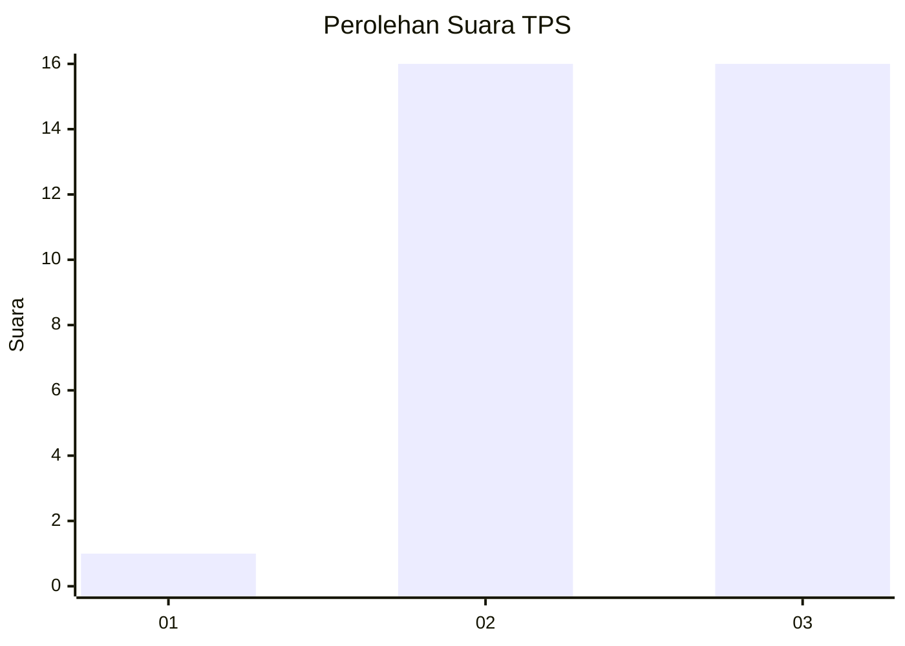
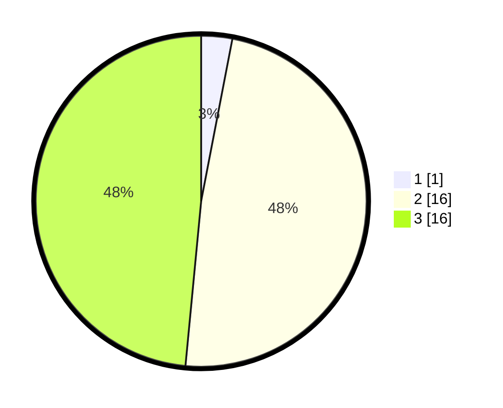

# Hasil

## Grafik

## Tabel

| No. | Nama Paslon    | Suara | Suara (raw) | Persentase |
|:--- |:-------------- | -----:| -----------:| ----------:|
| 1   | ANIES MUHAIMIN | 1     | [1][p-1]    | 3,03       |
| 2   | PRABOWO GIBRAN | 16    | [16][p-2]   | 48,48      |
| 3   | GANJAR MAHFUD  | 16    | [16][p-3]   | 48,48      |

[p-1]: https://github.com/gigit-pemilu/pemilu-2024-61-kalimantan-barat/blob/main/pilpres/hitung-suara/sub/61-kalimantan-barat/sub/06-kapuas-hulu/sub/23-puring-kencana/sub/2002-merakai-panjang/sub/002-tps/sub/paslon-1.txt
[p-2]: https://github.com/gigit-pemilu/pemilu-2024-61-kalimantan-barat/blob/main/pilpres/hitung-suara/sub/61-kalimantan-barat/sub/06-kapuas-hulu/sub/23-puring-kencana/sub/2002-merakai-panjang/sub/002-tps/sub/paslon-2.txt
[p-3]: https://github.com/gigit-pemilu/pemilu-2024-61-kalimantan-barat/blob/main/pilpres/hitung-suara/sub/61-kalimantan-barat/sub/06-kapuas-hulu/sub/23-puring-kencana/sub/2002-merakai-panjang/sub/002-tps/sub/paslon-3.txt

## Foto C Plano

https://sirekap-obj-formc.kpu.go.id/7f57/pemilu/ppwp/61/06/23/20/02/6106232002002-20240216-144301--973992b4-c58b-4d80-934c-8e324bc604ba.jpg

https://sirekap-obj-formc.kpu.go.id/7f57/pemilu/ppwp/61/06/23/20/02/6106232002002-20240216-144302--7112b30e-4b58-4864-aae6-fd5f5182cd8c.jpg

https://sirekap-obj-formc.kpu.go.id/7f57/pemilu/ppwp/61/06/23/20/02/6106232002002-20240216-144301--cdc5d154-cd7b-4674-885b-d56a1bf347b1.jpg

## Metadata

| Key        | Value               |
| ---------- | ------------------- |
| Time Stamp | 2024-02-21 20:00:00 |

## DATA PEMILIH TETAP

Jumlah pemilih dalam DPT: **49**.
 * L: **23**.
 * P: **26**.

## DATA PENGGUNA HAK PILIH

Jumlah pengguna hak pilih dalam DPT: **32**.
 * L: **14**.
 * P: **18**.

Jumlah pengguna hak pilih dalam DPTb: **1**.
 * L: **0**.
 * P: **1**.

Jumlah pengguna hak pilih dalam DPK: **0**.
 * L: **0**.
 * P: **0**.

Jumlah pengguna hak pilih: **33**.
 * L: **14**.
 * P: **19**.

## JUMLAH SUARA SAH DAN TIDAK SAH

JUMLAH SELURUH SUARA SAH: **0**.

JUMLAH SUARA TIDAK SAH: **0**.

JUMLAH SELURUH SUARA SAH DAN SUARA TIDAK SAH: **0**.

