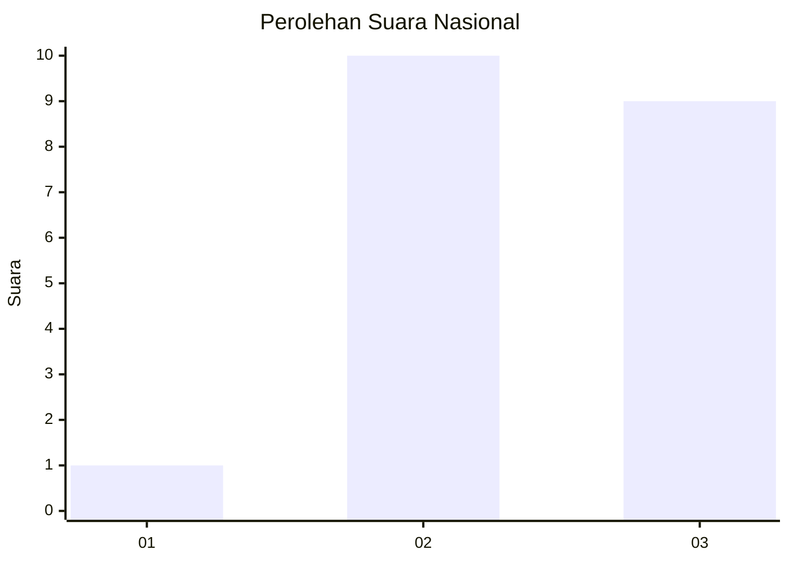
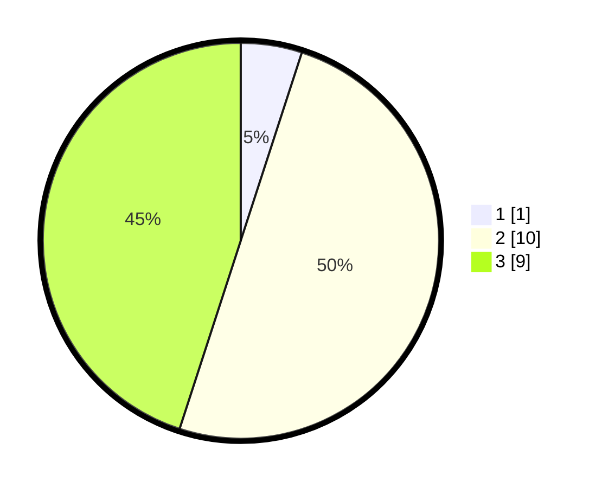

# Hasil

## Grafik

## Tabel

| No. | Nama Paslon    | Suara | Suara (raw) | Persentase |
|:--- |:-------------- | -----:| -----------:| ----------:|
| 1   | ANIES MUHAIMIN | 1     | [1][p-1]    | 5,00       |
| 2   | PRABOWO GIBRAN | 10    | [10][p-2]   | 50,00      |
| 3   | GANJAR MAHFUD  | 9     | [9][p-3]    | 45,00      |

[p-1]: https://github.com/gigit-pemilu/pemilu-2024/blob/main/pilpres/hitung-suara/sub/61-kalimantan-barat/sub/06-kapuas-hulu/sub/23-puring-kencana/sub/2006-langau/sub/002-tps/sub/paslon-1.txt
[p-2]: https://github.com/gigit-pemilu/pemilu-2024/blob/main/pilpres/hitung-suara/sub/61-kalimantan-barat/sub/06-kapuas-hulu/sub/23-puring-kencana/sub/2006-langau/sub/002-tps/sub/paslon-2.txt
[p-3]: https://github.com/gigit-pemilu/pemilu-2024/blob/main/pilpres/hitung-suara/sub/61-kalimantan-barat/sub/06-kapuas-hulu/sub/23-puring-kencana/sub/2006-langau/sub/002-tps/sub/paslon-3.txt

## Foto C Plano

https://sirekap-obj-formc.kpu.go.id/47c9/pemilu/ppwp/61/06/23/20/06/6106232006002-20240216-152325--8bf71ddf-0d93-4998-bba6-fecde2075c87.jpg

https://sirekap-obj-formc.kpu.go.id/47c9/pemilu/ppwp/61/06/23/20/06/6106232006002-20240216-152326--b6ccfeb2-c035-4420-bd16-fb45e35d2f22.jpg

https://sirekap-obj-formc.kpu.go.id/47c9/pemilu/ppwp/61/06/23/20/06/6106232006002-20240216-152325--4573efae-a650-4520-8865-d24c0e2b5aa4.jpg

## Metadata

| Key        | Value               |
| ---------- | ------------------- |
| Time Stamp | 2024-02-16 22:01:00 |

## DATA PEMILIH TETAP

Jumlah pemilih dalam DPT: **36**.
 * L: **17**.
 * P: **19**.

## DATA PENGGUNA HAK PILIH

Jumlah pengguna hak pilih dalam DPT: **18**.
 * L: **11**.
 * P: **7**.

Jumlah pengguna hak pilih dalam DPTb: **2**.
 * L: **2**.
 * P: **0**.

Jumlah pengguna hak pilih dalam DPK: **0**.
 * L: **0**.
 * P: **0**.

Jumlah pengguna hak pilih: **20**.
 * L: **13**.
 * P: **7**.

## JUMLAH SUARA SAH DAN TIDAK SAH

JUMLAH SELURUH SUARA SAH: **20**.

JUMLAH SUARA TIDAK SAH: **0**.

JUMLAH SELURUH SUARA SAH DAN SUARA TIDAK SAH: **20**.

