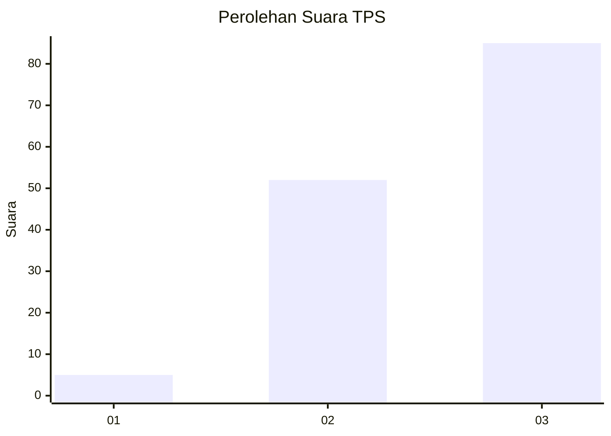
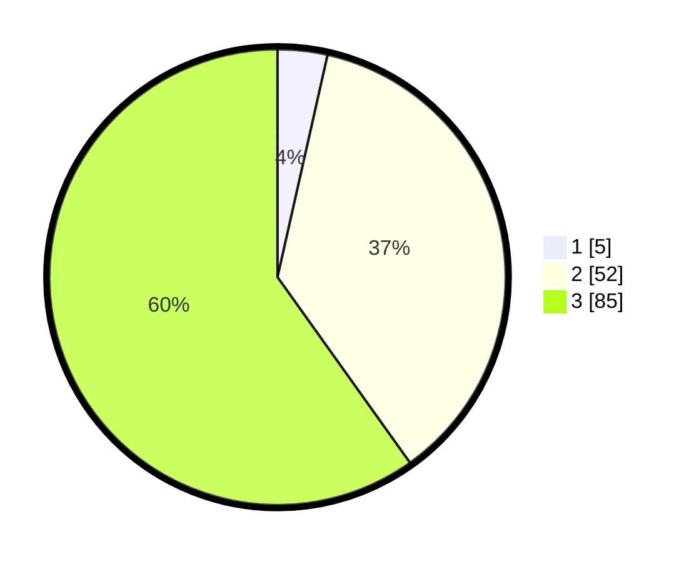

# Hasil

## Grafik

## Tabel

| No. | Nama Paslon    | Suara | Suara (raw) | Persentase |
|:--- |:-------------- | -----:| -----------:| ----------:|
| 1   | ANIES MUHAIMIN | 5     | [5][p-1]    | 3,52       |
| 2   | PRABOWO GIBRAN | 52    | [52][p-2]   | 36,62      |
| 3   | GANJAR MAHFUD  | 85    | [85][p-3]   | 59,86      |

[p-1]: https://github.com/gigit-pemilu/pemilu-2024-61-kalimantan-barat/blob/main/pilpres/hitung-suara/sub/61-kalimantan-barat/sub/07-bengkayang/sub/01-sungai-raya/sub/2001-sungai-duri/sub/001-tps/sub/paslon-1.txt
[p-2]: https://github.com/gigit-pemilu/pemilu-2024-61-kalimantan-barat/blob/main/pilpres/hitung-suara/sub/61-kalimantan-barat/sub/07-bengkayang/sub/01-sungai-raya/sub/2001-sungai-duri/sub/001-tps/sub/paslon-2.txt
[p-3]: https://github.com/gigit-pemilu/pemilu-2024-61-kalimantan-barat/blob/main/pilpres/hitung-suara/sub/61-kalimantan-barat/sub/07-bengkayang/sub/01-sungai-raya/sub/2001-sungai-duri/sub/001-tps/sub/paslon-3.txt

## Foto C Plano

https://sirekap-obj-formc.kpu.go.id/7bd4/pemilu/ppwp/61/07/01/20/01/6107012001001-20240216-041554--84027b51-e0c2-433a-a8e1-954b2f132b11.jpg

https://sirekap-obj-formc.kpu.go.id/7bd4/pemilu/ppwp/61/07/01/20/01/6107012001001-20240216-040032--55c3f78c-a59d-4411-a032-7ee08c1f59ca.jpg

https://sirekap-obj-formc.kpu.go.id/7bd4/pemilu/ppwp/61/07/01/20/01/6107012001001-20240216-041555--ef5e4569-c6fe-4ddb-8072-e9b62a9310a3.jpg

## Metadata

| Key        | Value               |
| ---------- | ------------------- |
| Time Stamp | 2024-02-16 14:30:33 |

## DATA PEMILIH TETAP

Jumlah pemilih dalam DPT: **226**.
 * L: **117**.
 * P: **109**.

## DATA PENGGUNA HAK PILIH

Jumlah pengguna hak pilih dalam DPT: **148**.
 * L: **74**.
 * P: **64**.

Jumlah pengguna hak pilih dalam DPTb: **4**.
 * L: **1**.
 * P: **3**.

Jumlah pengguna hak pilih dalam DPK: **9**.
 * L: **4**.
 * P: **5**.

Jumlah pengguna hak pilih: **161**.
 * L: **76**.
 * P: **72**.

## JUMLAH SUARA SAH DAN TIDAK SAH

JUMLAH SELURUH SUARA SAH: **142**.

JUMLAH SUARA TIDAK SAH: **6**.

JUMLAH SELURUH SUARA SAH DAN SUARA TIDAK SAH: **148**.

