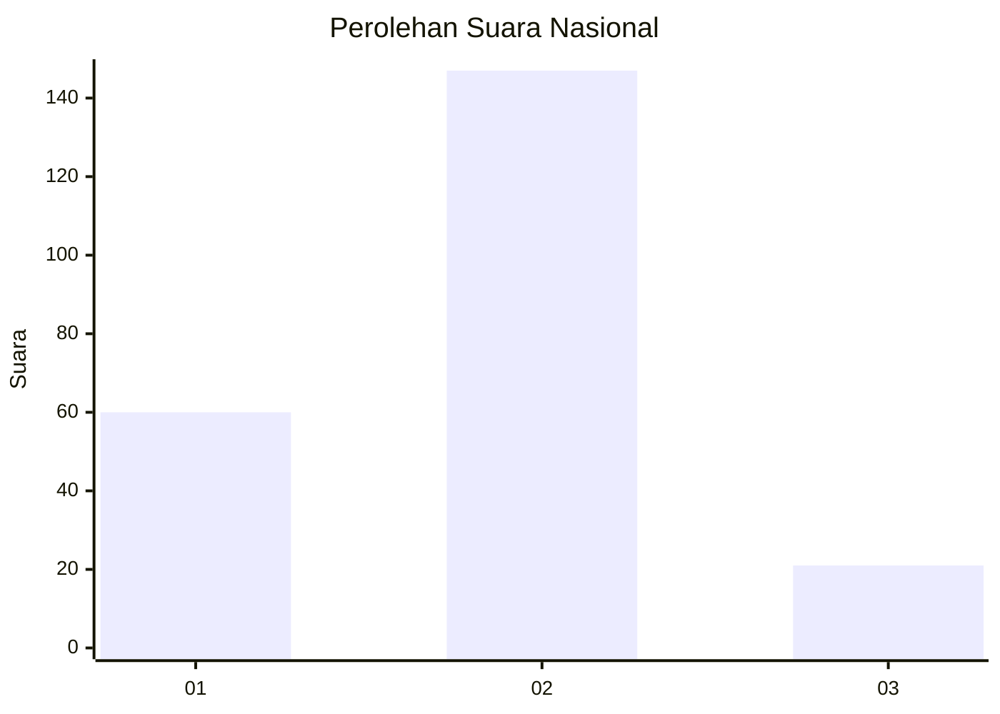
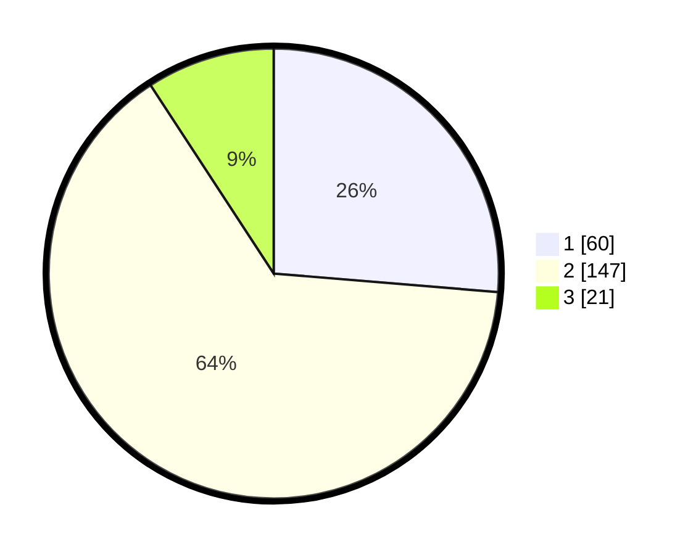

# Hasil

## Grafik

## Tabel

| No. | Nama Paslon    | Suara | Suara (raw) | Persentase |
|:--- |:-------------- | -----:| -----------:| ----------:|
| 1   | ANIES MUHAIMIN | 60    | [60][p-1]   | 26,32      |
| 2   | PRABOWO GIBRAN | 147   | [147][p-2]  | 64,47      |
| 3   | GANJAR MAHFUD  | 21    | [21][p-3]   | 9,21       |

[p-1]: https://github.com/gigit-pemilu/pemilu-2024/blob/main/pilpres/hitung-suara/sub/61-kalimantan-barat/sub/07-bengkayang/sub/01-sungai-raya/sub/2001-sungai-duri/sub/004-tps/sub/paslon-1.txt
[p-2]: https://github.com/gigit-pemilu/pemilu-2024/blob/main/pilpres/hitung-suara/sub/61-kalimantan-barat/sub/07-bengkayang/sub/01-sungai-raya/sub/2001-sungai-duri/sub/004-tps/sub/paslon-2.txt
[p-3]: https://github.com/gigit-pemilu/pemilu-2024/blob/main/pilpres/hitung-suara/sub/61-kalimantan-barat/sub/07-bengkayang/sub/01-sungai-raya/sub/2001-sungai-duri/sub/004-tps/sub/paslon-3.txt

## Foto C Plano

https://sirekap-obj-formc.kpu.go.id/b648/pemilu/ppwp/61/07/01/20/01/6107012001004-20240215-093835--06432c51-7b6f-42bb-8249-6cf220c91b1c.jpg

https://sirekap-obj-formc.kpu.go.id/b648/pemilu/ppwp/61/07/01/20/01/6107012001004-20240215-093810--88fbcbbd-274c-4bf5-938b-f4687cb0dc73.jpg

https://sirekap-obj-formc.kpu.go.id/b648/pemilu/ppwp/61/07/01/20/01/6107012001004-20240215-112410--2868701c-5e5e-4bc2-8398-a77751d51fd4.jpg

## Metadata

| Key        | Value               |
| ---------- | ------------------- |
| Time Stamp | 2024-02-16 08:00:28 |

