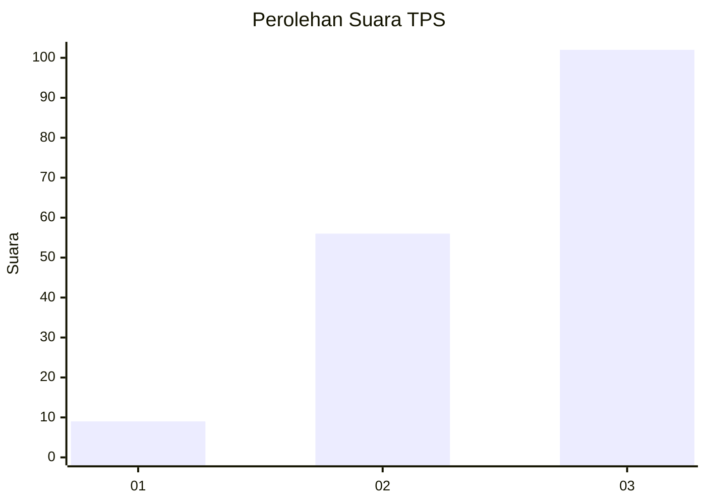
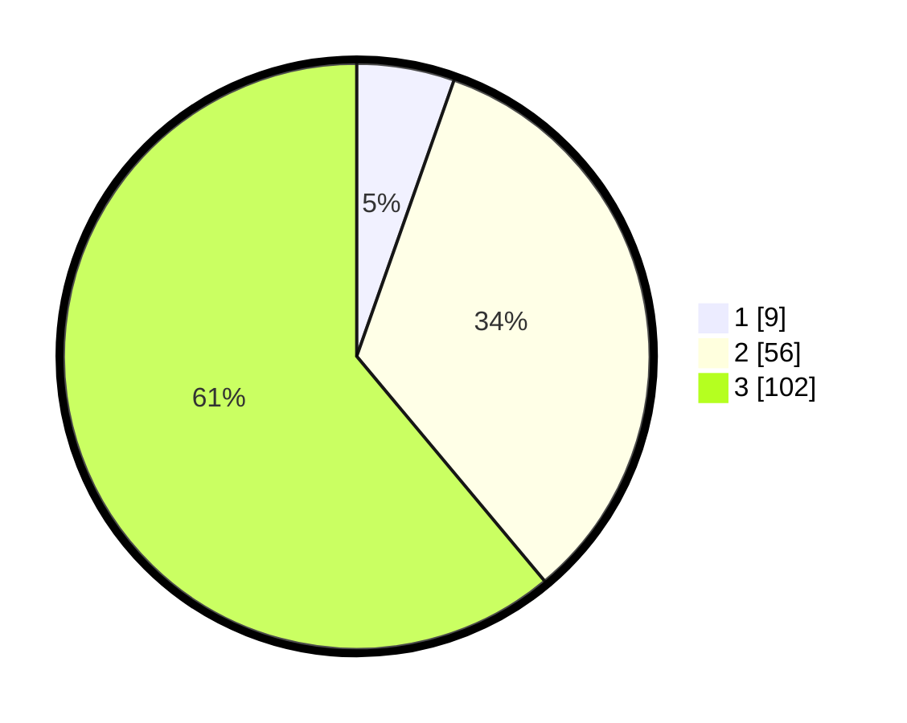

# Hasil

## Grafik

## Tabel

| No. | Nama Paslon    | Suara | Suara (raw) | Persentase |
|:--- |:-------------- | -----:| -----------:| ----------:|
| 1   | ANIES MUHAIMIN | 9     | [9][p-1]    | 5,39       |
| 2   | PRABOWO GIBRAN | 56    | [56][p-2]   | 33,53      |
| 3   | GANJAR MAHFUD  | 102   | [102][p-3]  | 61,08      |

[p-1]: https://github.com/gigit-pemilu/pemilu-2024-61-kalimantan-barat/blob/main/pilpres/hitung-suara/sub/61-kalimantan-barat/sub/07-bengkayang/sub/01-sungai-raya/sub/2004-sungai-jaga-a/sub/003-tps/sub/paslon-1.txt
[p-2]: https://github.com/gigit-pemilu/pemilu-2024-61-kalimantan-barat/blob/main/pilpres/hitung-suara/sub/61-kalimantan-barat/sub/07-bengkayang/sub/01-sungai-raya/sub/2004-sungai-jaga-a/sub/003-tps/sub/paslon-2.txt
[p-3]: https://github.com/gigit-pemilu/pemilu-2024-61-kalimantan-barat/blob/main/pilpres/hitung-suara/sub/61-kalimantan-barat/sub/07-bengkayang/sub/01-sungai-raya/sub/2004-sungai-jaga-a/sub/003-tps/sub/paslon-3.txt

## Foto C Plano

https://sirekap-obj-formc.kpu.go.id/407e/pemilu/ppwp/61/07/01/20/04/6107012004003-20240229-234350--b6483b98-8702-495e-978b-64971bc331b4.jpg

https://sirekap-obj-formc.kpu.go.id/407e/pemilu/ppwp/61/07/01/20/04/6107012004003-20240229-235646--1715bfe9-a7c1-43b7-a7a3-90c84336a7a8.jpg

https://sirekap-obj-formc.kpu.go.id/407e/pemilu/ppwp/61/07/01/20/04/6107012004003-20240229-235745--7d851a6a-d550-4deb-b331-9b5b9f658104.jpg

## Metadata

| Key        | Value               |
| ---------- | ------------------- |
| Time Stamp | 2024-03-10 22:00:00 |

