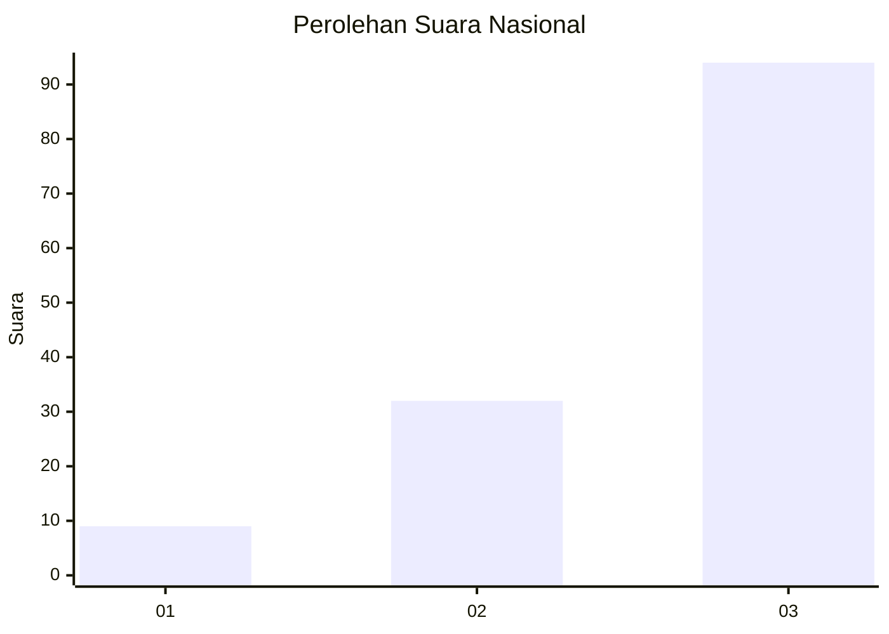
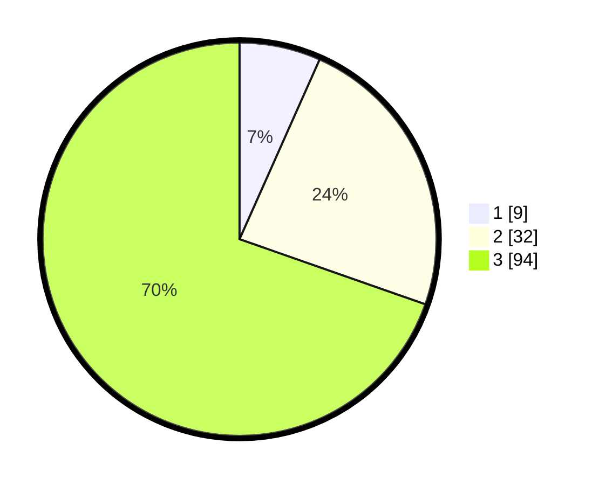

# Hasil

## Grafik

## Tabel

| No. | Nama Paslon    | Suara | Suara (raw) | Persentase |
|:--- |:-------------- | -----:| -----------:| ----------:|
| 1   | ANIES MUHAIMIN | 9     | [9][p-1]    | 6,67       |
| 2   | PRABOWO GIBRAN | 32    | [32][p-2]   | 23,70      |
| 3   | GANJAR MAHFUD  | 94    | [94][p-3]   | 69,63      |

[p-1]: https://github.com/gigit-pemilu/pemilu-2024/blob/main/pilpres/hitung-suara/sub/61-kalimantan-barat/sub/07-bengkayang/sub/01-sungai-raya/sub/2004-sungai-jaga-a/sub/004-tps/sub/paslon-1.txt
[p-2]: https://github.com/gigit-pemilu/pemilu-2024/blob/main/pilpres/hitung-suara/sub/61-kalimantan-barat/sub/07-bengkayang/sub/01-sungai-raya/sub/2004-sungai-jaga-a/sub/004-tps/sub/paslon-2.txt
[p-3]: https://github.com/gigit-pemilu/pemilu-2024/blob/main/pilpres/hitung-suara/sub/61-kalimantan-barat/sub/07-bengkayang/sub/01-sungai-raya/sub/2004-sungai-jaga-a/sub/004-tps/sub/paslon-3.txt

## Foto C Plano

https://sirekap-obj-formc.kpu.go.id/e7f8/pemilu/ppwp/61/07/01/20/04/6107012004004-20240217-195935--51a2df21-aab2-430a-894d-72fc70bfb779.jpg

https://sirekap-obj-formc.kpu.go.id/e7f8/pemilu/ppwp/61/07/01/20/04/6107012004004-20240214-195454--14463873-cad3-490d-9747-522fcc2ea075.jpg

https://sirekap-obj-formc.kpu.go.id/e7f8/pemilu/ppwp/61/07/01/20/04/6107012004004-20240218-210459--7c14c9c7-a9b4-4e5b-b0e9-8bc21b3923b6.jpg

## Metadata

| Key        | Value               |
| ---------- | ------------------- |
| Time Stamp | 2024-02-19 06:16:00 |

