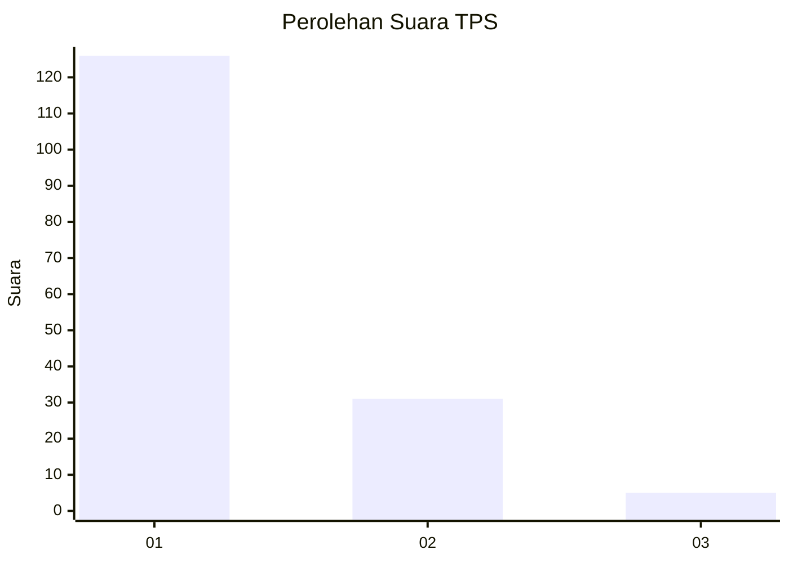
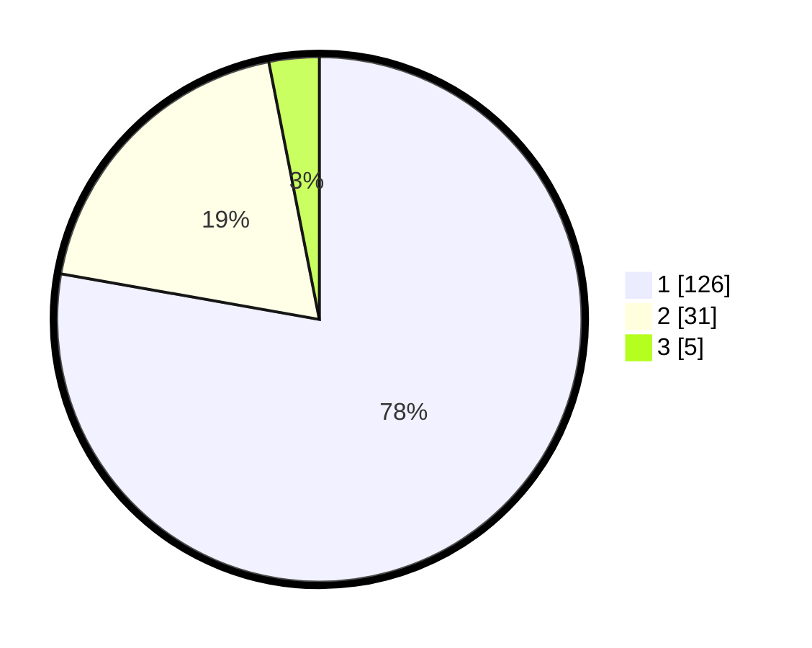

# Hasil

## Grafik

## Tabel

| No. | Nama Paslon    | Suara | Suara (raw) | Persentase |
|:--- |:-------------- | -----:| -----------:| ----------:|
| 1   | ANIES MUHAIMIN | 126   | [126][p-1]  | 77,78      |
| 2   | PRABOWO GIBRAN | 31    | [31][p-2]   | 19,14      |
| 3   | GANJAR MAHFUD  | 5     | [5][p-3]    | 3,09       |

[p-1]: https://github.com/gigit-pemilu/pemilu-2024-61-kalimantan-barat/blob/main/pilpres/hitung-suara/sub/61-kalimantan-barat/sub/07-bengkayang/sub/01-sungai-raya/sub/2004-sungai-jaga-a/sub/015-tps/sub/paslon-1.txt
[p-2]: https://github.com/gigit-pemilu/pemilu-2024-61-kalimantan-barat/blob/main/pilpres/hitung-suara/sub/61-kalimantan-barat/sub/07-bengkayang/sub/01-sungai-raya/sub/2004-sungai-jaga-a/sub/015-tps/sub/paslon-2.txt
[p-3]: https://github.com/gigit-pemilu/pemilu-2024-61-kalimantan-barat/blob/main/pilpres/hitung-suara/sub/61-kalimantan-barat/sub/07-bengkayang/sub/01-sungai-raya/sub/2004-sungai-jaga-a/sub/015-tps/sub/paslon-3.txt

## Foto C Plano

https://sirekap-obj-formc.kpu.go.id/26ec/pemilu/ppwp/61/07/01/20/04/6107012004015-20240214-155158--855c8573-4de5-4daa-b032-78d3b7c76719.jpg

https://sirekap-obj-formc.kpu.go.id/26ec/pemilu/ppwp/61/07/01/20/04/6107012004015-20240214-155101--0618d2c9-bae6-4f68-9703-4c8b517d0d8d.jpg

https://sirekap-obj-formc.kpu.go.id/26ec/pemilu/ppwp/61/07/01/20/04/6107012004015-20240214-155259--65e222a6-a6ae-40a4-bc73-e7561fbc267f.jpg

## Metadata

| Key        | Value               |
| ---------- | ------------------- |
| Time Stamp | 2024-02-15 01:47:43 |

