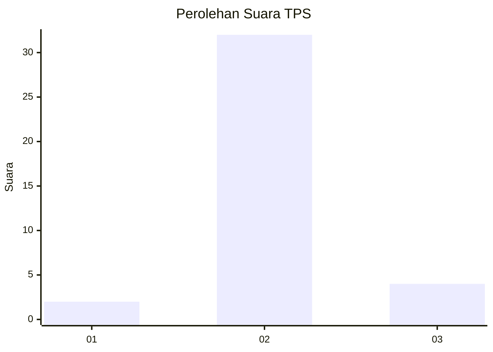
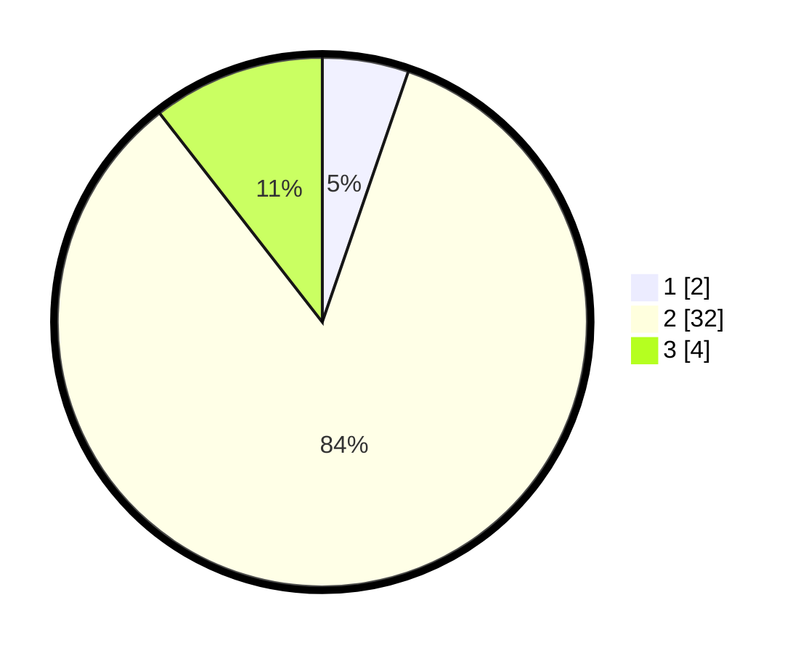

# Hasil

## Grafik

## Tabel

| No. | Nama Paslon    | Suara | Suara (raw) | Persentase |
|:--- |:-------------- | -----:| -----------:| ----------:|
| 1   | ANIES MUHAIMIN | 2     | [2][p-1]    | 5,26       |
| 2   | PRABOWO GIBRAN | 32    | [32][p-2]   | 84,21      |
| 3   | GANJAR MAHFUD  | 4     | [4][p-3]    | 10,53      |

[p-1]: https://github.com/gigit-pemilu/pemilu-2024-61-kalimantan-barat/blob/main/pilpres/hitung-suara/sub/61-kalimantan-barat/sub/07-bengkayang/sub/10-suti-semarang/sub/2002-muhi-bersatu/sub/002-tps/sub/paslon-1.txt
[p-2]: https://github.com/gigit-pemilu/pemilu-2024-61-kalimantan-barat/blob/main/pilpres/hitung-suara/sub/61-kalimantan-barat/sub/07-bengkayang/sub/10-suti-semarang/sub/2002-muhi-bersatu/sub/002-tps/sub/paslon-2.txt
[p-3]: https://github.com/gigit-pemilu/pemilu-2024-61-kalimantan-barat/blob/main/pilpres/hitung-suara/sub/61-kalimantan-barat/sub/07-bengkayang/sub/10-suti-semarang/sub/2002-muhi-bersatu/sub/002-tps/sub/paslon-3.txt

## Foto C Plano

https://sirekap-obj-formc.kpu.go.id/cca8/pemilu/ppwp/61/07/10/20/02/6107102002002-20240216-134846--307168b0-7002-4e35-8736-fdc9d39f0cee.jpg

https://sirekap-obj-formc.kpu.go.id/cca8/pemilu/ppwp/61/07/10/20/02/6107102002002-20240216-134847--e5772094-bb7e-4fe5-b87a-38723b7b467d.jpg

https://sirekap-obj-formc.kpu.go.id/cca8/pemilu/ppwp/61/07/10/20/02/6107102002002-20240216-134847--c8ffd37a-5521-4905-ae16-84435bd4ffd3.jpg

## Metadata

| Key        | Value               |
| ---------- | ------------------- |
| Time Stamp | 2024-02-17 08:30:03 |

## DATA PEMILIH TETAP

Jumlah pemilih dalam DPT: **52**.
 * L: **23**.
 * P: **29**.

## DATA PENGGUNA HAK PILIH

Jumlah pengguna hak pilih dalam DPT: **36**.
 * L: **17**.
 * P: **19**.

Jumlah pengguna hak pilih dalam DPTb: **4**.
 * L: **3**.
 * P: **1**.

Jumlah pengguna hak pilih dalam DPK: **0**.
 * L: **0**.
 * P: **0**.

Jumlah pengguna hak pilih: **40**.
 * L: **20**.
 * P: **20**.

## JUMLAH SUARA SAH DAN TIDAK SAH

JUMLAH SELURUH SUARA SAH: **38**.

JUMLAH SUARA TIDAK SAH: **2**.

JUMLAH SELURUH SUARA SAH DAN SUARA TIDAK SAH: **40**.

