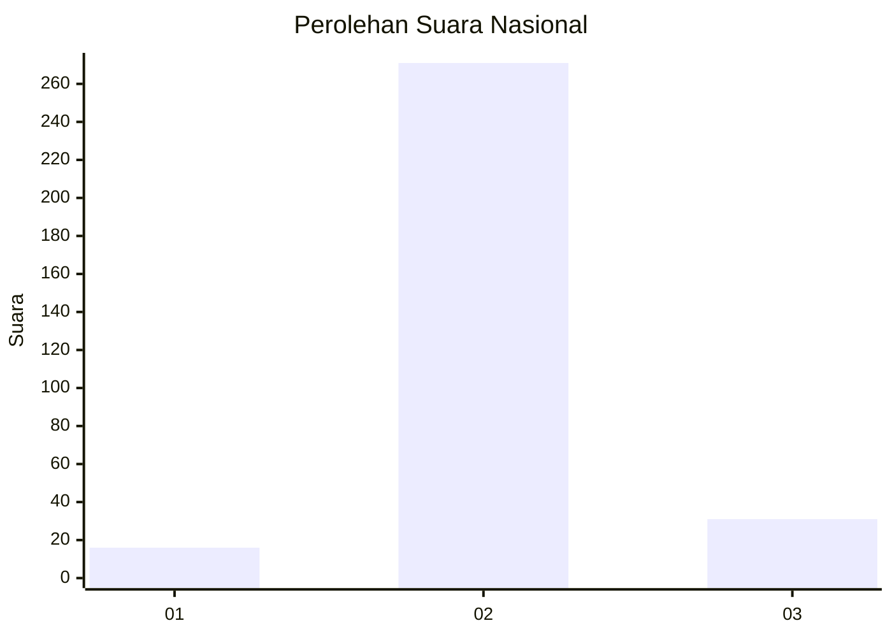
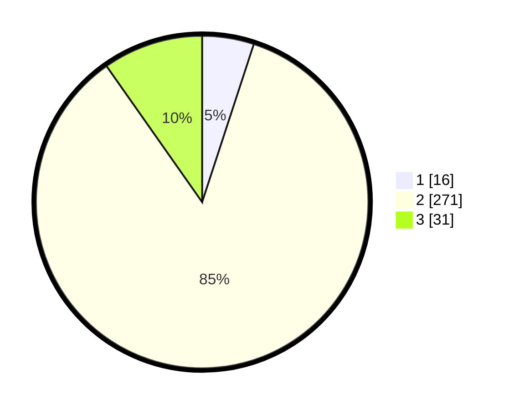

# Hasil

## Grafik

## Tabel

| No. | Nama Paslon    | Suara | Suara (raw) | Persentase |
|:--- |:-------------- | -----:| -----------:| ----------:|
| 1   | ANIES MUHAIMIN | 16    | [16][p-1]   | 5,03       |
| 2   | PRABOWO GIBRAN | 271   | [271][p-2]  | 85,22      |
| 3   | GANJAR MAHFUD  | 31    | [31][p-3]   | 9,75       |

[p-1]: https://github.com/gigit-pemilu/pemilu-2024/blob/main/pilpres/hitung-suara/sub/61-kalimantan-barat/sub/07-bengkayang/sub/13-lumar/sub/2002-tiga-berkat/sub/901-tps/sub/paslon-1.txt
[p-2]: https://github.com/gigit-pemilu/pemilu-2024/blob/main/pilpres/hitung-suara/sub/61-kalimantan-barat/sub/07-bengkayang/sub/13-lumar/sub/2002-tiga-berkat/sub/901-tps/sub/paslon-2.txt
[p-3]: https://github.com/gigit-pemilu/pemilu-2024/blob/main/pilpres/hitung-suara/sub/61-kalimantan-barat/sub/07-bengkayang/sub/13-lumar/sub/2002-tiga-berkat/sub/901-tps/sub/paslon-3.txt

## Foto C Plano

https://sirekap-obj-formc.kpu.go.id/21c0/pemilu/ppwp/61/07/13/20/02/6107132002901-20240218-173146--b0bd12c1-feea-4cc3-905b-5bc148d48e02.jpg

https://sirekap-obj-formc.kpu.go.id/21c0/pemilu/ppwp/61/07/13/20/02/6107132002901-20240214-194712--537d9cd1-5cbd-4a8f-b320-5ba1e0ecc7e2.jpg

https://sirekap-obj-formc.kpu.go.id/21c0/pemilu/ppwp/61/07/13/20/02/6107132002901-20240218-173147--e42dbee3-2e65-4ff8-a4e9-a45bd39a8e7e.jpg

## Metadata

| Key        | Value               |
| ---------- | ------------------- |
| Time Stamp | 2024-03-10 23:00:00 |

## DATA PEMILIH TETAP

Jumlah pemilih dalam DPT: **133**.
 * L: **132**.
 * P: **1**.

## DATA PENGGUNA HAK PILIH

Jumlah pengguna hak pilih dalam DPT: **128**.
 * L: **127**.
 * P: **1**.

Jumlah pengguna hak pilih dalam DPTb: **193**.
 * L: **186**.
 * P: **7**.

Jumlah pengguna hak pilih dalam DPK: **0**.
 * L: **0**.
 * P: **0**.

Jumlah pengguna hak pilih: **321**.
 * L: **313**.
 * P: **8**.

## JUMLAH SUARA SAH DAN TIDAK SAH

JUMLAH SELURUH SUARA SAH: **318**.

JUMLAH SUARA TIDAK SAH: **3**.

JUMLAH SELURUH SUARA SAH DAN SUARA TIDAK SAH: **321**.

