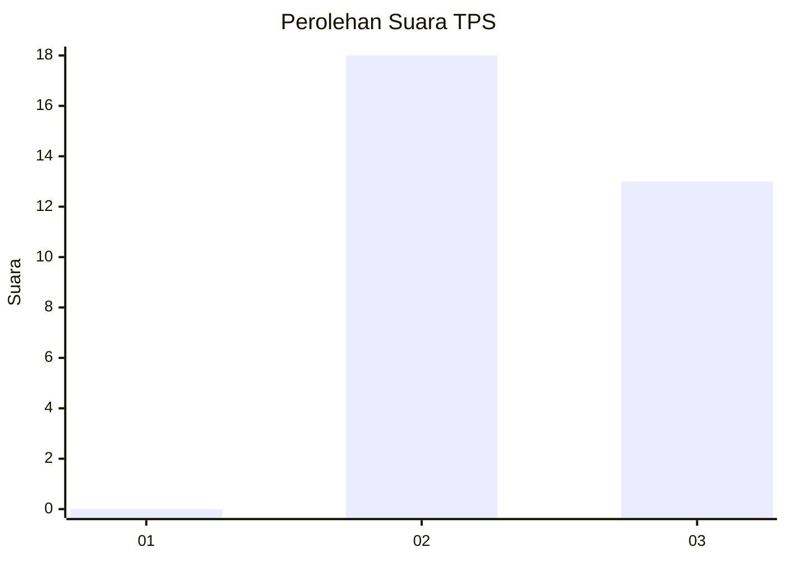
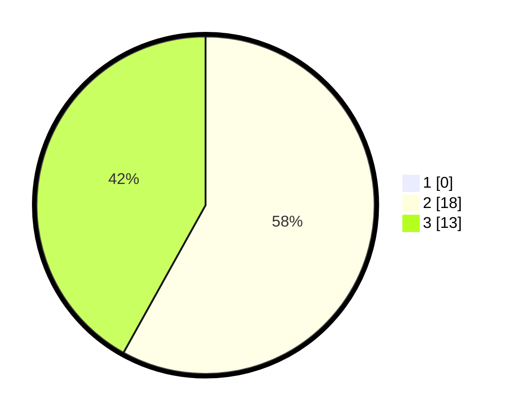

# Hasil

## Grafik

## Tabel

| No. | Nama Paslon    | Suara | Suara (raw) | Persentase |
|:--- |:-------------- | -----:| -----------:| ----------:|
| 1   | ANIES MUHAIMIN | 0     | [0][p-1]    | 0,00       |
| 2   | PRABOWO GIBRAN | 18    | [18][p-2]   | 58,06      |
| 3   | GANJAR MAHFUD  | 13    | [13][p-3]   | 41,94      |

[p-1]: https://github.com/gigit-pemilu/pemilu-2024-61-kalimantan-barat/blob/main/pilpres/hitung-suara/sub/61-kalimantan-barat/sub/07-bengkayang/sub/13-lumar/sub/2003-seren-selimbau/sub/004-tps/sub/paslon-1.txt
[p-2]: https://github.com/gigit-pemilu/pemilu-2024-61-kalimantan-barat/blob/main/pilpres/hitung-suara/sub/61-kalimantan-barat/sub/07-bengkayang/sub/13-lumar/sub/2003-seren-selimbau/sub/004-tps/sub/paslon-2.txt
[p-3]: https://github.com/gigit-pemilu/pemilu-2024-61-kalimantan-barat/blob/main/pilpres/hitung-suara/sub/61-kalimantan-barat/sub/07-bengkayang/sub/13-lumar/sub/2003-seren-selimbau/sub/004-tps/sub/paslon-3.txt

## Foto C Plano

https://sirekap-obj-formc.kpu.go.id/1554/pemilu/ppwp/61/07/13/20/03/6107132003004-20240218-132036--02f6f81b-e337-4d14-a665-4c939f7156e4.jpg

https://sirekap-obj-formc.kpu.go.id/1554/pemilu/ppwp/61/07/13/20/03/6107132003004-20240218-132037--7fc26e57-8347-4c84-8c63-cd83c6129bf5.jpg

https://sirekap-obj-formc.kpu.go.id/1554/pemilu/ppwp/61/07/13/20/03/6107132003004-20240218-132036--48cf3b34-d69d-4dec-aec3-76ed80e622be.jpg

## Metadata

| Key        | Value               |
| ---------- | ------------------- |
| Time Stamp | 2024-02-24 22:31:28 |

## DATA PEMILIH TETAP

Jumlah pemilih dalam DPT: **35**.
 * L: **19**.
 * P: **16**.

## DATA PENGGUNA HAK PILIH

Jumlah pengguna hak pilih dalam DPT: **28**.
 * L: **15**.
 * P: **13**.

Jumlah pengguna hak pilih dalam DPTb: **3**.
 * L: **2**.
 * P: **1**.

Jumlah pengguna hak pilih dalam DPK: **0**.
 * L: **0**.
 * P: **0**.

Jumlah pengguna hak pilih: **31**.
 * L: **17**.
 * P: **14**.

## JUMLAH SUARA SAH DAN TIDAK SAH

JUMLAH SELURUH SUARA SAH: **31**.

JUMLAH SUARA TIDAK SAH: **0**.

JUMLAH SELURUH SUARA SAH DAN SUARA TIDAK SAH: **31**.

