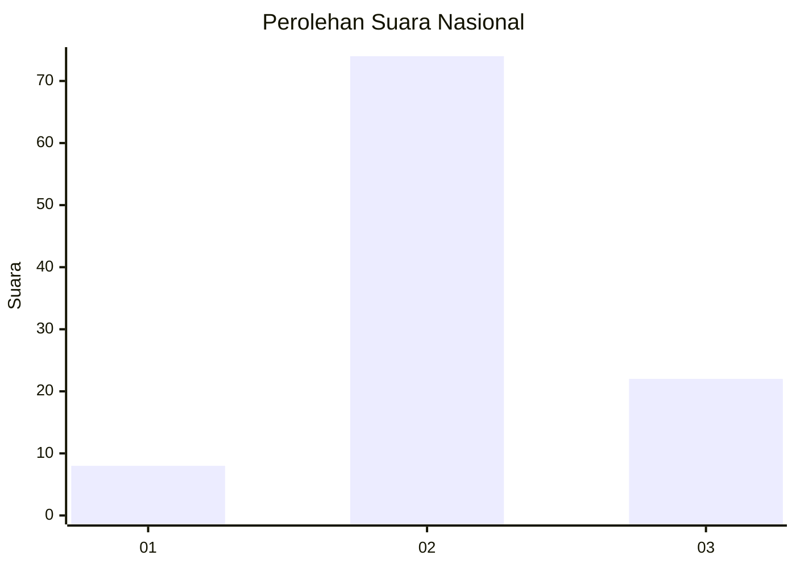
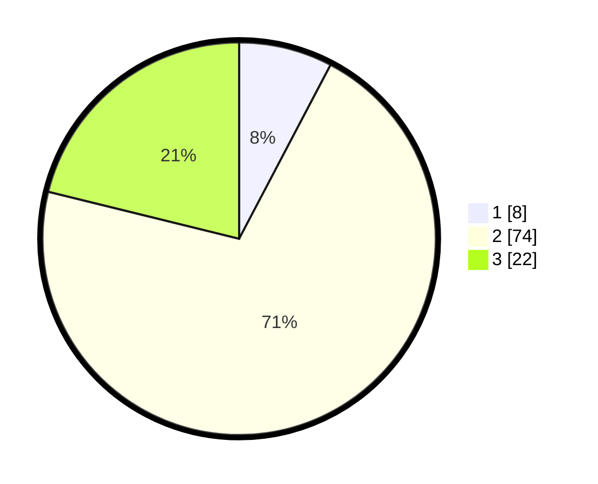

# Hasil

## Grafik

## Tabel

| No. | Nama Paslon    | Suara | Suara (raw) | Persentase |
|:--- |:-------------- | -----:| -----------:| ----------:|
| 1   | ANIES MUHAIMIN | 8     | [8][p-1]    | 7,69       |
| 2   | PRABOWO GIBRAN | 74    | [74][p-2]   | 71,15      |
| 3   | GANJAR MAHFUD  | 22    | [22][p-3]   | 21,15      |

[p-1]: https://github.com/gigit-pemilu/pemilu-2024/blob/main/pilpres/hitung-suara/sub/61-kalimantan-barat/sub/08-landak/sub/01-ngabang/sub/2001-hilir-kantor/sub/001-tps/sub/paslon-1.txt
[p-2]: https://github.com/gigit-pemilu/pemilu-2024/blob/main/pilpres/hitung-suara/sub/61-kalimantan-barat/sub/08-landak/sub/01-ngabang/sub/2001-hilir-kantor/sub/001-tps/sub/paslon-2.txt
[p-3]: https://github.com/gigit-pemilu/pemilu-2024/blob/main/pilpres/hitung-suara/sub/61-kalimantan-barat/sub/08-landak/sub/01-ngabang/sub/2001-hilir-kantor/sub/001-tps/sub/paslon-3.txt

## Foto C Plano

https://sirekap-obj-formc.kpu.go.id/f8a4/pemilu/ppwp/61/08/01/20/01/6108012001001-20240216-151512--a68c27bf-ff4a-4dfc-80dd-28315e03ee35.jpg

https://sirekap-obj-formc.kpu.go.id/f8a4/pemilu/ppwp/61/08/01/20/01/6108012001001-20240216-151513--7dff30bb-80e1-4d5b-9471-e0e1c7414a49.jpg

https://sirekap-obj-formc.kpu.go.id/f8a4/pemilu/ppwp/61/08/01/20/01/6108012001001-20240216-151512--630cd1fc-723d-4444-a7ee-1db973f3da62.jpg

## Metadata

| Key        | Value               |
| ---------- | ------------------- |
| Time Stamp | 2024-02-16 16:25:10 |

## DATA PEMILIH TETAP

Jumlah pemilih dalam DPT: **112**.
 * L: **55**.
 * P: **57**.

## DATA PENGGUNA HAK PILIH

Jumlah pengguna hak pilih dalam DPT: **104**.
 * L: **50**.
 * P: **54**.

Jumlah pengguna hak pilih dalam DPTb: **2**.
 * L: **2**.
 * P: **0**.

Jumlah pengguna hak pilih dalam DPK: **0**.
 * L: **0**.
 * P: **0**.

Jumlah pengguna hak pilih: **106**.
 * L: **52**.
 * P: **54**.

## JUMLAH SUARA SAH DAN TIDAK SAH

JUMLAH SELURUH SUARA SAH: **105**.

JUMLAH SUARA TIDAK SAH: **1**.

JUMLAH SELURUH SUARA SAH DAN SUARA TIDAK SAH: **106**.

