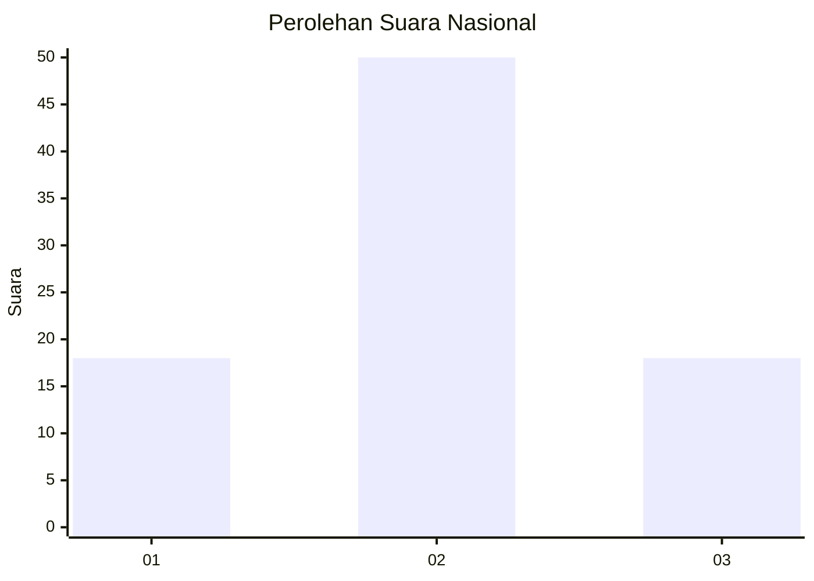
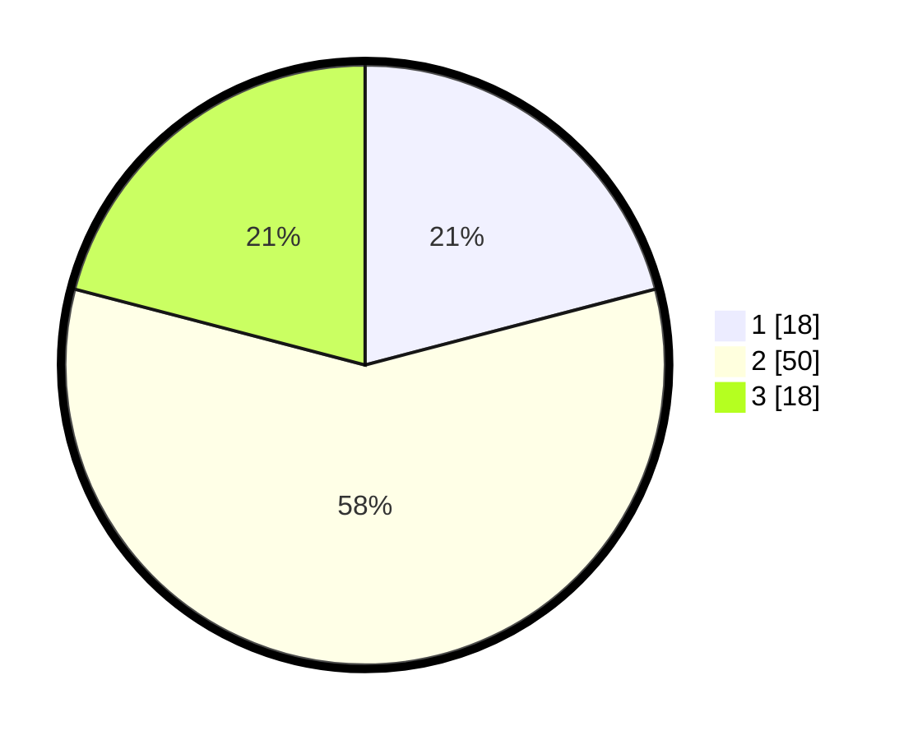

# Hasil

## Grafik

## Tabel

| No. | Nama Paslon    | Suara | Suara (raw) | Persentase |
|:--- |:-------------- | -----:| -----------:| ----------:|
| 1   | ANIES MUHAIMIN | 18    | [18][p-1]   | 20,93      |
| 2   | PRABOWO GIBRAN | 50    | [50][p-2]   | 58,14      |
| 3   | GANJAR MAHFUD  | 18    | [18][p-3]   | 20,93      |

[p-1]: https://github.com/gigit-pemilu/pemilu-2024/blob/main/pilpres/hitung-suara/sub/61-kalimantan-barat/sub/08-landak/sub/01-ngabang/sub/2002-hilir-tengah/sub/002-tps/sub/paslon-1.txt
[p-2]: https://github.com/gigit-pemilu/pemilu-2024/blob/main/pilpres/hitung-suara/sub/61-kalimantan-barat/sub/08-landak/sub/01-ngabang/sub/2002-hilir-tengah/sub/002-tps/sub/paslon-2.txt
[p-3]: https://github.com/gigit-pemilu/pemilu-2024/blob/main/pilpres/hitung-suara/sub/61-kalimantan-barat/sub/08-landak/sub/01-ngabang/sub/2002-hilir-tengah/sub/002-tps/sub/paslon-3.txt

## Foto C Plano

https://sirekap-obj-formc.kpu.go.id/fea8/pemilu/ppwp/61/08/01/20/02/6108012002002-20240225-223341--f2b6bece-e96d-49c3-b614-d41faa46bf6b.jpg

https://sirekap-obj-formc.kpu.go.id/fea8/pemilu/ppwp/61/08/01/20/02/6108012002002-20240214-230150--8cff7ecc-d499-419c-b2b7-2c19836a948f.jpg

https://sirekap-obj-formc.kpu.go.id/fea8/pemilu/ppwp/61/08/01/20/02/6108012002002-20240214-230509--ed24a7d8-6021-438b-9e29-ea33e8c8bcdc.jpg

## Metadata

| Key        | Value               |
| ---------- | ------------------- |
| Time Stamp | 2024-02-25 23:00:00 |

