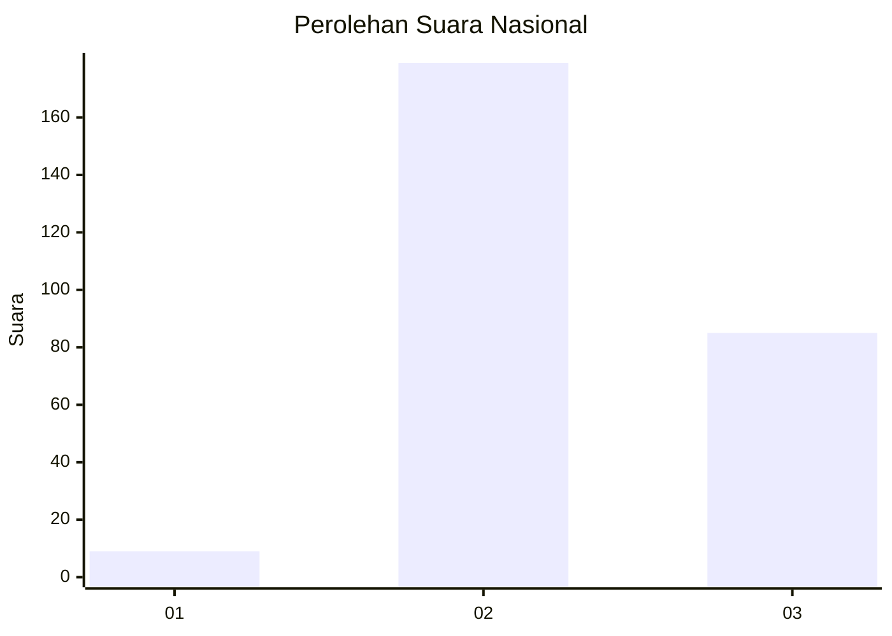
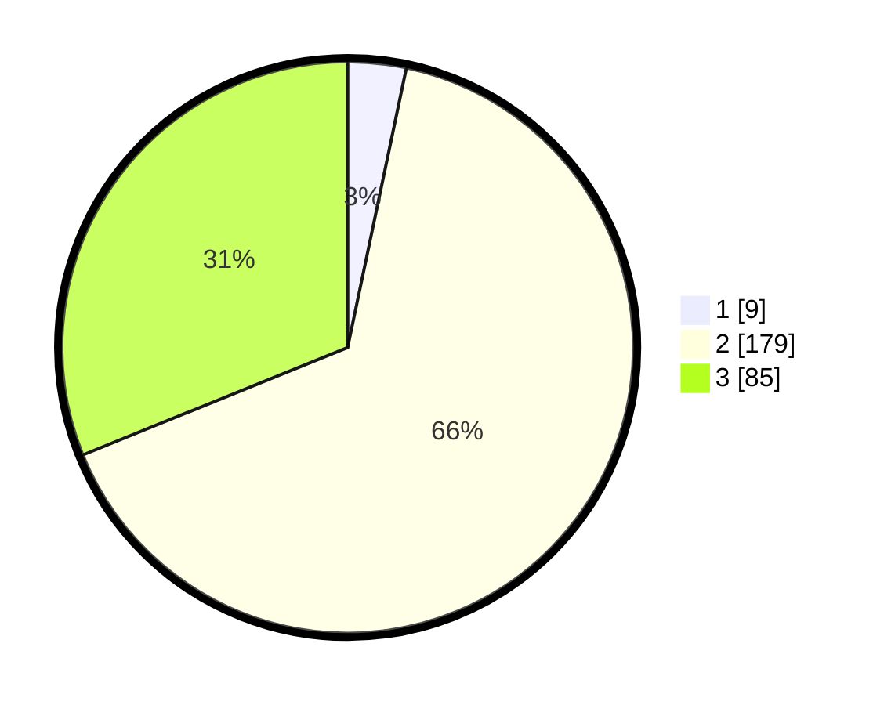

# Hasil

## Grafik

## Tabel

| No. | Nama Paslon    | Suara | Suara (raw) | Persentase |
|:--- |:-------------- | -----:| -----------:| ----------:|
| 1   | ANIES MUHAIMIN | 9     | [9][p-1]    | 3,30       |
| 2   | PRABOWO GIBRAN | 179   | [179][p-2]  | 65,57      |
| 3   | GANJAR MAHFUD  | 85    | [85][p-3]   | 31,14      |

[p-1]: https://github.com/gigit-pemilu/pemilu-2024/blob/main/pilpres/hitung-suara/sub/61-kalimantan-barat/sub/08-landak/sub/01-ngabang/sub/2002-hilir-tengah/sub/016-tps/sub/paslon-1.txt
[p-2]: https://github.com/gigit-pemilu/pemilu-2024/blob/main/pilpres/hitung-suara/sub/61-kalimantan-barat/sub/08-landak/sub/01-ngabang/sub/2002-hilir-tengah/sub/016-tps/sub/paslon-2.txt
[p-3]: https://github.com/gigit-pemilu/pemilu-2024/blob/main/pilpres/hitung-suara/sub/61-kalimantan-barat/sub/08-landak/sub/01-ngabang/sub/2002-hilir-tengah/sub/016-tps/sub/paslon-3.txt

## Foto C Plano

https://sirekap-obj-formc.kpu.go.id/11fd/pemilu/ppwp/61/08/01/20/02/6108012002016-20240215-001105--fa1f0413-6a7e-48df-888c-6869b84e4f2d.jpg

https://sirekap-obj-formc.kpu.go.id/11fd/pemilu/ppwp/61/08/01/20/02/6108012002016-20240215-001416--61a57edd-f535-4448-9899-14121d71f985.jpg

https://sirekap-obj-formc.kpu.go.id/11fd/pemilu/ppwp/61/08/01/20/02/6108012002016-20240215-001514--1fe384ad-0d5c-419d-895c-402b0ddd5746.jpg

## Metadata

| Key        | Value               |
| ---------- | ------------------- |
| Time Stamp | 2024-02-19 06:16:00 |

