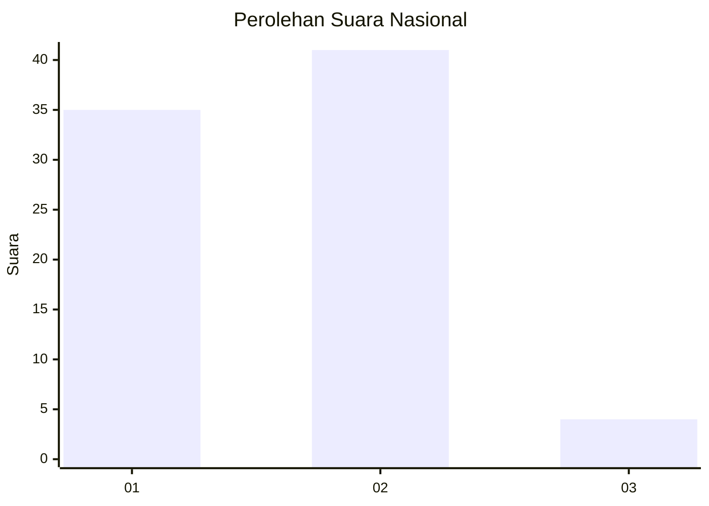
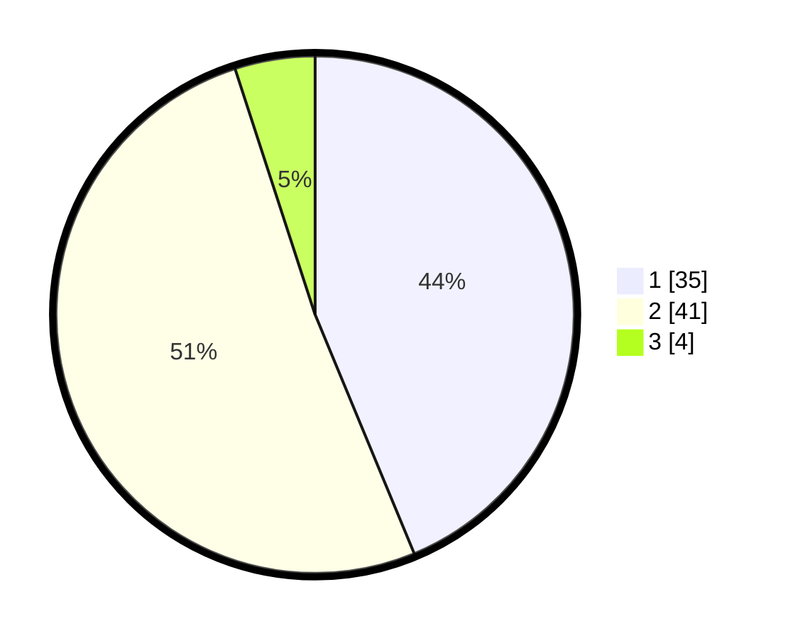

# Hasil

## Grafik

## Tabel

| No. | Nama Paslon    | Suara | Suara (raw) | Persentase |
|:--- |:-------------- | -----:| -----------:| ----------:|
| 1   | ANIES MUHAIMIN | 35    | [35][p-1]   | 43,75      |
| 2   | PRABOWO GIBRAN | 41    | [41][p-2]   | 51,25      |
| 3   | GANJAR MAHFUD  | 4     | [4][p-3]    | 5,00       |

[p-1]: https://github.com/gigit-pemilu/pemilu-2024/blob/main/pilpres/hitung-suara/sub/61-kalimantan-barat/sub/08-landak/sub/01-ngabang/sub/2002-hilir-tengah/sub/023-tps/sub/paslon-1.txt
[p-2]: https://github.com/gigit-pemilu/pemilu-2024/blob/main/pilpres/hitung-suara/sub/61-kalimantan-barat/sub/08-landak/sub/01-ngabang/sub/2002-hilir-tengah/sub/023-tps/sub/paslon-2.txt
[p-3]: https://github.com/gigit-pemilu/pemilu-2024/blob/main/pilpres/hitung-suara/sub/61-kalimantan-barat/sub/08-landak/sub/01-ngabang/sub/2002-hilir-tengah/sub/023-tps/sub/paslon-3.txt

## Foto C Plano

https://sirekap-obj-formc.kpu.go.id/9225/pemilu/ppwp/61/08/01/20/02/6108012002023-20240214-193018--3fead244-9b90-4bb9-aa4e-13de552c00f3.jpg

https://sirekap-obj-formc.kpu.go.id/9225/pemilu/ppwp/61/08/01/20/02/6108012002023-20240214-193033--5da8cf3a-ac6b-4ef0-90ba-b07ed1e87d12.jpg

https://sirekap-obj-formc.kpu.go.id/9225/pemilu/ppwp/61/08/01/20/02/6108012002023-20240214-193050--8780a8c3-8e42-466b-b3b8-cb985a31c6e9.jpg

## Metadata

| Key        | Value               |
| ---------- | ------------------- |
| Time Stamp | 2024-02-19 06:16:00 |

