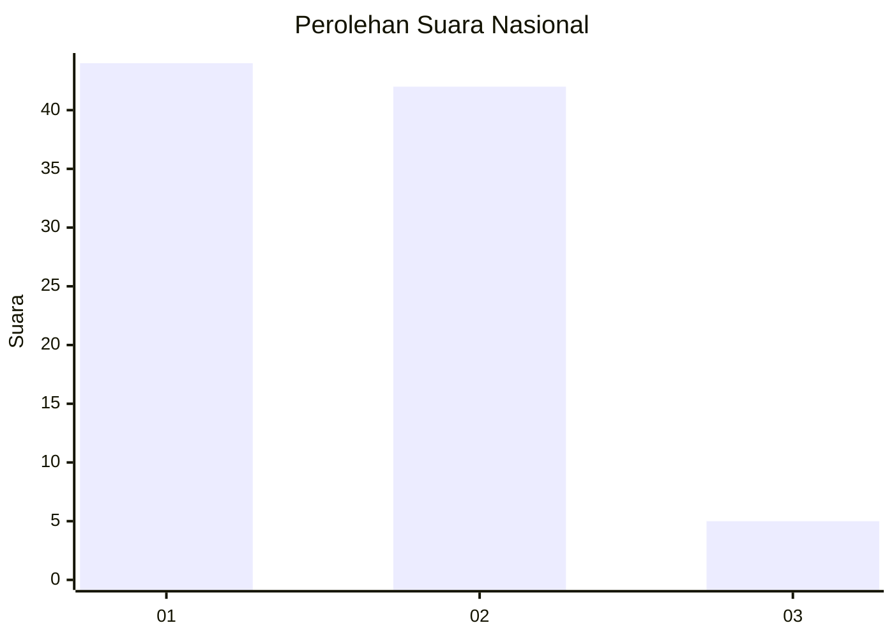
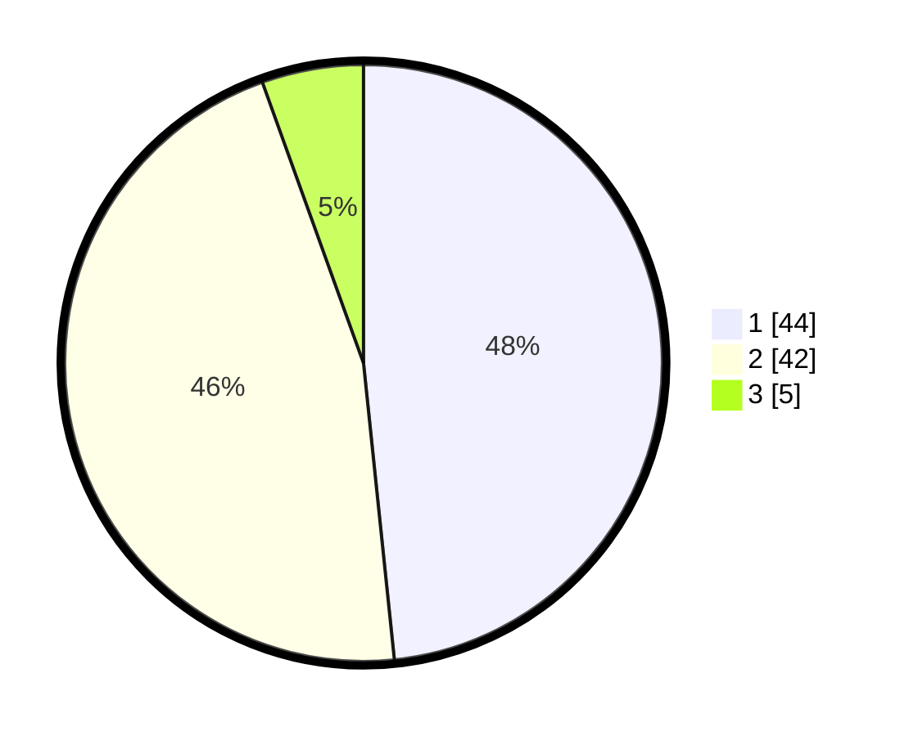

# Hasil

## Grafik

## Tabel

| No. | Nama Paslon    | Suara | Suara (raw) | Persentase |
|:--- |:-------------- | -----:| -----------:| ----------:|
| 1   | ANIES MUHAIMIN | 44    | [44][p-1]   | 48,35      |
| 2   | PRABOWO GIBRAN | 42    | [42][p-2]   | 46,15      |
| 3   | GANJAR MAHFUD  | 5     | [5][p-3]    | 5,49       |

[p-1]: https://github.com/gigit-pemilu/pemilu-2024/blob/main/pilpres/hitung-suara/sub/61-kalimantan-barat/sub/08-landak/sub/01-ngabang/sub/2004-mungguk/sub/002-tps/sub/paslon-1.txt
[p-2]: https://github.com/gigit-pemilu/pemilu-2024/blob/main/pilpres/hitung-suara/sub/61-kalimantan-barat/sub/08-landak/sub/01-ngabang/sub/2004-mungguk/sub/002-tps/sub/paslon-2.txt
[p-3]: https://github.com/gigit-pemilu/pemilu-2024/blob/main/pilpres/hitung-suara/sub/61-kalimantan-barat/sub/08-landak/sub/01-ngabang/sub/2004-mungguk/sub/002-tps/sub/paslon-3.txt

## Foto C Plano

https://sirekap-obj-formc.kpu.go.id/8814/pemilu/ppwp/61/08/01/20/04/6108012004002-20240214-190941--995a13e3-3e45-479f-80b7-a596f604cd20.jpg

https://sirekap-obj-formc.kpu.go.id/8814/pemilu/ppwp/61/08/01/20/04/6108012004002-20240214-191055--ca0dc666-f70a-4bdf-9f7f-070cbd96cf2b.jpg

https://sirekap-obj-formc.kpu.go.id/8814/pemilu/ppwp/61/08/01/20/04/6108012004002-20240214-191153--7eaea108-15f1-45bb-b770-97d304414f80.jpg

## Metadata

| Key        | Value               |
| ---------- | ------------------- |
| Time Stamp | 2024-02-19 06:16:00 |

