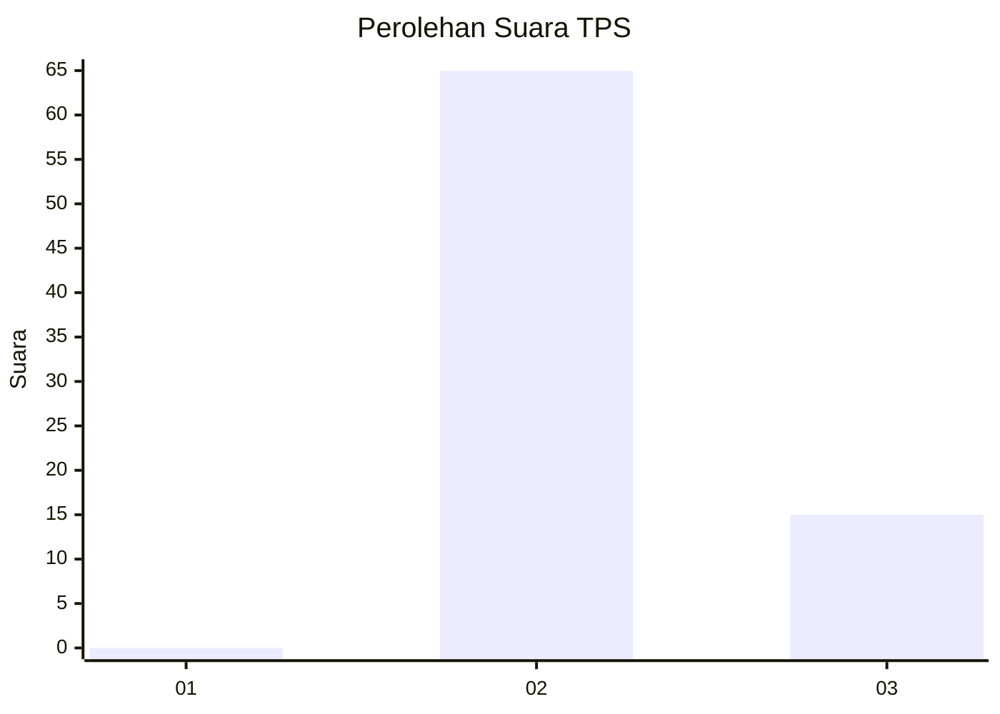
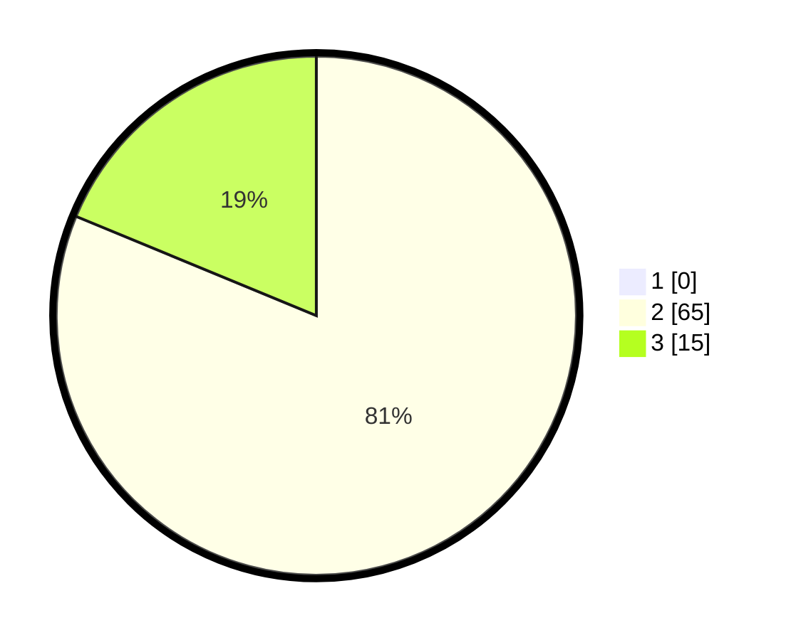

# Hasil

## Grafik

## Tabel

| No. | Nama Paslon    | Suara | Suara (raw) | Persentase |
|:--- |:-------------- | -----:| -----------:| ----------:|
| 1   | ANIES MUHAIMIN | 0     | [0][p-1]    | 0,00       |
| 2   | PRABOWO GIBRAN | 65    | [65][p-2]   | 81,25      |
| 3   | GANJAR MAHFUD  | 15    | [15][p-3]   | 18,75      |

[p-1]: https://github.com/gigit-pemilu/pemilu-2024-61-kalimantan-barat/blob/main/pilpres/hitung-suara/sub/61-kalimantan-barat/sub/08-landak/sub/01-ngabang/sub/2011-amang/sub/004-tps/sub/paslon-1.txt
[p-2]: https://github.com/gigit-pemilu/pemilu-2024-61-kalimantan-barat/blob/main/pilpres/hitung-suara/sub/61-kalimantan-barat/sub/08-landak/sub/01-ngabang/sub/2011-amang/sub/004-tps/sub/paslon-2.txt
[p-3]: https://github.com/gigit-pemilu/pemilu-2024-61-kalimantan-barat/blob/main/pilpres/hitung-suara/sub/61-kalimantan-barat/sub/08-landak/sub/01-ngabang/sub/2011-amang/sub/004-tps/sub/paslon-3.txt

## Foto C Plano

https://sirekap-obj-formc.kpu.go.id/05d6/pemilu/ppwp/61/08/01/20/11/6108012011004-20240216-215308--c93d925d-0c39-4aca-91aa-11e7314e0529.jpg

https://sirekap-obj-formc.kpu.go.id/05d6/pemilu/ppwp/61/08/01/20/11/6108012011004-20240217-063609--d0bdbfe4-52fb-4c03-8cee-411922785d36.jpg

https://sirekap-obj-formc.kpu.go.id/05d6/pemilu/ppwp/61/08/01/20/11/6108012011004-20240217-063614--e79ab1cb-0eff-431a-b79d-eb08f4441e11.jpg

## Metadata

| Key        | Value               |
| ---------- | ------------------- |
| Time Stamp | 2024-02-25 18:00:00 |

