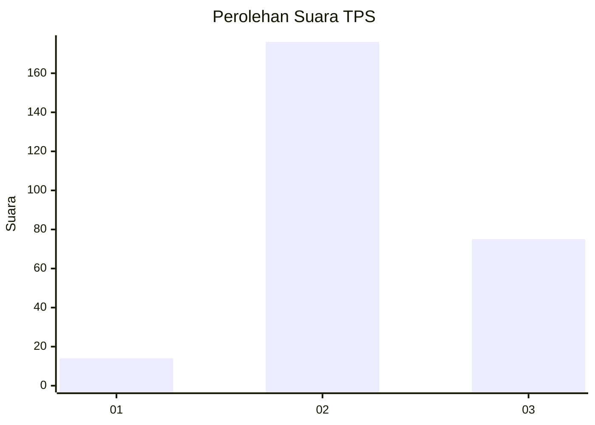
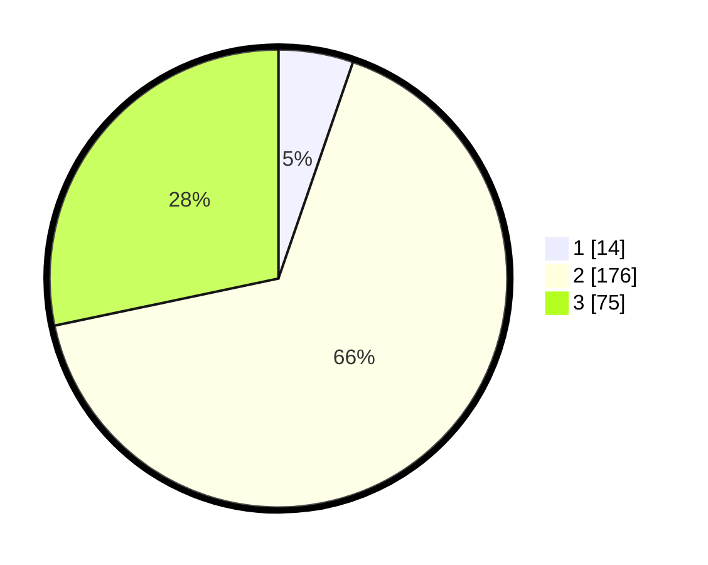

# Hasil

## Grafik

## Tabel

| No. | Nama Paslon    | Suara | Suara (raw) | Persentase |
|:--- |:-------------- | -----:| -----------:| ----------:|
| 1   | ANIES MUHAIMIN | 14    | [14][p-1]   | 5,28       |
| 2   | PRABOWO GIBRAN | 176   | [176][p-2]  | 66,42      |
| 3   | GANJAR MAHFUD  | 75    | [75][p-3]   | 28,30      |

[p-1]: https://github.com/gigit-pemilu/pemilu-2024-61-kalimantan-barat/blob/main/pilpres/hitung-suara/sub/61-kalimantan-barat/sub/08-landak/sub/01-ngabang/sub/2014-amboyo-inti/sub/016-tps/sub/paslon-1.txt
[p-2]: https://github.com/gigit-pemilu/pemilu-2024-61-kalimantan-barat/blob/main/pilpres/hitung-suara/sub/61-kalimantan-barat/sub/08-landak/sub/01-ngabang/sub/2014-amboyo-inti/sub/016-tps/sub/paslon-2.txt
[p-3]: https://github.com/gigit-pemilu/pemilu-2024-61-kalimantan-barat/blob/main/pilpres/hitung-suara/sub/61-kalimantan-barat/sub/08-landak/sub/01-ngabang/sub/2014-amboyo-inti/sub/016-tps/sub/paslon-3.txt

## Foto C Plano

https://sirekap-obj-formc.kpu.go.id/ef6e/pemilu/ppwp/61/08/01/20/14/6108012014016-20240215-091036--4ee547a1-3bdf-4ec1-adad-e8b2e3de45d6.jpg

https://sirekap-obj-formc.kpu.go.id/ef6e/pemilu/ppwp/61/08/01/20/14/6108012014016-20240215-091218--f74ef76f-00cb-42d2-86eb-b166a8ab47f2.jpg

https://sirekap-obj-formc.kpu.go.id/ef6e/pemilu/ppwp/61/08/01/20/14/6108012014016-20240215-091448--e95ed6c7-1033-4c97-acd8-a22fd723f0f7.jpg

## Metadata

| Key        | Value               |
| ---------- | ------------------- |
| Time Stamp | 2024-02-16 12:51:22 |

