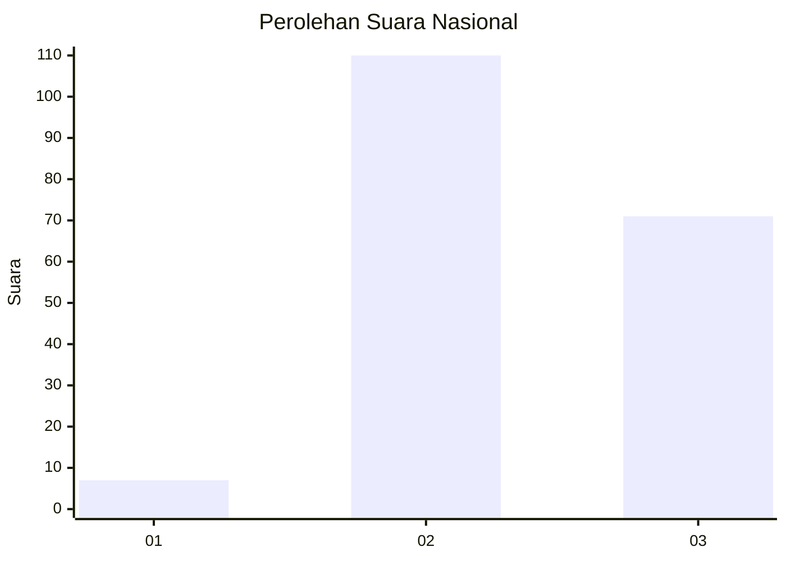
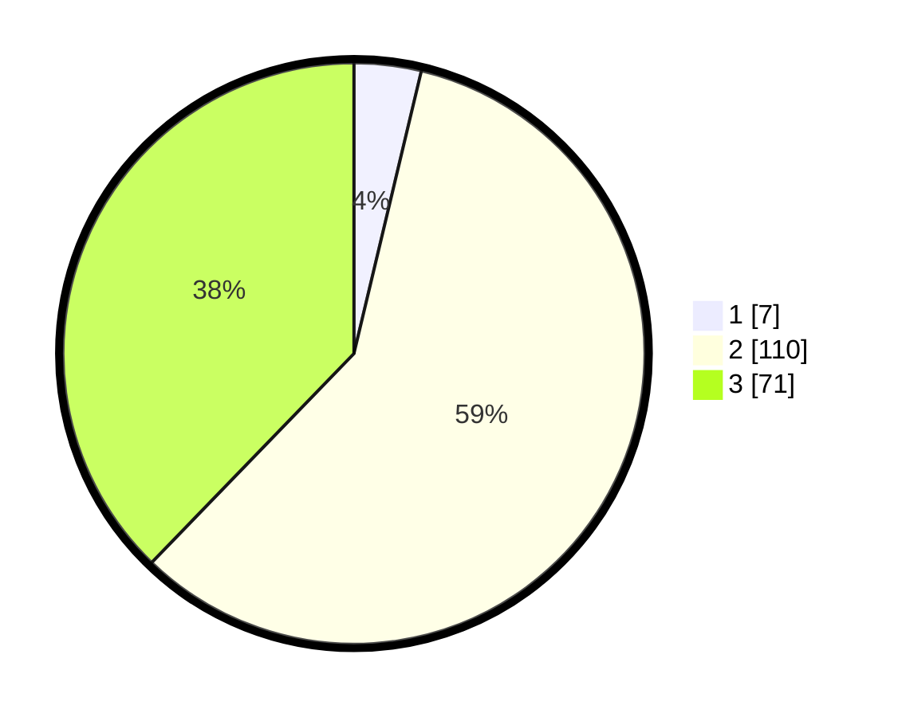

# Hasil

## Grafik

## Tabel

| No. | Nama Paslon    | Suara | Suara (raw) | Persentase |
|:--- |:-------------- | -----:| -----------:| ----------:|
| 1   | ANIES MUHAIMIN | 7     | [7][p-1]    | 3,72       |
| 2   | PRABOWO GIBRAN | 110   | [110][p-2]  | 58,51      |
| 3   | GANJAR MAHFUD  | 71    | [71][p-3]   | 37,77      |

[p-1]: https://github.com/gigit-pemilu/pemilu-2024/blob/main/pilpres/hitung-suara/sub/61-kalimantan-barat/sub/08-landak/sub/02-mempawah-hulu/sub/2009-sungai-laki/sub/005-tps/sub/paslon-1.txt
[p-2]: https://github.com/gigit-pemilu/pemilu-2024/blob/main/pilpres/hitung-suara/sub/61-kalimantan-barat/sub/08-landak/sub/02-mempawah-hulu/sub/2009-sungai-laki/sub/005-tps/sub/paslon-2.txt
[p-3]: https://github.com/gigit-pemilu/pemilu-2024/blob/main/pilpres/hitung-suara/sub/61-kalimantan-barat/sub/08-landak/sub/02-mempawah-hulu/sub/2009-sungai-laki/sub/005-tps/sub/paslon-3.txt

## Foto C Plano

https://sirekap-obj-formc.kpu.go.id/74e9/pemilu/ppwp/61/08/02/20/09/6108022009005-20240215-164619--7a82094f-8b34-4c74-bef1-a39483b6b4d7.jpg

https://sirekap-obj-formc.kpu.go.id/74e9/pemilu/ppwp/61/08/02/20/09/6108022009005-20240215-125632--3ec4dccd-2138-48d8-b980-66e18a8315e1.jpg

https://sirekap-obj-formc.kpu.go.id/74e9/pemilu/ppwp/61/08/02/20/09/6108022009005-20240215-125744--e6b83fae-68f3-474f-b84e-29b5e9b2743a.jpg

## Metadata

| Key        | Value               |
| ---------- | ------------------- |
| Time Stamp | 2024-02-24 22:31:28 |

