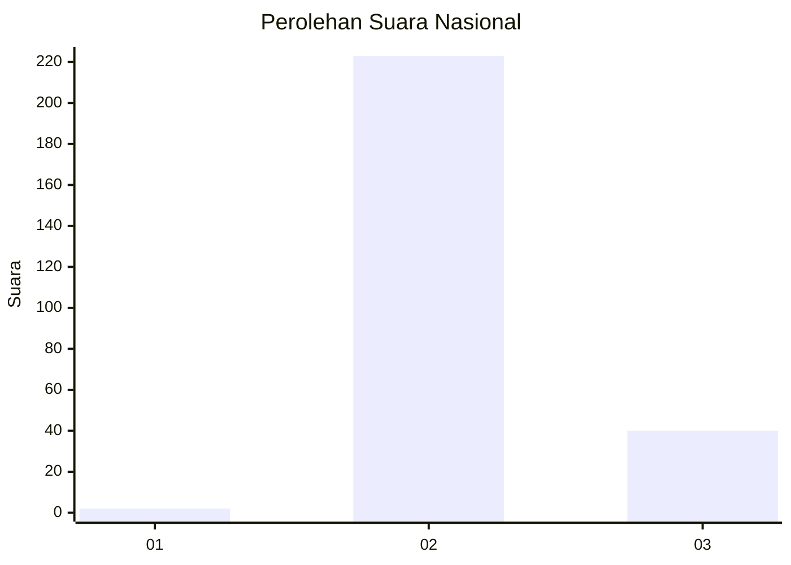
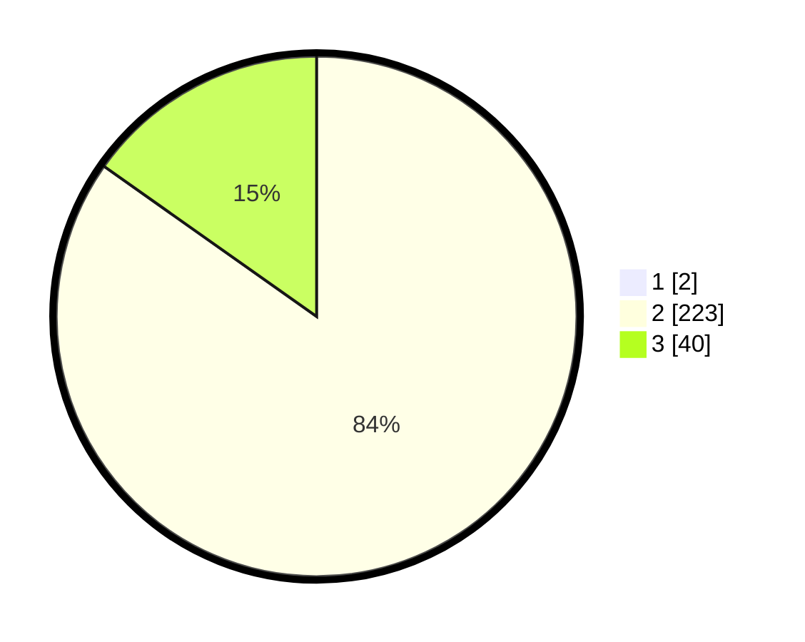

# Hasil

## Grafik

## Tabel

| No. | Nama Paslon    | Suara | Suara (raw) | Persentase |
|:--- |:-------------- | -----:| -----------:| ----------:|
| 1   | ANIES MUHAIMIN | 2     | [2][p-1]    | 0,75       |
| 2   | PRABOWO GIBRAN | 223   | [223][p-2]  | 84,15      |
| 3   | GANJAR MAHFUD  | 40    | [40][p-3]   | 15,09      |

[p-1]: https://github.com/gigit-pemilu/pemilu-2024/blob/main/pilpres/hitung-suara/sub/61-kalimantan-barat/sub/08-landak/sub/04-mandor/sub/2006-sumsum/sub/007-tps/sub/paslon-1.txt
[p-2]: https://github.com/gigit-pemilu/pemilu-2024/blob/main/pilpres/hitung-suara/sub/61-kalimantan-barat/sub/08-landak/sub/04-mandor/sub/2006-sumsum/sub/007-tps/sub/paslon-2.txt
[p-3]: https://github.com/gigit-pemilu/pemilu-2024/blob/main/pilpres/hitung-suara/sub/61-kalimantan-barat/sub/08-landak/sub/04-mandor/sub/2006-sumsum/sub/007-tps/sub/paslon-3.txt

## Foto C Plano

https://sirekap-obj-formc.kpu.go.id/67e0/pemilu/ppwp/61/08/04/20/06/6108042006007-20240214-195446--8549a2ff-41fd-4aa7-b9b4-2989e1d36a40.jpg

https://sirekap-obj-formc.kpu.go.id/67e0/pemilu/ppwp/61/08/04/20/06/6108042006007-20240215-095748--fd488b62-8f02-4ce1-8622-95880d7b94c6.jpg

https://sirekap-obj-formc.kpu.go.id/67e0/pemilu/ppwp/61/08/04/20/06/6108042006007-20240214-191616--88a1dc8f-0284-4c94-9978-8e6303e0478a.jpg

## Metadata

| Key        | Value               |
| ---------- | ------------------- |
| Time Stamp | 2024-02-19 06:16:00 |

