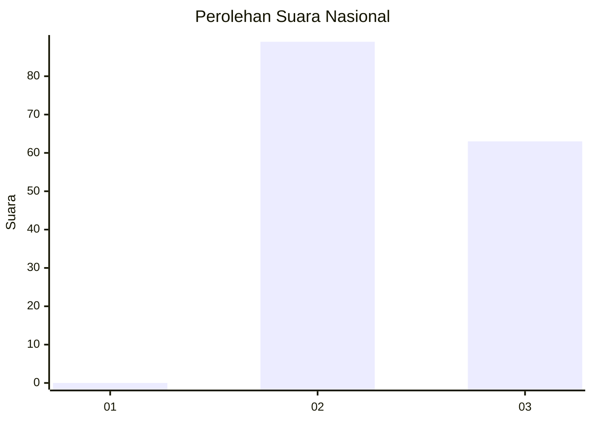
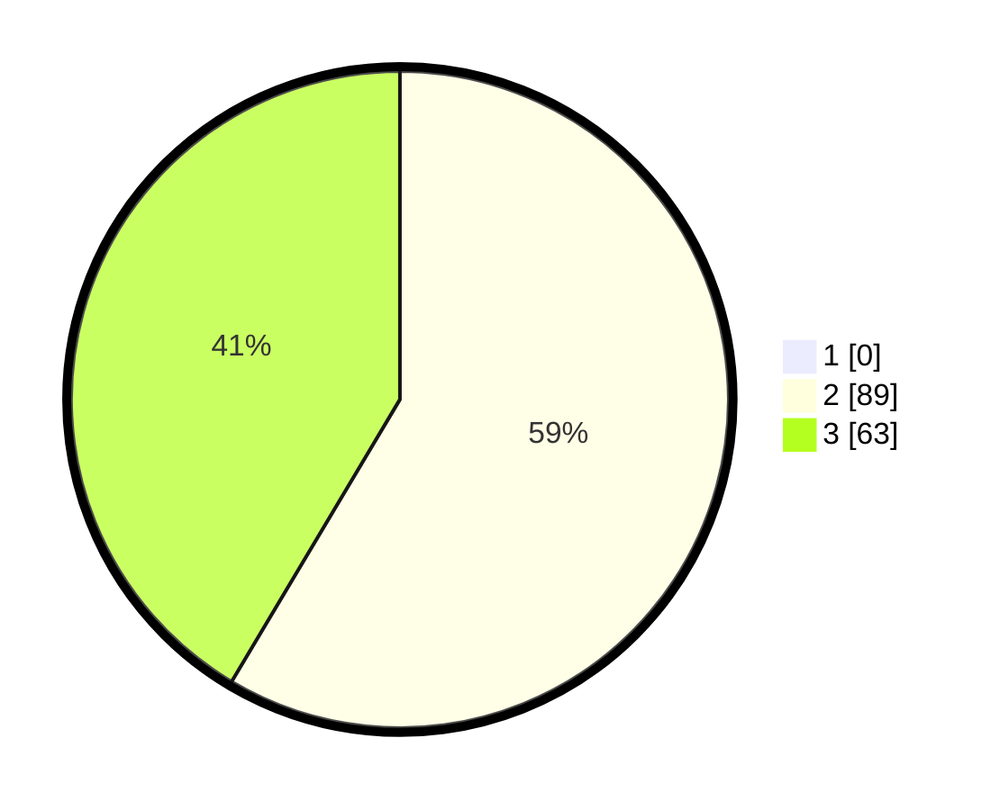

# Hasil

## Grafik

## Tabel

| No. | Nama Paslon    | Suara | Suara (raw) | Persentase |
|:--- |:-------------- | -----:| -----------:| ----------:|
| 1   | ANIES MUHAIMIN | 0     | [0][p-1]    | 0,00       |
| 2   | PRABOWO GIBRAN | 89    | [89][p-2]   | 58,55      |
| 3   | GANJAR MAHFUD  | 63    | [63][p-3]   | 41,45      |

[p-1]: https://github.com/gigit-pemilu/pemilu-2024/blob/main/pilpres/hitung-suara/sub/61-kalimantan-barat/sub/08-landak/sub/04-mandor/sub/2007-sekilap/sub/002-tps/sub/paslon-1.txt
[p-2]: https://github.com/gigit-pemilu/pemilu-2024/blob/main/pilpres/hitung-suara/sub/61-kalimantan-barat/sub/08-landak/sub/04-mandor/sub/2007-sekilap/sub/002-tps/sub/paslon-2.txt
[p-3]: https://github.com/gigit-pemilu/pemilu-2024/blob/main/pilpres/hitung-suara/sub/61-kalimantan-barat/sub/08-landak/sub/04-mandor/sub/2007-sekilap/sub/002-tps/sub/paslon-3.txt

## Foto C Plano

https://sirekap-obj-formc.kpu.go.id/dd60/pemilu/ppwp/61/08/04/20/07/6108042007002-20240215-080557--eb9666a8-2024-4f07-b26f-b09980eacf9d.jpg

https://sirekap-obj-formc.kpu.go.id/dd60/pemilu/ppwp/61/08/04/20/07/6108042007002-20240215-121928--8ee7e5e8-310f-4f26-b79d-e228cc0f69c4.jpg

https://sirekap-obj-formc.kpu.go.id/dd60/pemilu/ppwp/61/08/04/20/07/6108042007002-20240215-080649--a61db193-5b9d-4aa8-8fca-f3b622efa210.jpg

## Metadata

| Key        | Value               |
| ---------- | ------------------- |
| Time Stamp | 2024-02-16 21:01:00 |

