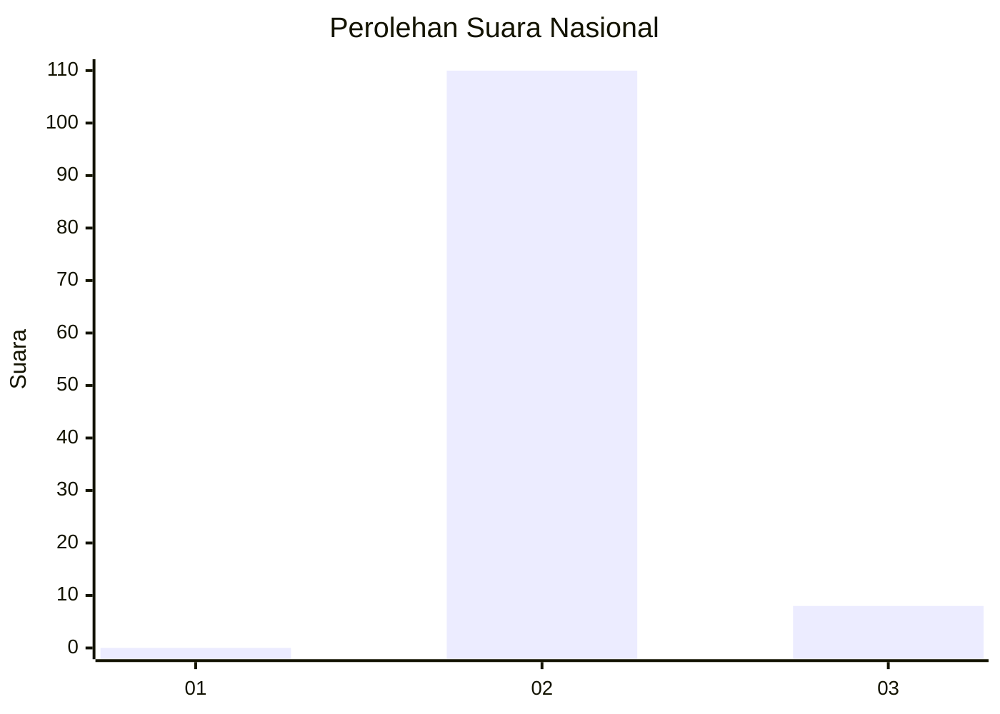
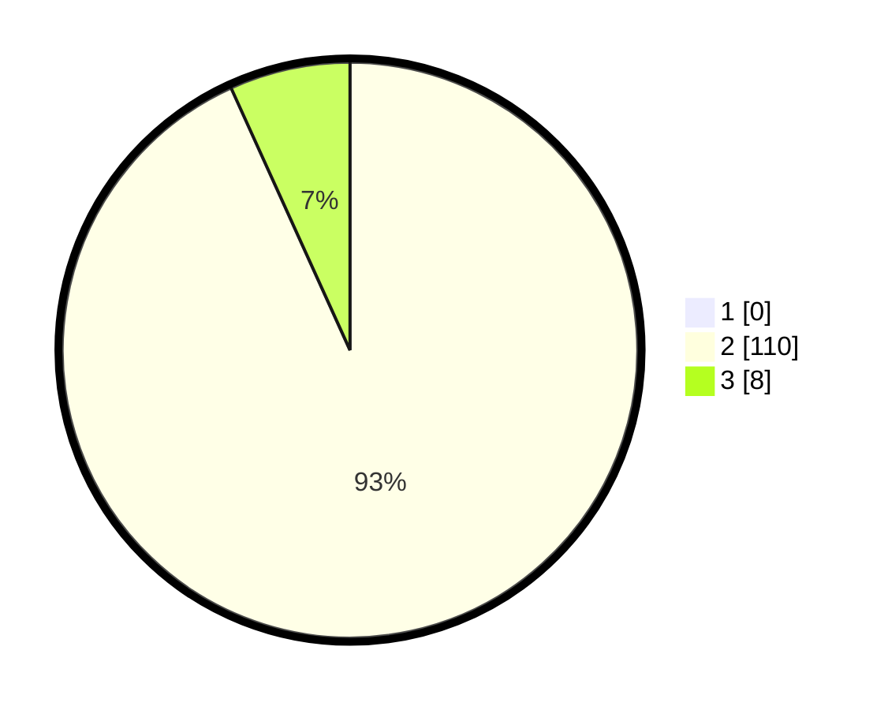

# Hasil

## Grafik

## Tabel

| No. | Nama Paslon    | Suara | Suara (raw) | Persentase |
|:--- |:-------------- | -----:| -----------:| ----------:|
| 1   | ANIES MUHAIMIN | 0     | [0][p-1]    | 0,00       |
| 2   | PRABOWO GIBRAN | 110   | [110][p-2]  | 93,22      |
| 3   | GANJAR MAHFUD  | 8     | [8][p-3]    | 6,78       |

[p-1]: https://github.com/gigit-pemilu/pemilu-2024/blob/main/pilpres/hitung-suara/sub/61-kalimantan-barat/sub/08-landak/sub/04-mandor/sub/2017-ngarak/sub/008-tps/sub/paslon-1.txt
[p-2]: https://github.com/gigit-pemilu/pemilu-2024/blob/main/pilpres/hitung-suara/sub/61-kalimantan-barat/sub/08-landak/sub/04-mandor/sub/2017-ngarak/sub/008-tps/sub/paslon-2.txt
[p-3]: https://github.com/gigit-pemilu/pemilu-2024/blob/main/pilpres/hitung-suara/sub/61-kalimantan-barat/sub/08-landak/sub/04-mandor/sub/2017-ngarak/sub/008-tps/sub/paslon-3.txt

## Foto C Plano

https://sirekap-obj-formc.kpu.go.id/bdb3/pemilu/ppwp/61/08/04/20/17/6108042017008-20240215-070715--444c62e0-a003-48a6-b5a6-d94a38ef197a.jpg

https://sirekap-obj-formc.kpu.go.id/bdb3/pemilu/ppwp/61/08/04/20/17/6108042017008-20240215-071133--c921d7ad-422c-453f-a369-b37662208652.jpg

https://sirekap-obj-formc.kpu.go.id/bdb3/pemilu/ppwp/61/08/04/20/17/6108042017008-20240215-071349--f75e5cf1-63ed-495f-8ff2-0a743f132207.jpg

## Metadata

| Key        | Value               |
| ---------- | ------------------- |
| Time Stamp | 2024-02-25 15:00:00 |

