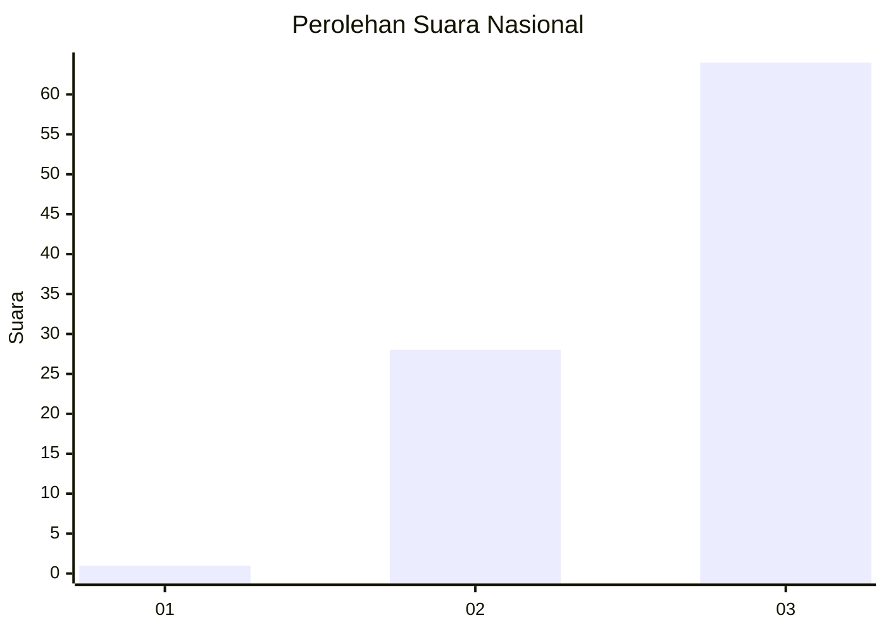
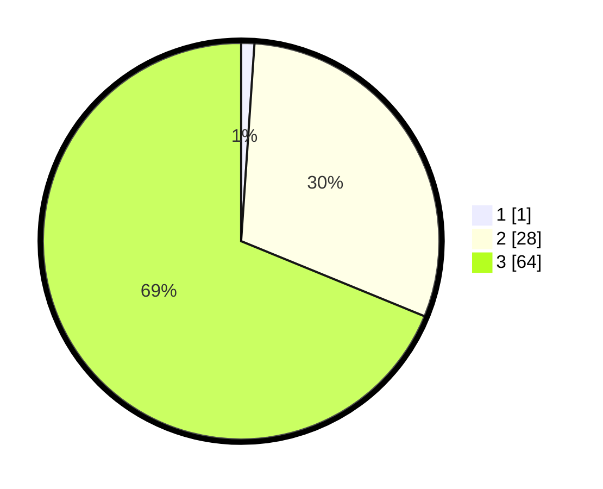

# Hasil

## Grafik

## Tabel

| No. | Nama Paslon    | Suara | Suara (raw) | Persentase |
|:--- |:-------------- | -----:| -----------:| ----------:|
| 1   | ANIES MUHAIMIN | 1     | [1][p-1]    | 1,08       |
| 2   | PRABOWO GIBRAN | 28    | [28][p-2]   | 30,11      |
| 3   | GANJAR MAHFUD  | 64    | [64][p-3]   | 68,82      |

[p-1]: https://github.com/gigit-pemilu/pemilu-2024/blob/main/pilpres/hitung-suara/sub/61-kalimantan-barat/sub/08-landak/sub/05-air-besar/sub/2009-temoyok/sub/003-tps/sub/paslon-1.txt
[p-2]: https://github.com/gigit-pemilu/pemilu-2024/blob/main/pilpres/hitung-suara/sub/61-kalimantan-barat/sub/08-landak/sub/05-air-besar/sub/2009-temoyok/sub/003-tps/sub/paslon-2.txt
[p-3]: https://github.com/gigit-pemilu/pemilu-2024/blob/main/pilpres/hitung-suara/sub/61-kalimantan-barat/sub/08-landak/sub/05-air-besar/sub/2009-temoyok/sub/003-tps/sub/paslon-3.txt

## Foto C Plano

https://sirekap-obj-formc.kpu.go.id/963d/pemilu/ppwp/61/08/05/20/09/6108052009003-20240216-150707--d316a37d-a9f9-443b-842f-2cf35ce36456.jpg

https://sirekap-obj-formc.kpu.go.id/963d/pemilu/ppwp/61/08/05/20/09/6108052009003-20240216-150652--3ff1cbde-2159-42c1-9670-76ec7fe57dc9.jpg

https://sirekap-obj-formc.kpu.go.id/963d/pemilu/ppwp/61/08/05/20/09/6108052009003-20240216-150724--9c99441d-835a-4783-a6b2-3f94e5727bf1.jpg

## Metadata

| Key        | Value               |
| ---------- | ------------------- |
| Time Stamp | 2024-02-24 22:31:28 |

