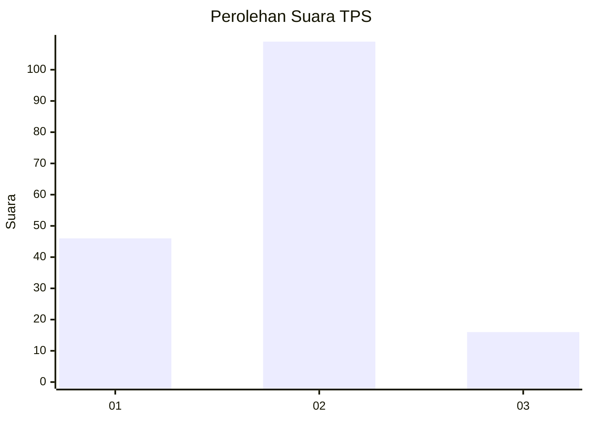
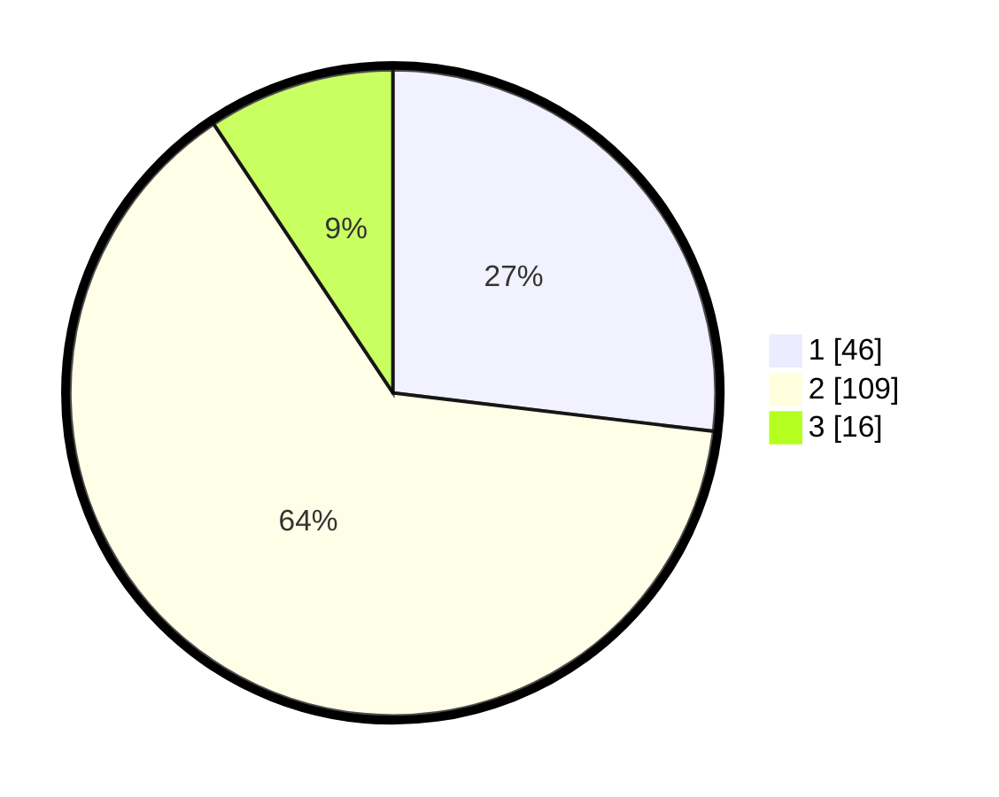

# Hasil

## Grafik

## Tabel

| No. | Nama Paslon    | Suara | Suara (raw) | Persentase |
|:--- |:-------------- | -----:| -----------:| ----------:|
| 1   | ANIES MUHAIMIN | 46    | [46][p-1]   | 26,90      |
| 2   | PRABOWO GIBRAN | 109   | [109][p-2]  | 63,74      |
| 3   | GANJAR MAHFUD  | 16    | [16][p-3]   | 9,36       |

[p-1]: https://github.com/gigit-pemilu/pemilu-2024-61-kalimantan-barat/blob/main/pilpres/hitung-suara/sub/61-kalimantan-barat/sub/08-landak/sub/06-menyuke/sub/2001-darit/sub/003-tps/sub/paslon-1.txt
[p-2]: https://github.com/gigit-pemilu/pemilu-2024-61-kalimantan-barat/blob/main/pilpres/hitung-suara/sub/61-kalimantan-barat/sub/08-landak/sub/06-menyuke/sub/2001-darit/sub/003-tps/sub/paslon-2.txt
[p-3]: https://github.com/gigit-pemilu/pemilu-2024-61-kalimantan-barat/blob/main/pilpres/hitung-suara/sub/61-kalimantan-barat/sub/08-landak/sub/06-menyuke/sub/2001-darit/sub/003-tps/sub/paslon-3.txt

## Foto C Plano

https://sirekap-obj-formc.kpu.go.id/fb41/pemilu/ppwp/61/08/06/20/01/6108062001003-20240215-005511--7055a07a-3a55-4671-9493-97834459200c.jpg

https://sirekap-obj-formc.kpu.go.id/fb41/pemilu/ppwp/61/08/06/20/01/6108062001003-20240215-005543--6e48c929-9a38-489f-bef2-7fbb596024b1.jpg

https://sirekap-obj-formc.kpu.go.id/fb41/pemilu/ppwp/61/08/06/20/01/6108062001003-20240215-005603--9e7b6eab-ba75-4281-bdc0-827b18dc0155.jpg

## Metadata

| Key        | Value               |
| ---------- | ------------------- |
| Time Stamp | 2024-02-16 12:51:22 |

