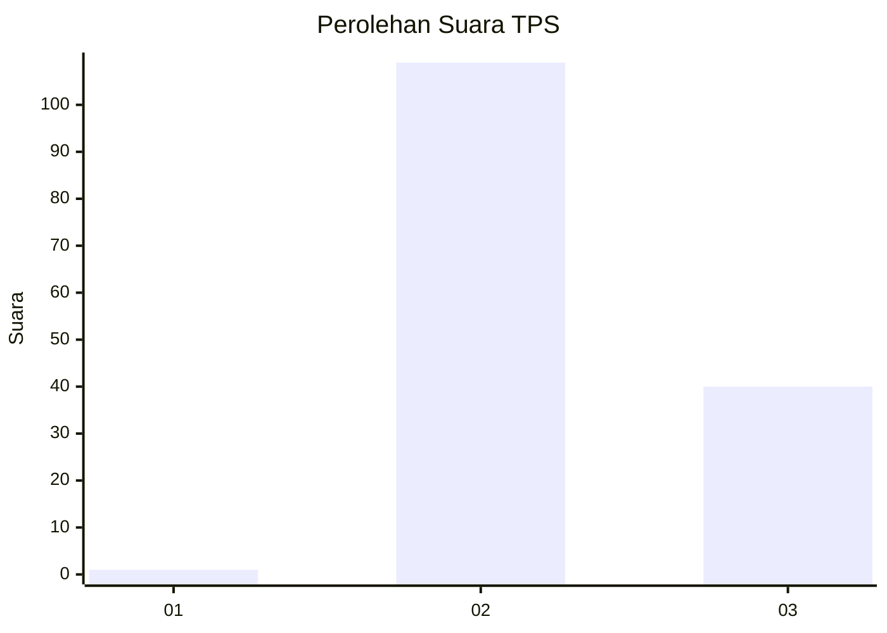
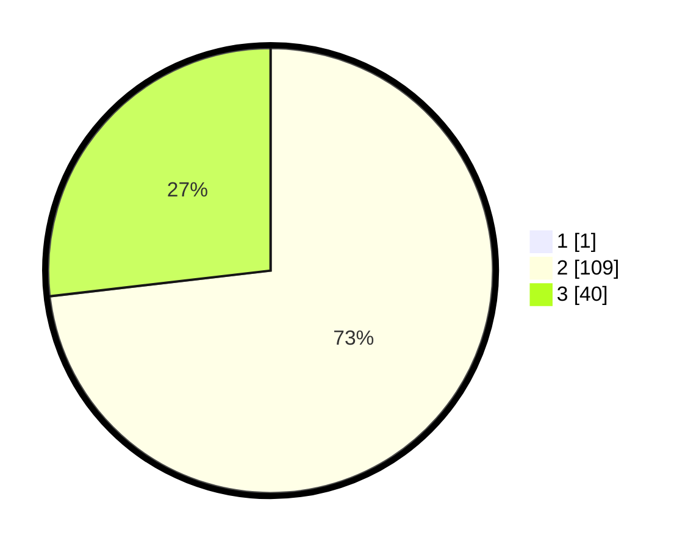

# Hasil

## Grafik

## Tabel

| No. | Nama Paslon    | Suara | Suara (raw) | Persentase |
|:--- |:-------------- | -----:| -----------:| ----------:|
| 1   | ANIES MUHAIMIN | 1     | [1][p-1]    | 0,67       |
| 2   | PRABOWO GIBRAN | 109   | [109][p-2]  | 72,67      |
| 3   | GANJAR MAHFUD  | 40    | [40][p-3]   | 26,67      |

[p-1]: https://github.com/gigit-pemilu/pemilu-2024-61-kalimantan-barat/blob/main/pilpres/hitung-suara/sub/61-kalimantan-barat/sub/08-landak/sub/06-menyuke/sub/2003-ansang/sub/001-tps/sub/paslon-1.txt
[p-2]: https://github.com/gigit-pemilu/pemilu-2024-61-kalimantan-barat/blob/main/pilpres/hitung-suara/sub/61-kalimantan-barat/sub/08-landak/sub/06-menyuke/sub/2003-ansang/sub/001-tps/sub/paslon-2.txt
[p-3]: https://github.com/gigit-pemilu/pemilu-2024-61-kalimantan-barat/blob/main/pilpres/hitung-suara/sub/61-kalimantan-barat/sub/08-landak/sub/06-menyuke/sub/2003-ansang/sub/001-tps/sub/paslon-3.txt

## Foto C Plano

https://sirekap-obj-formc.kpu.go.id/86bc/pemilu/ppwp/61/08/06/20/03/6108062003001-20240215-135320--0dde673b-554a-47d4-bd9b-03f2d2a0dab1.jpg

https://sirekap-obj-formc.kpu.go.id/86bc/pemilu/ppwp/61/08/06/20/03/6108062003001-20240215-135322--75b15485-5bed-43d4-bf55-3abd8dfd1af2.jpg

https://sirekap-obj-formc.kpu.go.id/86bc/pemilu/ppwp/61/08/06/20/03/6108062003001-20240215-135330--335eb1ac-b155-4d74-9a33-53ca2225a7d9.jpg

## Metadata

| Key        | Value               |
| ---------- | ------------------- |
| Time Stamp | 2024-02-25 16:00:00 |

