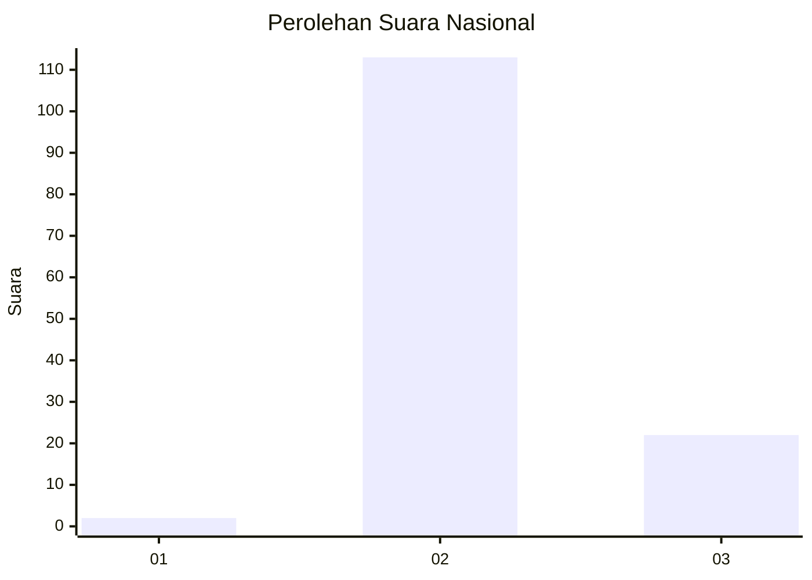
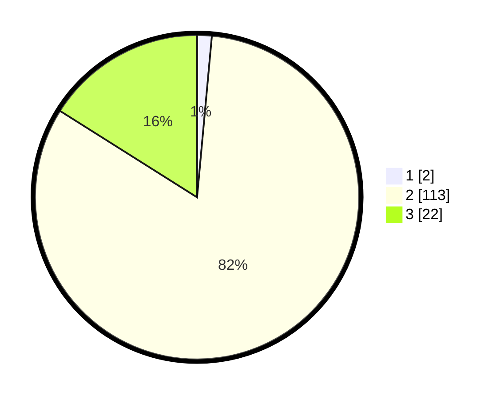

# Hasil

## Grafik

## Tabel

| No. | Nama Paslon    | Suara | Suara (raw) | Persentase |
|:--- |:-------------- | -----:| -----------:| ----------:|
| 1   | ANIES MUHAIMIN | 2     | [2][p-1]    | 1,46       |
| 2   | PRABOWO GIBRAN | 113   | [113][p-2]  | 82,48      |
| 3   | GANJAR MAHFUD  | 22    | [22][p-3]   | 16,06      |

[p-1]: https://github.com/gigit-pemilu/pemilu-2024/blob/main/pilpres/hitung-suara/sub/61-kalimantan-barat/sub/08-landak/sub/06-menyuke/sub/2003-ansang/sub/002-tps/sub/paslon-1.txt
[p-2]: https://github.com/gigit-pemilu/pemilu-2024/blob/main/pilpres/hitung-suara/sub/61-kalimantan-barat/sub/08-landak/sub/06-menyuke/sub/2003-ansang/sub/002-tps/sub/paslon-2.txt
[p-3]: https://github.com/gigit-pemilu/pemilu-2024/blob/main/pilpres/hitung-suara/sub/61-kalimantan-barat/sub/08-landak/sub/06-menyuke/sub/2003-ansang/sub/002-tps/sub/paslon-3.txt

## Foto C Plano

https://sirekap-obj-formc.kpu.go.id/436d/pemilu/ppwp/61/08/06/20/03/6108062003002-20240214-223259--3d59f98c-8a38-4633-bbc3-38032133e334.jpg

https://sirekap-obj-formc.kpu.go.id/436d/pemilu/ppwp/61/08/06/20/03/6108062003002-20240214-223146--8860f0be-2d67-4712-b9f1-5607efcb590c.jpg

https://sirekap-obj-formc.kpu.go.id/436d/pemilu/ppwp/61/08/06/20/03/6108062003002-20240214-223055--2ce21b7b-6e1e-44c9-a220-7c0e4a99a226.jpg

## Metadata

| Key        | Value               |
| ---------- | ------------------- |
| Time Stamp | 2024-02-25 15:00:00 |

