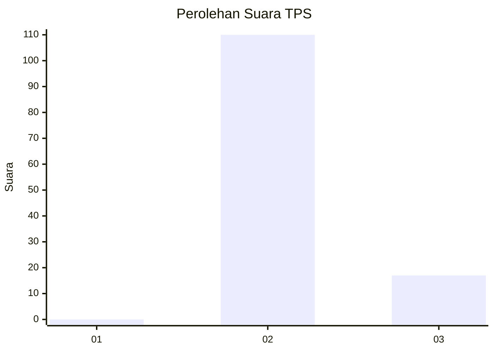
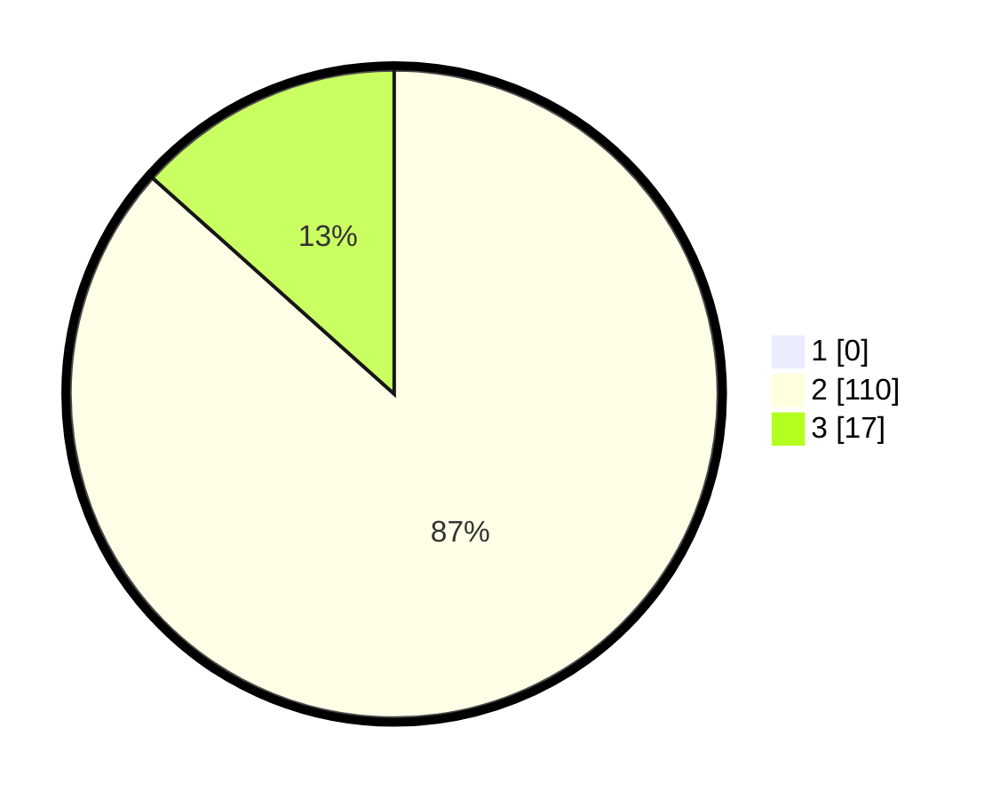

# Hasil

## Grafik

## Tabel

| No. | Nama Paslon    | Suara | Suara (raw) | Persentase |
|:--- |:-------------- | -----:| -----------:| ----------:|
| 1   | ANIES MUHAIMIN | 0     | [0][p-1]    | 0,00       |
| 2   | PRABOWO GIBRAN | 110   | [110][p-2]  | 86,61      |
| 3   | GANJAR MAHFUD  | 17    | [17][p-3]   | 13,39      |

[p-1]: https://github.com/gigit-pemilu/pemilu-2024-61-kalimantan-barat/blob/main/pilpres/hitung-suara/sub/61-kalimantan-barat/sub/08-landak/sub/06-menyuke/sub/2003-ansang/sub/004-tps/sub/paslon-1.txt
[p-2]: https://github.com/gigit-pemilu/pemilu-2024-61-kalimantan-barat/blob/main/pilpres/hitung-suara/sub/61-kalimantan-barat/sub/08-landak/sub/06-menyuke/sub/2003-ansang/sub/004-tps/sub/paslon-2.txt
[p-3]: https://github.com/gigit-pemilu/pemilu-2024-61-kalimantan-barat/blob/main/pilpres/hitung-suara/sub/61-kalimantan-barat/sub/08-landak/sub/06-menyuke/sub/2003-ansang/sub/004-tps/sub/paslon-3.txt

## Foto C Plano

https://sirekap-obj-formc.kpu.go.id/f6fe/pemilu/ppwp/61/08/06/20/03/6108062003004-20240215-123015--30036dca-f0dc-4e54-be54-7f4183be1958.jpg

https://sirekap-obj-formc.kpu.go.id/f6fe/pemilu/ppwp/61/08/06/20/03/6108062003004-20240215-141842--f3d61b18-2eac-4b30-8b64-a54edc5cbb93.jpg

https://sirekap-obj-formc.kpu.go.id/f6fe/pemilu/ppwp/61/08/06/20/03/6108062003004-20240215-142008--5bac92cf-99b1-49e6-bf42-b2c1d82c59ae.jpg

## Metadata

| Key        | Value               |
| ---------- | ------------------- |
| Time Stamp | 2024-02-24 22:31:28 |

