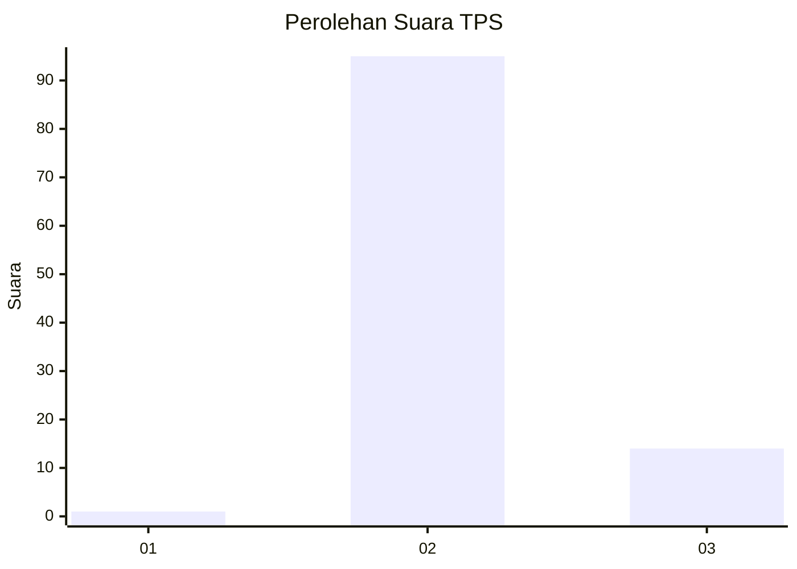
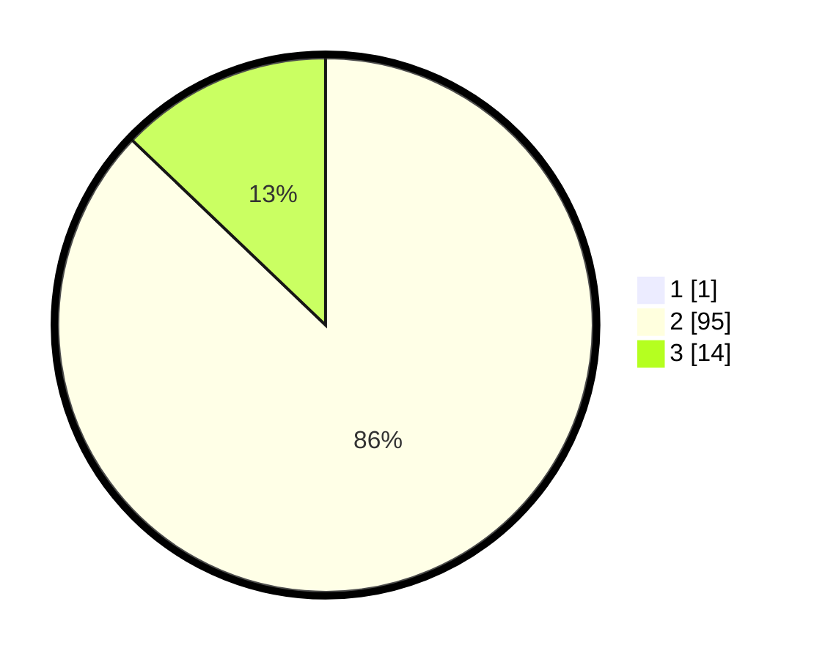

# Hasil

## Grafik

## Tabel

| No. | Nama Paslon    | Suara | Suara (raw) | Persentase |
|:--- |:-------------- | -----:| -----------:| ----------:|
| 1   | ANIES MUHAIMIN | 1     | [1][p-1]    | 0,91       |
| 2   | PRABOWO GIBRAN | 95    | [95][p-2]   | 86,36      |
| 3   | GANJAR MAHFUD  | 14    | [14][p-3]   | 12,73      |

[p-1]: https://github.com/gigit-pemilu/pemilu-2024-61-kalimantan-barat/blob/main/pilpres/hitung-suara/sub/61-kalimantan-barat/sub/08-landak/sub/07-sengah-temila/sub/2007-tonang/sub/016-tps/sub/paslon-1.txt
[p-2]: https://github.com/gigit-pemilu/pemilu-2024-61-kalimantan-barat/blob/main/pilpres/hitung-suara/sub/61-kalimantan-barat/sub/08-landak/sub/07-sengah-temila/sub/2007-tonang/sub/016-tps/sub/paslon-2.txt
[p-3]: https://github.com/gigit-pemilu/pemilu-2024-61-kalimantan-barat/blob/main/pilpres/hitung-suara/sub/61-kalimantan-barat/sub/08-landak/sub/07-sengah-temila/sub/2007-tonang/sub/016-tps/sub/paslon-3.txt

## Foto C Plano

https://sirekap-obj-formc.kpu.go.id/30a7/pemilu/ppwp/61/08/07/20/07/6108072007016-20240214-193141--2bb99981-ad28-4b18-a85a-d47cb30e7163.jpg

https://sirekap-obj-formc.kpu.go.id/30a7/pemilu/ppwp/61/08/07/20/07/6108072007016-20240214-193334--0b3a8671-0253-46c0-bfb2-5fdc49d5157b.jpg

https://sirekap-obj-formc.kpu.go.id/30a7/pemilu/ppwp/61/08/07/20/07/6108072007016-20240214-193507--11dc6d27-3150-48bd-b55c-615938a4efd4.jpg

## Metadata

| Key        | Value               |
| ---------- | ------------------- |
| Time Stamp | 2024-02-25 11:00:00 |

