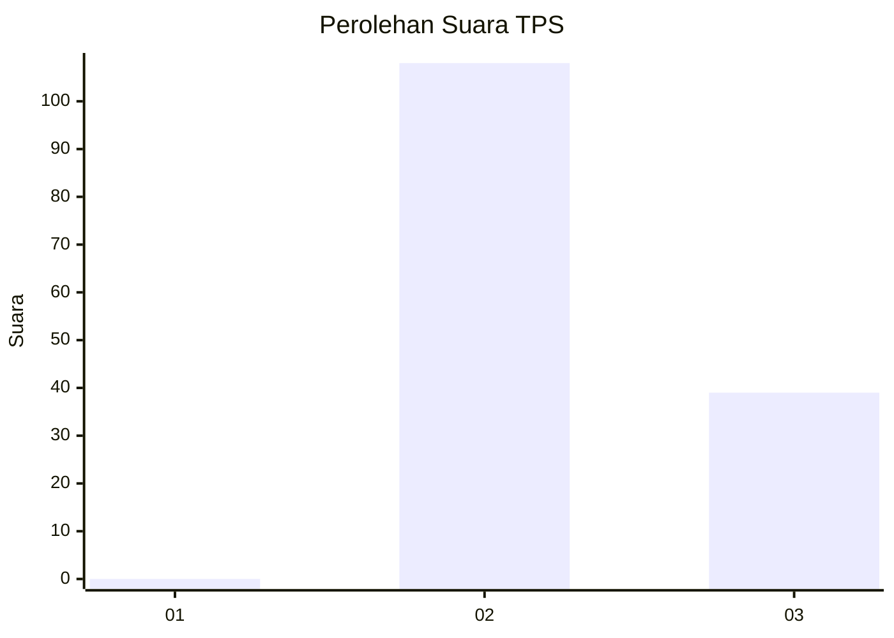
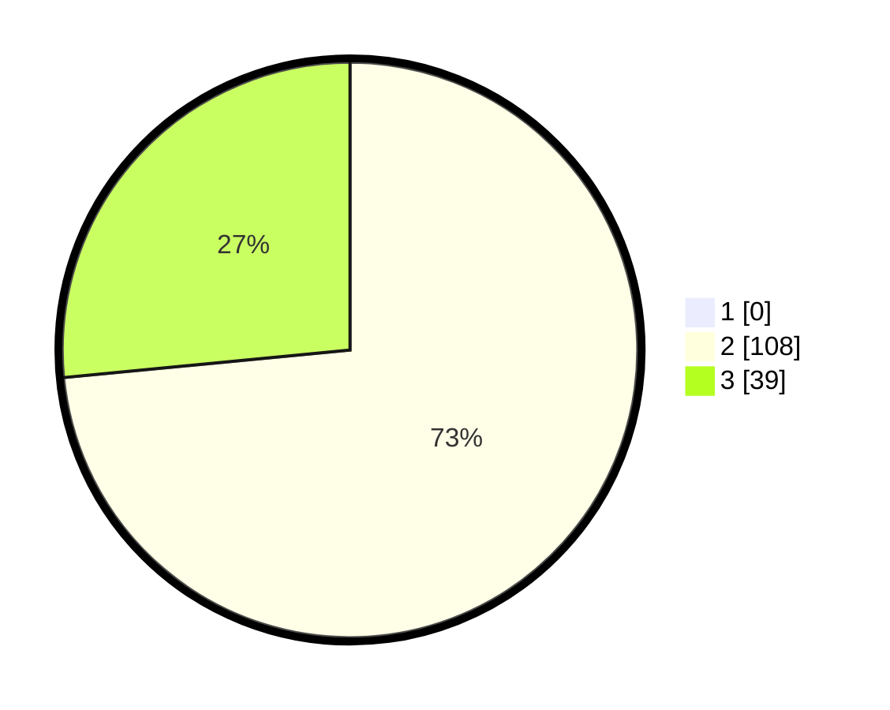

# Hasil

## Grafik

## Tabel

| No. | Nama Paslon    | Suara | Suara (raw) | Persentase |
|:--- |:-------------- | -----:| -----------:| ----------:|
| 1   | ANIES MUHAIMIN | 0     | [0][p-1]    | 0,00       |
| 2   | PRABOWO GIBRAN | 108   | [108][p-2]  | 73,47      |
| 3   | GANJAR MAHFUD  | 39    | [39][p-3]   | 26,53      |

[p-1]: https://github.com/gigit-pemilu/pemilu-2024-61-kalimantan-barat/blob/main/pilpres/hitung-suara/sub/61-kalimantan-barat/sub/08-landak/sub/10-sebangki/sub/2001-sebangki/sub/002-tps/sub/paslon-1.txt
[p-2]: https://github.com/gigit-pemilu/pemilu-2024-61-kalimantan-barat/blob/main/pilpres/hitung-suara/sub/61-kalimantan-barat/sub/08-landak/sub/10-sebangki/sub/2001-sebangki/sub/002-tps/sub/paslon-2.txt
[p-3]: https://github.com/gigit-pemilu/pemilu-2024-61-kalimantan-barat/blob/main/pilpres/hitung-suara/sub/61-kalimantan-barat/sub/08-landak/sub/10-sebangki/sub/2001-sebangki/sub/002-tps/sub/paslon-3.txt

## Foto C Plano

https://sirekap-obj-formc.kpu.go.id/7724/pemilu/ppwp/61/08/10/20/01/6108102001002-20240215-120820--9f2ffa06-0159-41d6-91e3-dc5409aa4551.jpg

https://sirekap-obj-formc.kpu.go.id/7724/pemilu/ppwp/61/08/10/20/01/6108102001002-20240215-121119--7cedacc7-8d91-43ee-a46a-daf437faab41.jpg

https://sirekap-obj-formc.kpu.go.id/7724/pemilu/ppwp/61/08/10/20/01/6108102001002-20240215-120957--053e8008-ba9b-4cf5-bdd5-ca373073e9ba.jpg

## Metadata

| Key        | Value               |
| ---------- | ------------------- |
| Time Stamp | 2024-02-24 22:31:28 |

