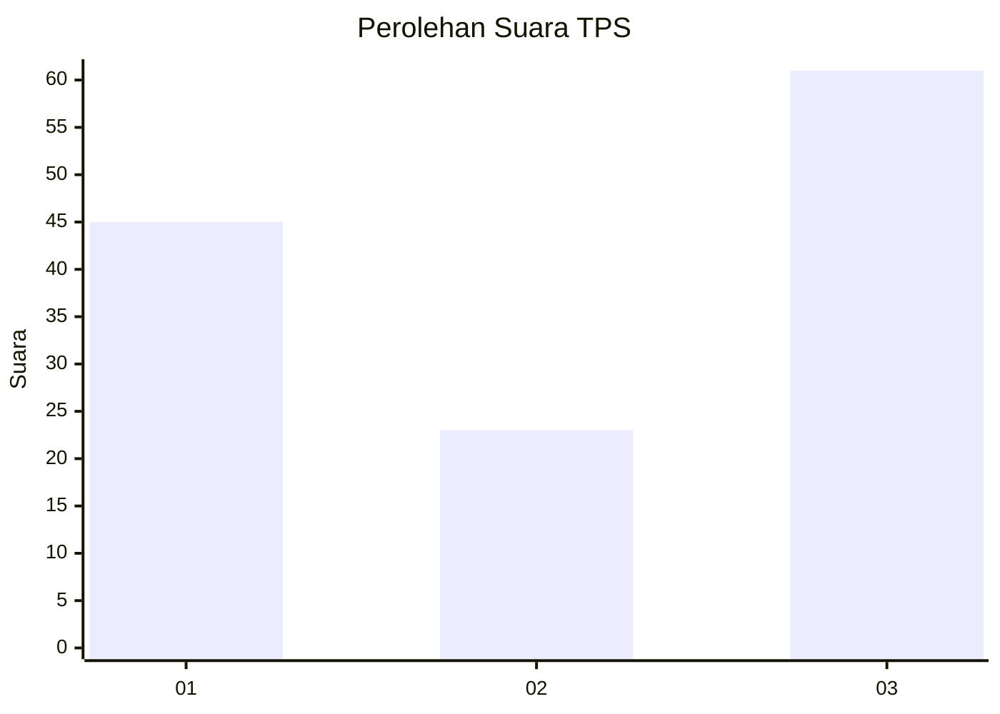
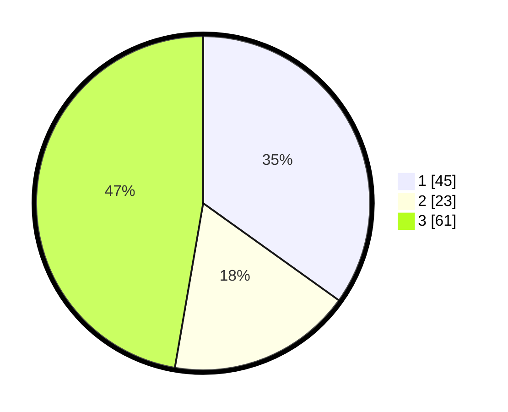

# Hasil

## Grafik

## Tabel

| No. | Nama Paslon    | Suara | Suara (raw) | Persentase |
|:--- |:-------------- | -----:| -----------:| ----------:|
| 1   | ANIES MUHAIMIN | 45    | [45][p-1]   | 34,88      |
| 2   | PRABOWO GIBRAN | 23    | [23][p-2]   | 17,83      |
| 3   | GANJAR MAHFUD  | 61    | [61][p-3]   | 47,29      |

[p-1]: https://github.com/gigit-pemilu/pemilu-2024-61-kalimantan-barat/blob/main/pilpres/hitung-suara/sub/61-kalimantan-barat/sub/08-landak/sub/10-sebangki/sub/2005-sungai-segak/sub/003-tps/sub/paslon-1.txt
[p-2]: https://github.com/gigit-pemilu/pemilu-2024-61-kalimantan-barat/blob/main/pilpres/hitung-suara/sub/61-kalimantan-barat/sub/08-landak/sub/10-sebangki/sub/2005-sungai-segak/sub/003-tps/sub/paslon-2.txt
[p-3]: https://github.com/gigit-pemilu/pemilu-2024-61-kalimantan-barat/blob/main/pilpres/hitung-suara/sub/61-kalimantan-barat/sub/08-landak/sub/10-sebangki/sub/2005-sungai-segak/sub/003-tps/sub/paslon-3.txt

## Foto C Plano

https://sirekap-obj-formc.kpu.go.id/e79a/pemilu/ppwp/61/08/10/20/05/6108102005003-20240214-215405--c73a7a67-dfea-4a3f-95af-ee5471d59c20.jpg

https://sirekap-obj-formc.kpu.go.id/e79a/pemilu/ppwp/61/08/10/20/05/6108102005003-20240214-215415--9a5414c2-147c-48ce-a276-6f3961d6fea1.jpg

https://sirekap-obj-formc.kpu.go.id/e79a/pemilu/ppwp/61/08/10/20/05/6108102005003-20240215-090050--4f342244-5feb-46d4-b1ee-432fe47c5add.jpg

## Metadata

| Key        | Value               |
| ---------- | ------------------- |
| Time Stamp | 2024-02-24 22:31:28 |

