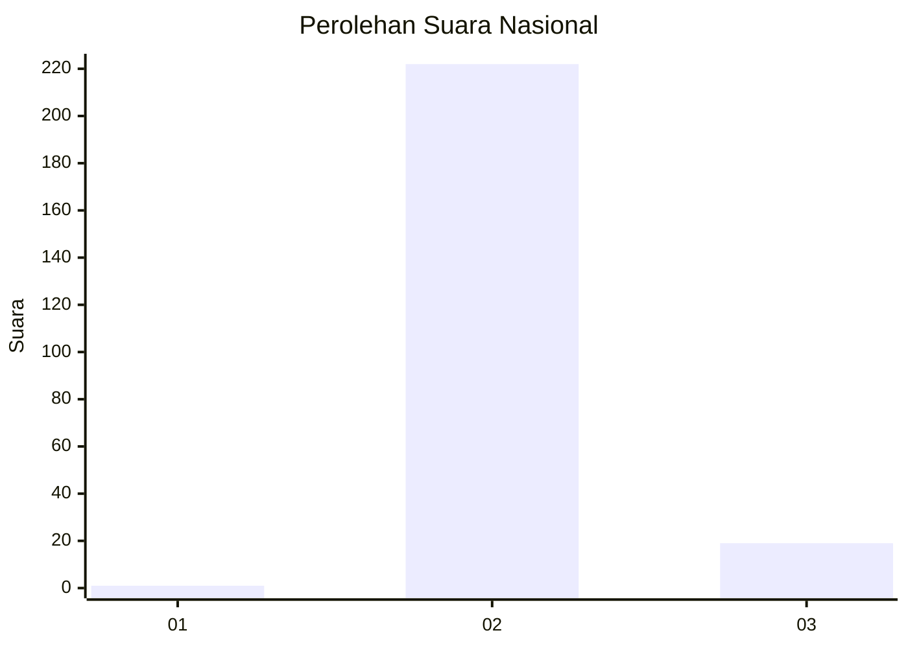
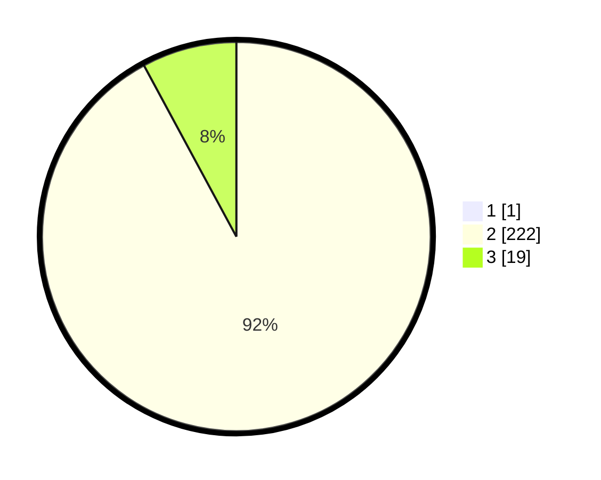

# Hasil

## Grafik

## Tabel

| No. | Nama Paslon    | Suara | Suara (raw) | Persentase |
|:--- |:-------------- | -----:| -----------:| ----------:|
| 1   | ANIES MUHAIMIN | 1     | [1][p-1]    | 0,41       |
| 2   | PRABOWO GIBRAN | 222   | [222][p-2]  | 91,74      |
| 3   | GANJAR MAHFUD  | 19    | [19][p-3]   | 7,85       |

[p-1]: https://github.com/gigit-pemilu/pemilu-2024/blob/main/pilpres/hitung-suara/sub/61-kalimantan-barat/sub/08-landak/sub/11-jelimpo/sub/2001-temahar/sub/007-tps/sub/paslon-1.txt
[p-2]: https://github.com/gigit-pemilu/pemilu-2024/blob/main/pilpres/hitung-suara/sub/61-kalimantan-barat/sub/08-landak/sub/11-jelimpo/sub/2001-temahar/sub/007-tps/sub/paslon-2.txt
[p-3]: https://github.com/gigit-pemilu/pemilu-2024/blob/main/pilpres/hitung-suara/sub/61-kalimantan-barat/sub/08-landak/sub/11-jelimpo/sub/2001-temahar/sub/007-tps/sub/paslon-3.txt

## Foto C Plano

https://sirekap-obj-formc.kpu.go.id/d424/pemilu/ppwp/61/08/11/20/01/6108112001007-20240215-020516--4c57a2a5-d28f-4a31-b4f0-4a92336350aa.jpg

https://sirekap-obj-formc.kpu.go.id/d424/pemilu/ppwp/61/08/11/20/01/6108112001007-20240215-020657--fc01490d-9fb4-4c5b-9d0e-2e0e323de607.jpg

https://sirekap-obj-formc.kpu.go.id/d424/pemilu/ppwp/61/08/11/20/01/6108112001007-20240215-020941--16062e32-1910-4187-8f31-7a40c0fc022e.jpg

## Metadata

| Key        | Value               |
| ---------- | ------------------- |
| Time Stamp | 2024-02-25 12:00:00 |

