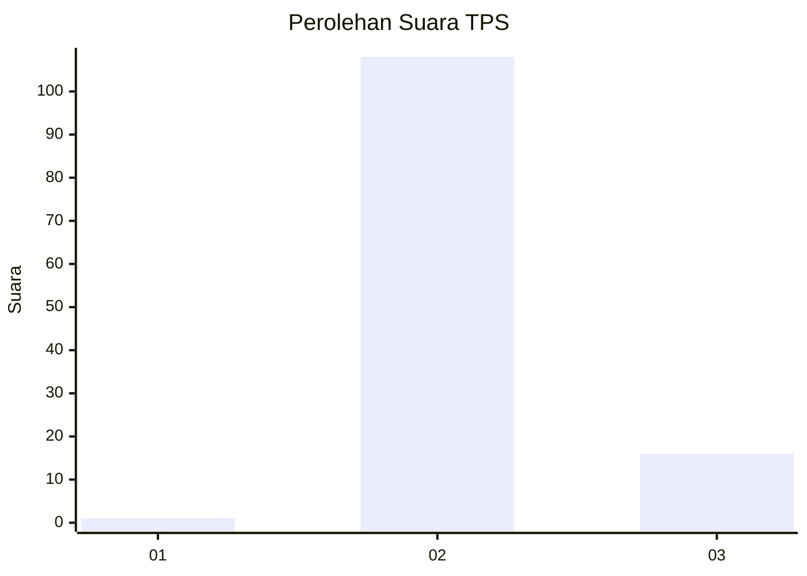
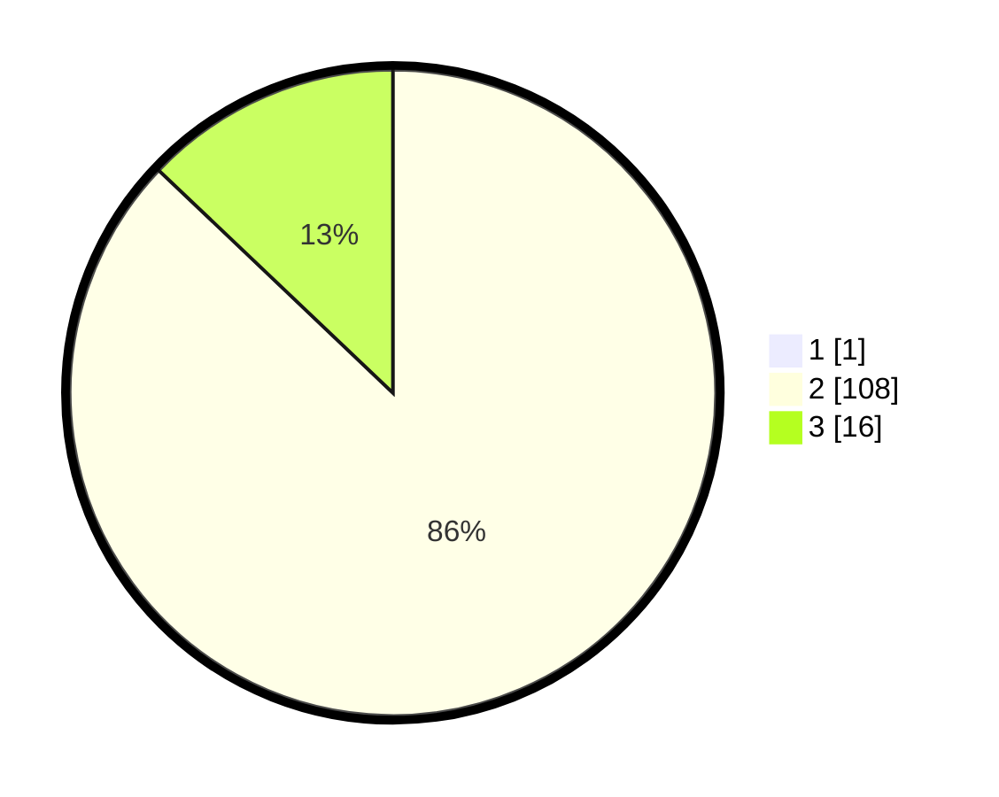

# Hasil

## Grafik

## Tabel

| No. | Nama Paslon    | Suara | Suara (raw) | Persentase |
|:--- |:-------------- | -----:| -----------:| ----------:|
| 1   | ANIES MUHAIMIN | 1     | [1][p-1]    | 0,80       |
| 2   | PRABOWO GIBRAN | 108   | [108][p-2]  | 86,40      |
| 3   | GANJAR MAHFUD  | 16    | [16][p-3]   | 12,80      |

[p-1]: https://github.com/gigit-pemilu/pemilu-2024-61-kalimantan-barat/blob/main/pilpres/hitung-suara/sub/61-kalimantan-barat/sub/08-landak/sub/11-jelimpo/sub/2009-kayu-ara/sub/002-tps/sub/paslon-1.txt
[p-2]: https://github.com/gigit-pemilu/pemilu-2024-61-kalimantan-barat/blob/main/pilpres/hitung-suara/sub/61-kalimantan-barat/sub/08-landak/sub/11-jelimpo/sub/2009-kayu-ara/sub/002-tps/sub/paslon-2.txt
[p-3]: https://github.com/gigit-pemilu/pemilu-2024-61-kalimantan-barat/blob/main/pilpres/hitung-suara/sub/61-kalimantan-barat/sub/08-landak/sub/11-jelimpo/sub/2009-kayu-ara/sub/002-tps/sub/paslon-3.txt

## Foto C Plano

https://sirekap-obj-formc.kpu.go.id/987f/pemilu/ppwp/61/08/11/20/09/6108112009002-20240226-204227--7d45e117-6616-40a1-8ed3-0f1ca018efce.jpg

https://sirekap-obj-formc.kpu.go.id/987f/pemilu/ppwp/61/08/11/20/09/6108112009002-20240226-204347--dd458c09-e844-4b98-bf21-9465e0c38e7e.jpg

https://sirekap-obj-formc.kpu.go.id/987f/pemilu/ppwp/61/08/11/20/09/6108112009002-20240226-204436--b028b830-c310-4948-ae25-7120c1833f19.jpg

## Metadata

| Key        | Value               |
| ---------- | ------------------- |
| Time Stamp | 2024-03-03 11:00:00 |

