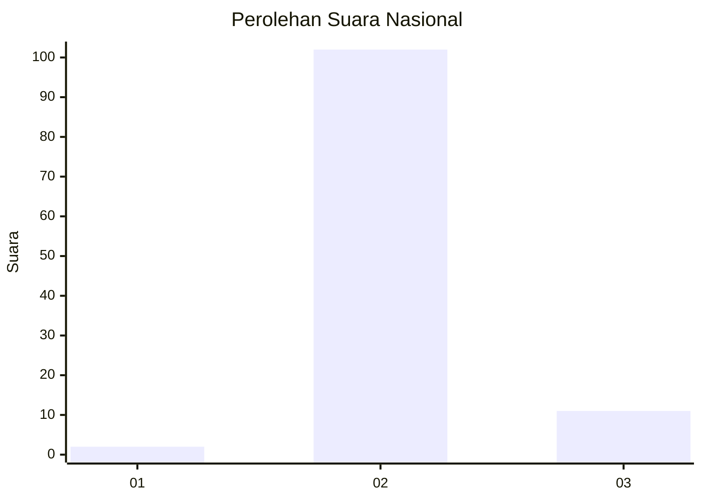
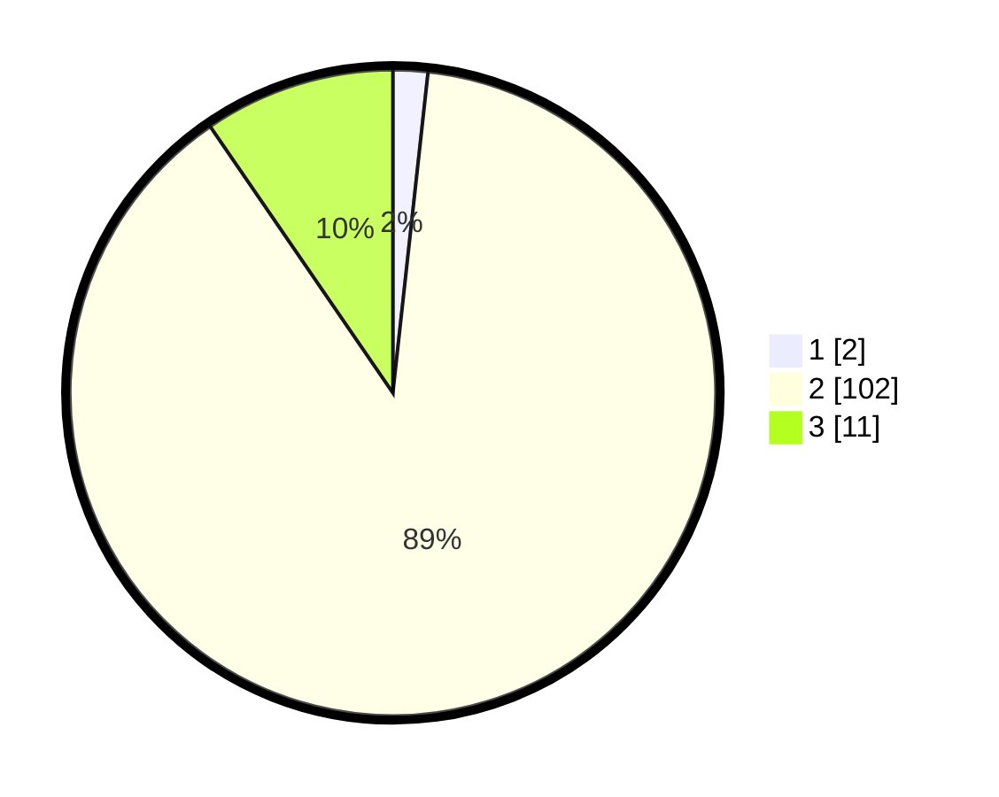

# Hasil

## Grafik

## Tabel

| No. | Nama Paslon    | Suara | Suara (raw) | Persentase |
|:--- |:-------------- | -----:| -----------:| ----------:|
| 1   | ANIES MUHAIMIN | 2     | [2][p-1]    | 1,74       |
| 2   | PRABOWO GIBRAN | 102   | [102][p-2]  | 88,70      |
| 3   | GANJAR MAHFUD  | 11    | [11][p-3]   | 9,57       |

[p-1]: https://github.com/gigit-pemilu/pemilu-2024/blob/main/pilpres/hitung-suara/sub/61-kalimantan-barat/sub/08-landak/sub/12-banyuke-hulu/sub/2005-ringo-lojok/sub/007-tps/sub/paslon-1.txt
[p-2]: https://github.com/gigit-pemilu/pemilu-2024/blob/main/pilpres/hitung-suara/sub/61-kalimantan-barat/sub/08-landak/sub/12-banyuke-hulu/sub/2005-ringo-lojok/sub/007-tps/sub/paslon-2.txt
[p-3]: https://github.com/gigit-pemilu/pemilu-2024/blob/main/pilpres/hitung-suara/sub/61-kalimantan-barat/sub/08-landak/sub/12-banyuke-hulu/sub/2005-ringo-lojok/sub/007-tps/sub/paslon-3.txt

## Foto C Plano

https://sirekap-obj-formc.kpu.go.id/78c3/pemilu/ppwp/61/08/12/20/05/6108122005007-20240219-095448--9b2396ee-f8c6-43c6-a9da-61e7291ad791.jpg

https://sirekap-obj-formc.kpu.go.id/78c3/pemilu/ppwp/61/08/12/20/05/6108122005007-20240219-095450--83bb433c-b7a4-4f16-b901-ede76a1cbbce.jpg

https://sirekap-obj-formc.kpu.go.id/78c3/pemilu/ppwp/61/08/12/20/05/6108122005007-20240219-095449--e12289dd-174a-4029-83af-0411567b8832.jpg

## Metadata

| Key        | Value               |
| ---------- | ------------------- |
| Time Stamp | 2024-02-24 22:31:28 |

