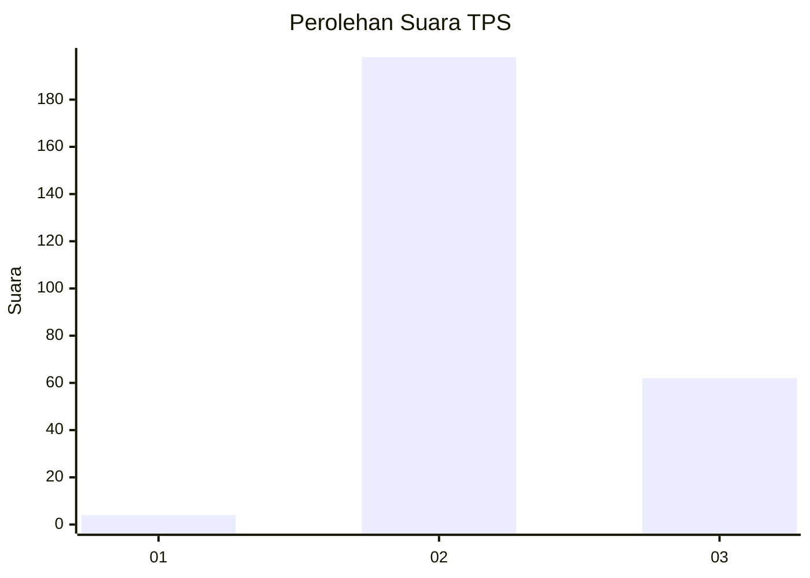
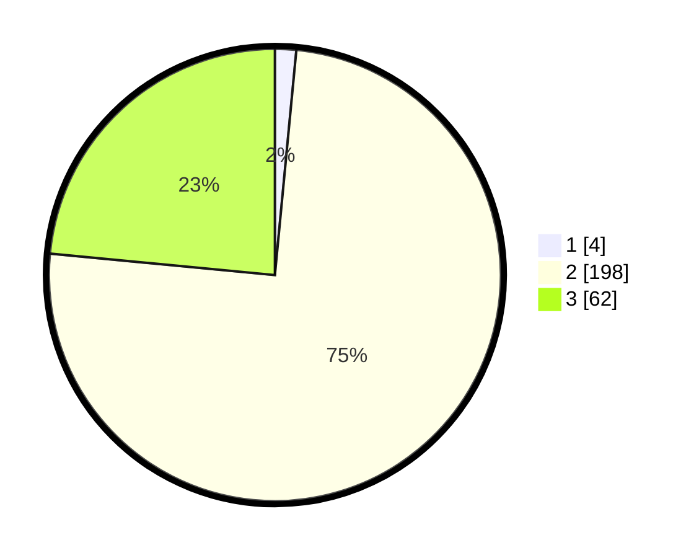

# Hasil

## Grafik

## Tabel

| No. | Nama Paslon    | Suara | Suara (raw) | Persentase |
|:--- |:-------------- | -----:| -----------:| ----------:|
| 1   | ANIES MUHAIMIN | 4     | [4][p-1]    | 1,52       |
| 2   | PRABOWO GIBRAN | 198   | [198][p-2]  | 75,00      |
| 3   | GANJAR MAHFUD  | 62    | [62][p-3]   | 23,48      |

[p-1]: https://github.com/gigit-pemilu/pemilu-2024-61-kalimantan-barat/blob/main/pilpres/hitung-suara/sub/61-kalimantan-barat/sub/08-landak/sub/13-sompak/sub/2007-pakumbang/sub/004-tps/sub/paslon-1.txt
[p-2]: https://github.com/gigit-pemilu/pemilu-2024-61-kalimantan-barat/blob/main/pilpres/hitung-suara/sub/61-kalimantan-barat/sub/08-landak/sub/13-sompak/sub/2007-pakumbang/sub/004-tps/sub/paslon-2.txt
[p-3]: https://github.com/gigit-pemilu/pemilu-2024-61-kalimantan-barat/blob/main/pilpres/hitung-suara/sub/61-kalimantan-barat/sub/08-landak/sub/13-sompak/sub/2007-pakumbang/sub/004-tps/sub/paslon-3.txt

## Foto C Plano

https://sirekap-obj-formc.kpu.go.id/f44d/pemilu/ppwp/61/08/13/20/07/6108132007004-20240217-225948--3b61b982-b526-4ecb-ae4a-6960b55f1043.jpg

https://sirekap-obj-formc.kpu.go.id/f44d/pemilu/ppwp/61/08/13/20/07/6108132007004-20240217-230922--13bf7d35-4610-4d93-be4f-b1ac50400a89.jpg

https://sirekap-obj-formc.kpu.go.id/f44d/pemilu/ppwp/61/08/13/20/07/6108132007004-20240217-231055--c95d213a-89c1-48dd-ac4a-fa3fcd11857e.jpg

## Metadata

| Key        | Value               |
| ---------- | ------------------- |
| Time Stamp | 2024-02-25 11:00:00 |

