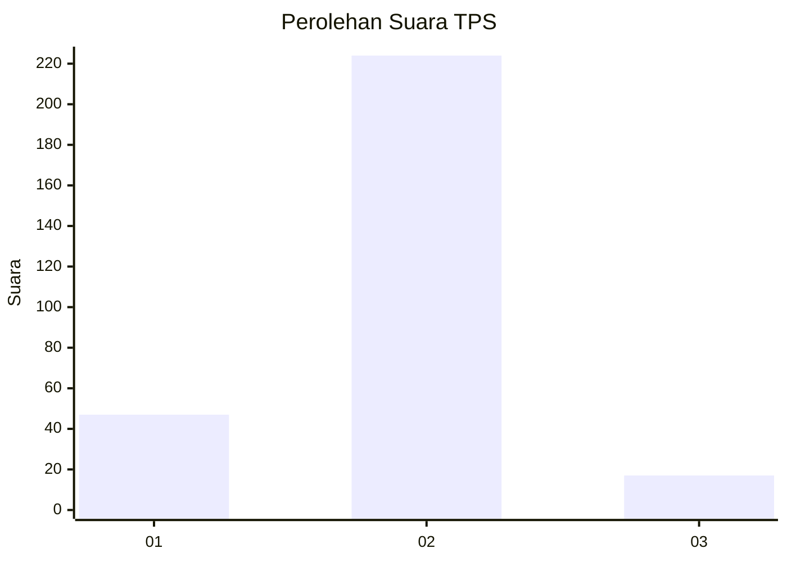
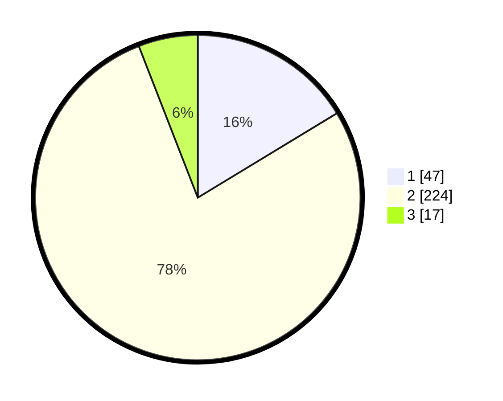

# Hasil

## Grafik

## Tabel

| No. | Nama Paslon    | Suara | Suara (raw) | Persentase |
|:--- |:-------------- | -----:| -----------:| ----------:|
| 1   | ANIES MUHAIMIN | 47    | [47][p-1]   | 16,32      |
| 2   | PRABOWO GIBRAN | 224   | [224][p-2]  | 77,78      |
| 3   | GANJAR MAHFUD  | 17    | [17][p-3]   | 5,90       |

[p-1]: https://github.com/gigit-pemilu/pemilu-2024-61-kalimantan-barat/blob/main/pilpres/hitung-suara/sub/61-kalimantan-barat/sub/09-sekadau/sub/01-sekadau-hilir/sub/2002-mungguk/sub/011-tps/sub/paslon-1.txt
[p-2]: https://github.com/gigit-pemilu/pemilu-2024-61-kalimantan-barat/blob/main/pilpres/hitung-suara/sub/61-kalimantan-barat/sub/09-sekadau/sub/01-sekadau-hilir/sub/2002-mungguk/sub/011-tps/sub/paslon-2.txt
[p-3]: https://github.com/gigit-pemilu/pemilu-2024-61-kalimantan-barat/blob/main/pilpres/hitung-suara/sub/61-kalimantan-barat/sub/09-sekadau/sub/01-sekadau-hilir/sub/2002-mungguk/sub/011-tps/sub/paslon-3.txt

## Foto C Plano

https://sirekap-obj-formc.kpu.go.id/8742/pemilu/ppwp/61/09/01/20/02/6109012002011-20240219-195103--baa6a879-5a0b-4b3a-b864-5c81ad2297d7.jpg

https://sirekap-obj-formc.kpu.go.id/8742/pemilu/ppwp/61/09/01/20/02/6109012002011-20240219-195201--c10a81b0-06ad-4a78-b4a6-918de33afe3f.jpg

https://sirekap-obj-formc.kpu.go.id/8742/pemilu/ppwp/61/09/01/20/02/6109012002011-20240219-195243--6dc3cc32-9c1d-4160-8234-8d9c3ee7f9d5.jpg

## Metadata

| Key        | Value               |
| ---------- | ------------------- |
| Time Stamp | 2024-02-19 20:00:00 |

## DATA PEMILIH TETAP

Jumlah pemilih dalam DPT: **233**.
 * L: **335**.
 * P: **309**.

## DATA PENGGUNA HAK PILIH

Jumlah pengguna hak pilih dalam DPT: **333**.
 * L: **33**.
 * P: **232**.

Jumlah pengguna hak pilih dalam DPTb: **223**.
 * L: **273**.
 * P: **785**.

Jumlah pengguna hak pilih dalam DPK: **202**.
 * L: **72**.
 * P: **222**.

Jumlah pengguna hak pilih: **355**.
 * L: **339**.
 * P: **255**.

## JUMLAH SUARA SAH DAN TIDAK SAH

JUMLAH SELURUH SUARA SAH: **193**.

JUMLAH SUARA TIDAK SAH: **2**.

JUMLAH SELURUH SUARA SAH DAN SUARA TIDAK SAH: **195**.

