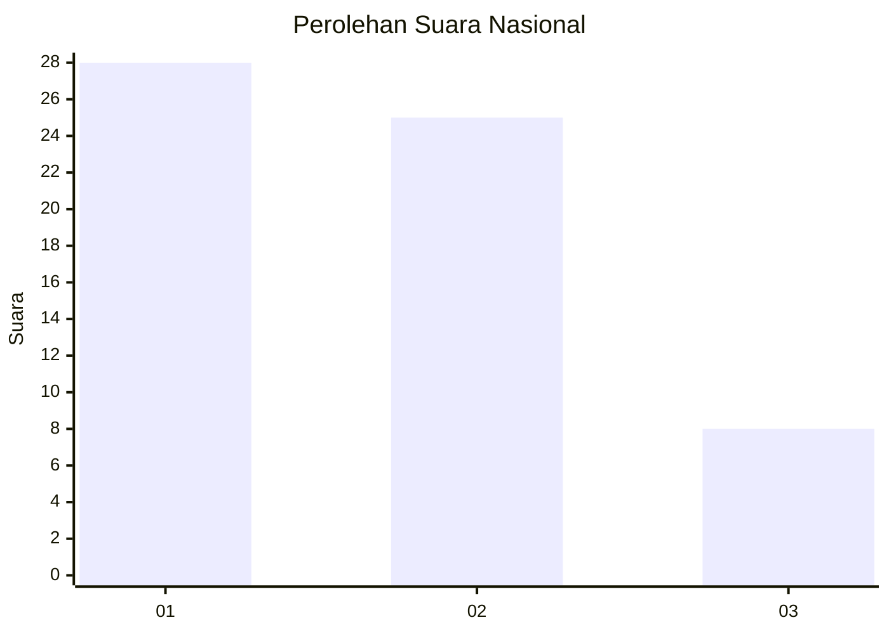
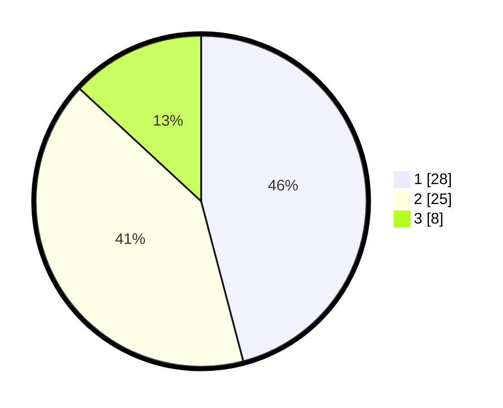

# Hasil

## Grafik

## Tabel

| No. | Nama Paslon    | Suara | Suara (raw) | Persentase |
|:--- |:-------------- | -----:| -----------:| ----------:|
| 1   | ANIES MUHAIMIN | 28    | [28][p-1]   | 45,90      |
| 2   | PRABOWO GIBRAN | 25    | [25][p-2]   | 40,98      |
| 3   | GANJAR MAHFUD  | 8     | [8][p-3]    | 13,11      |

[p-1]: https://github.com/gigit-pemilu/pemilu-2024/blob/main/pilpres/hitung-suara/sub/61-kalimantan-barat/sub/09-sekadau/sub/01-sekadau-hilir/sub/2006-semabi/sub/001-tps/sub/paslon-1.txt
[p-2]: https://github.com/gigit-pemilu/pemilu-2024/blob/main/pilpres/hitung-suara/sub/61-kalimantan-barat/sub/09-sekadau/sub/01-sekadau-hilir/sub/2006-semabi/sub/001-tps/sub/paslon-2.txt
[p-3]: https://github.com/gigit-pemilu/pemilu-2024/blob/main/pilpres/hitung-suara/sub/61-kalimantan-barat/sub/09-sekadau/sub/01-sekadau-hilir/sub/2006-semabi/sub/001-tps/sub/paslon-3.txt

## Foto C Plano

https://sirekap-obj-formc.kpu.go.id/56fd/pemilu/ppwp/61/09/01/20/06/6109012006001-20240220-103347--75a6c1df-c622-4403-a1ce-7efae61ba82f.jpg

https://sirekap-obj-formc.kpu.go.id/56fd/pemilu/ppwp/61/09/01/20/06/6109012006001-20240220-103502--d1b30bf4-fca0-4ec9-babf-1e20b91bdf6f.jpg

https://sirekap-obj-formc.kpu.go.id/56fd/pemilu/ppwp/61/09/01/20/06/6109012006001-20240220-103622--230cd56a-b402-45a2-96cc-57293ee808b9.jpg

## Metadata

| Key        | Value               |
| ---------- | ------------------- |
| Time Stamp | 2024-02-20 11:00:00 |

## DATA PEMILIH TETAP

Jumlah pemilih dalam DPT: **197**.
 * L: **99**.
 * P: **103**.

## DATA PENGGUNA HAK PILIH

Jumlah pengguna hak pilih dalam DPT: **162**.
 * L: **71**.
 * P: **91**.

Jumlah pengguna hak pilih dalam DPTb: **20**.
 * L: **880**.
 * P: **882**.

Jumlah pengguna hak pilih dalam DPK: **1**.
 * L: **1**.
 * P: **80**.

Jumlah pengguna hak pilih: **164**.
 * L: **73**.
 * P: **91**.

## JUMLAH SUARA SAH DAN TIDAK SAH

JUMLAH SELURUH SUARA SAH: **161**.

JUMLAH SUARA TIDAK SAH: **3**.

JUMLAH SELURUH SUARA SAH DAN SUARA TIDAK SAH: **164**.

