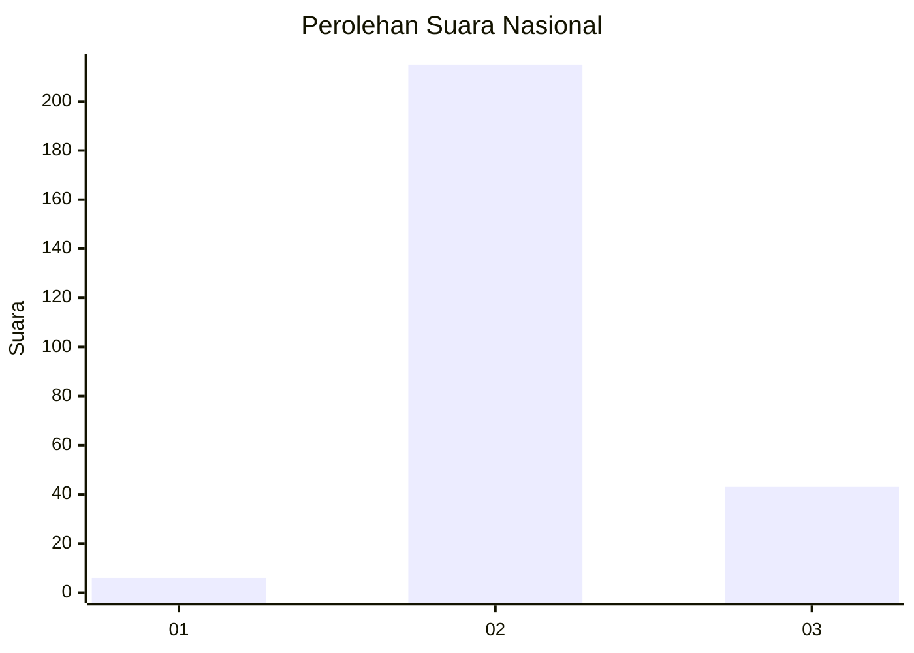
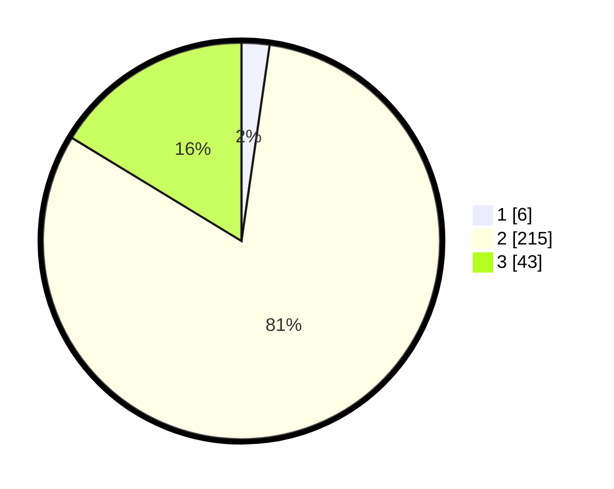

# Hasil

## Grafik

## Tabel

| No. | Nama Paslon    | Suara | Suara (raw) | Persentase |
|:--- |:-------------- | -----:| -----------:| ----------:|
| 1   | ANIES MUHAIMIN | 6     | [6][p-1]    | 2,27       |
| 2   | PRABOWO GIBRAN | 215   | [215][p-2]  | 81,44      |
| 3   | GANJAR MAHFUD  | 43    | [43][p-3]   | 16,29      |

[p-1]: https://github.com/gigit-pemilu/pemilu-2024/blob/main/pilpres/hitung-suara/sub/61-kalimantan-barat/sub/09-sekadau/sub/01-sekadau-hilir/sub/2016-bokak-sebumbun/sub/001-tps/sub/paslon-1.txt
[p-2]: https://github.com/gigit-pemilu/pemilu-2024/blob/main/pilpres/hitung-suara/sub/61-kalimantan-barat/sub/09-sekadau/sub/01-sekadau-hilir/sub/2016-bokak-sebumbun/sub/001-tps/sub/paslon-2.txt
[p-3]: https://github.com/gigit-pemilu/pemilu-2024/blob/main/pilpres/hitung-suara/sub/61-kalimantan-barat/sub/09-sekadau/sub/01-sekadau-hilir/sub/2016-bokak-sebumbun/sub/001-tps/sub/paslon-3.txt

## Foto C Plano

https://sirekap-obj-formc.kpu.go.id/be63/pemilu/ppwp/61/09/01/20/16/6109012016001-20240215-070216--6f9daf53-acf1-4813-b8c3-da3776508278.jpg

https://sirekap-obj-formc.kpu.go.id/be63/pemilu/ppwp/61/09/01/20/16/6109012016001-20240215-070229--80bf6962-8a53-4cd6-84f8-45e836e8f671.jpg

https://sirekap-obj-formc.kpu.go.id/be63/pemilu/ppwp/61/09/01/20/16/6109012016001-20240215-070244--dc3b0eb8-8e89-41df-a4c0-10ea9eae5bbf.jpg

## Metadata

| Key        | Value               |
| ---------- | ------------------- |
| Time Stamp | 2024-02-25 12:00:00 |

