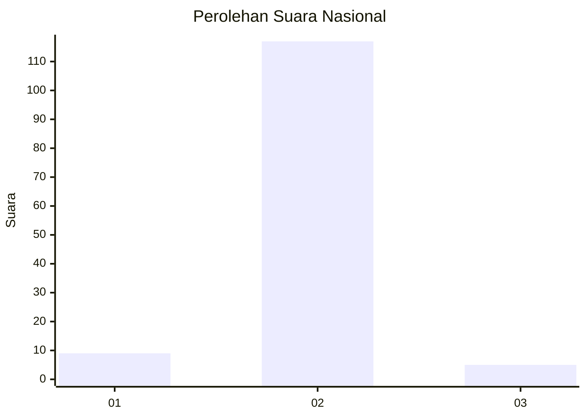
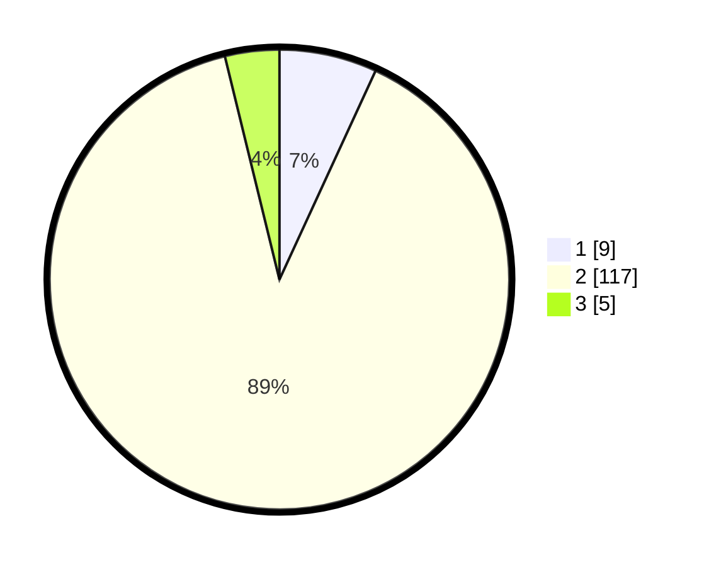

# Hasil

## Grafik

## Tabel

| No. | Nama Paslon    | Suara | Suara (raw) | Persentase |
|:--- |:-------------- | -----:| -----------:| ----------:|
| 1   | ANIES MUHAIMIN | 9     | [9][p-1]    | 6,87       |
| 2   | PRABOWO GIBRAN | 117   | [117][p-2]  | 89,31      |
| 3   | GANJAR MAHFUD  | 5     | [5][p-3]    | 3,82       |

[p-1]: https://github.com/gigit-pemilu/pemilu-2024/blob/main/pilpres/hitung-suara/sub/61-kalimantan-barat/sub/09-sekadau/sub/02-sekadau-hulu/sub/2001-rawak-hilir/sub/005-tps/sub/paslon-1.txt
[p-2]: https://github.com/gigit-pemilu/pemilu-2024/blob/main/pilpres/hitung-suara/sub/61-kalimantan-barat/sub/09-sekadau/sub/02-sekadau-hulu/sub/2001-rawak-hilir/sub/005-tps/sub/paslon-2.txt
[p-3]: https://github.com/gigit-pemilu/pemilu-2024/blob/main/pilpres/hitung-suara/sub/61-kalimantan-barat/sub/09-sekadau/sub/02-sekadau-hulu/sub/2001-rawak-hilir/sub/005-tps/sub/paslon-3.txt

## Foto C Plano

https://sirekap-obj-formc.kpu.go.id/11d7/pemilu/ppwp/61/09/02/20/01/6109022001005-20240214-155300--ceca1413-c341-4d95-880c-c57cfba06983.jpg

https://sirekap-obj-formc.kpu.go.id/11d7/pemilu/ppwp/61/09/02/20/01/6109022001005-20240214-155329--38cd5469-41c4-45a4-b3a6-09a7bbf837cc.jpg

https://sirekap-obj-formc.kpu.go.id/11d7/pemilu/ppwp/61/09/02/20/01/6109022001005-20240214-155644--0acca31a-c5dc-4af1-9da7-9e2772869b7c.jpg

## Metadata

| Key        | Value               |
| ---------- | ------------------- |
| Time Stamp | 2024-02-24 22:31:28 |

